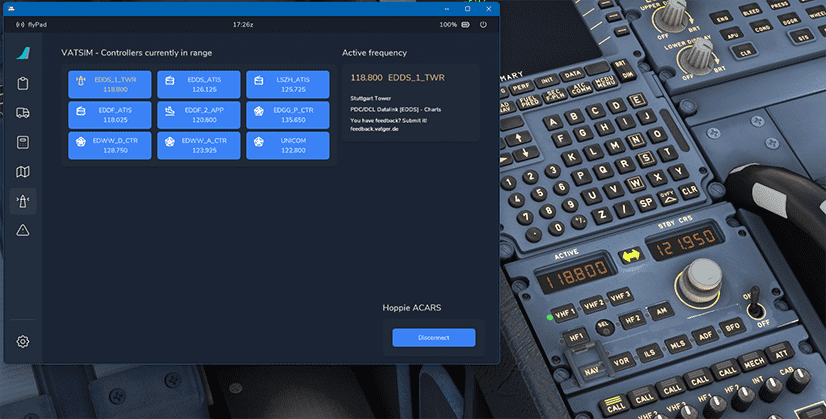

<link rel="stylesheet" href="../../../../stylesheets/efb-interactive.css">

# flyPad Online ATC

## Description

The FlyByWire flyPad helps pilots managing the communication frequencies when using Online ATC services like VATSIM or IVAO.

It lists all currently available ATC stations which can then be activated in the RMP 1 by a single click.

    
    <a href="../dashboard/">   
Dashboard
</a>
    <a href="../dispatch/">    
Dispatch
</a>
    <a href="../ground/">      
Ground
</a>
    <a href="../performance/"> 
Performance
</a>
    <a href="../charts/">      
Navigation & Charts
</a>
    <a href="../online-atc/">  
Online ATC
</a>
    <a href="../failures/">    
Failures
</a>
    <a href="../settings/">    
Settings
</a>
    Click on the menu icons in this image to see other flyPad pages.

## Usage

### Changing Frequencies

Go to the flyPad [ATSU/AOC settings page](settings.md#atsuaoc) and select your Online ATC service.

!!! warning ""
    Only VATSIM or IVAO can be used for this feature at this time.

Go back to the ATC page and see the list of the currently available ATC stations. Click on a station to set this frequency in the Captain's RMP.

{loading=lazy}

### Using Hoppie ACARS

See documentation for [Hoppie ACARS](../hoppie.md)
