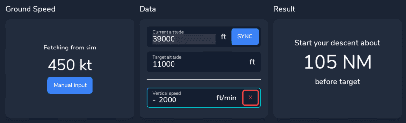
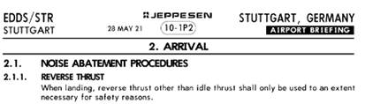
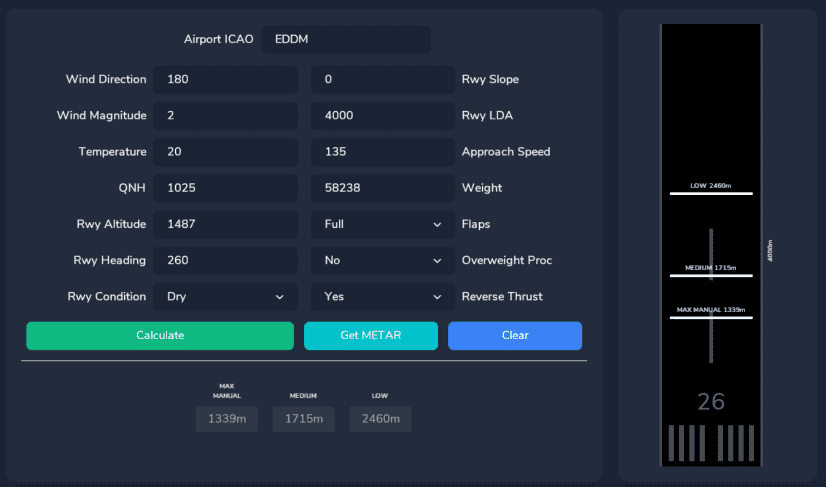
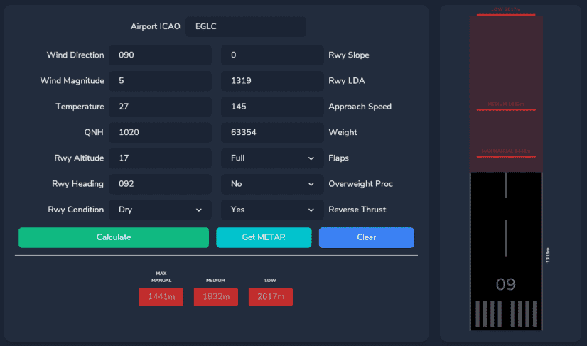

<link rel="stylesheet" href="../../../../stylesheets/efb-interactive.css">

# flyPad Performance

## Top of Descent Calculator

This calculator helps the pilot to calculate when to start descending (aka the Top of Descent) based on various variables so that different scenarios can be calculated (e.g. descending with 3° descent rate, descending with a given vertical speed, etc.).

For more information about descent and approach planning see our guide: [Descent and Approach Planning](../../../pilots-corner/beginner-guide/descent.md#1-descent-and-approach-planning)

    
    <a href="../dashboard/">   
Dashboard
</a>
    <a href="../dispatch/">    
Dispatch
</a>
    <a href="../ground/">      
Ground
</a>
    <a href="../performance/"> 
Performance
</a>
    <a href="../charts/">      
Navigation & Charts
</a>
    <a href="../online-atc/">  
Online ATC
</a>
    <a href="../failures/">    
Failures
</a>
    <a href="../settings/">    
Settings
</a>
    Click on the menu icons in this image to see other flyPad pages.

### Usage

There are several scenarios for the TOD Calculation:

1. Fixed Angle of Descent:
    - Descending from altitude X to altitude Y with a fixed descent angle (commonly 3°)
2. Fixed Distance to Navigation Fix:
    - Descending from altitude X to altitude Y within a fixed distance (e.g. 90NM)
3. Fixed Rate of Descent:
    - Descending from altitude X to altitude Y within a fixed vertical speed (e.g. -2.000ft/min)

Depending on the scenario, ground speeds are included in the calculation to take into account that we usually also slow down at some point during descent.

The flyPad TOD calculator can be used for all of these scenarios.

#### Angle of Descent

To calculate the TOD with a fixed angle of descent we simply have to enter the starting altitude and the desired target altitude.
We can also enter a certain angle other than 3°. But 3° is a common standard descent angle in aviation and rarely needs to be changed.

Example:

- Cruising altitude: 39.000ft
- Target altitude: 11.000ft
- Descent angle: 3°
- Ground Speed: has no impact on the calculation because of the fixed angle.

{loading=lazy}

**Result: We need to start our descent ^^88NM^^ before the target fix at which we want to reach 11.000ft.**

#### Distance to Fix

To calculate the TOD with a fixed distance to a specific fix we have to enter the starting altitude, the desired target altitude, and the distance to the target fix.

Example:

- Cruising altitude: 39.000ft
- Target altitude: 11.000ft
- Distance to fix: 90NM
- Ground Speed: 450 kt (constant)

{loading=lazy}

**Result: We need to start our descent 90NM before the target fix with either an average
of ^^vertical speed of -2.333ft/min^^ or an average ^^descent angle of -2.9°^^** during the descent distance.

!!! note ""
    The above result is averaged over the descent distance and the values are approximations. For more precision use one of the other two methods.

#### Rate of Descent

To calculate the TOD with a fixed vertical speed (rate of descent) we have to enter the starting altitude, the desired target altitude, and the desired vertical speed.

Example:

- Cruising altitude: 39.000ft
- Target altitude: 11.000ft
- Vertical Speed: -2.000ft/min
- Ground Speed: 450 kt (constant)

{loading=lazy}

**Result: We need to start our descent ^^105NM^^ before the target fix with a vertical speed of -2.000ft/min**

#### Ground Speed and Wind

To allow for different ground speeds during descent the calculator allows to enter
several altitude levels with the corresponding ground speed. This will be included in the calculations.

Example:

- Cruising altitude: 39.000ft
- Target altitude: 11.000ft
- Vertical Speed: -2.000ft/min
- Ground Speed: 420 kt at or above 10.000ft, 250kt below 10.000ft

{loading=lazy}

**Result: We need to start our descent ^^98NM^^ before the target fix with a vertical speed of -2.000ft/min**

!!! note "Wind"
    Wind is not a factor and can be ignored as these calculation are done based on ground speed which includes any wind impacting an aircraft in the air.

## Landing Performance Calculator

This calculator helps the pilot to determine if a certain runway can be used for landing and which aircraft configuration is required to safely come to a stop on the available runway length.

In more formal terms it computes if the Landing Distance Available (LDA) is greater than the Landing Distance Required (LDR). See also this article [Landing Distances - Skybrary](https://www.skybrary.aero/index.php/Landing_Distances){target=new}.

This calculation factors in wind, runway condition, aircraft weight and several others which might cause some runways to be viable in one situation but not viable in another situation (e.g. more weight, etc.).

    
    <a href="../dashboard/">   
Dashboard
</a>
    <a href="../dispatch/">    
Dispatch
</a>
    <a href="../ground/">      
Ground
</a>
    <a href="../performance/"> 
Performance
</a>
    <a href="../charts/">      
Navigation & Charts
</a>
    <a href="../online-atc/">  
Online ATC
</a>
    <a href="../failures/">    
Failures
</a>
    <a href="../settings/">    
Settings
</a>
    Click on the menu icons in this image to see other flyPad pages.

### Usage

Enter the required data into the calculator fields. Weather data can be automatically
filled by entering an airport icao and pressing "Get METAR". How to get the information
for all the fields is descibed in the following section.

- Wind, Temperature, QNH:
    - This information can be obtained from METAR or ATIS.

- Rwy Altitude:
    - This information can be obtained from the airport chart (see example below).

- Rwy Heading:
    - This information can be obtained from the airport chart (see example below).

- Rwy Condition:
    - This information can be obtained from METAR or ATIS and sometimes from NOTAMS on the OFP (Operational Flight Plan).

- Rwy Slope:
    - This information can be obtained from the airport chart (see example below) but requires a little calculation.
    - Formula: (((Runway elevation on touchdown side) - (Runway elevation on far side)) / Runway length) * 100.
    - Eg. EDDM 26R: 1.449ft - 1.467ft = -18ft.
    - Then -18ft / 13.123ft = -0,00137.
    - Then -0,00137 * 100 = -0.137% slope.

- Rwy LDA (Landing Distance Available):
    - This information can be obtained from the airport chart (see example below).

- Approach Speed: MCDU PERF APPR
    - This is part of the MCDU PERF APPR page and can be taken from there (V~APP~).

    {loading=lazy}

- Weight:
    - This information can be obtained from the ECAM SD bottom right corner (GW 59600 KG in the example below).

    {loading=lazy}

- Flaps:
    - Planned landing flap setting (CONF FULL or CONF 3).

- Overweight Procedure:
    - Will the landing weight be greater than the maximum landing weight (Yes or No).

- Reverse Thrust:
    - Will reverse thrust be used (Yes or No)?
    - Subject to airport requirements that can be found on the airport chart (see example below).

    {loading=lazy}

#### Example Chart:

{loading=lazy}
*Copyright © 2021 Navigraph / Jeppesen 
"Navigraph Charts are intended for flight simulation use only, not for navigational use."*

#### Example 1

This runway can be used for landing with the given circumstances and full flaps in all braking configurations (low, medium, max manual).

{loading=lazy}

#### Example 2

This runway's landing distance available is long enough to be used for landing with full flaps and with max manual braking.
Be aware that there might be other restrictions that prohibit landing of an A320neo on this airport/runway.

{loading=lazy}

#### Example 3

This runway can not be used for landing with the given circumstances. It is similar to Example 2 but has a higher weight and therefore higher approach speed.

{loading=lazy}

