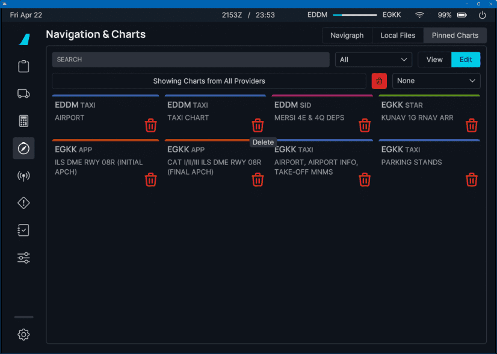

<link rel="stylesheet" href="../../../../stylesheets/efb-interactive.css">

# flyPad Navigation & Charts

## Navigraph

With a valid Navigraph subscription the FlyByWire flyPad allows access to all Navigraph charts from within the flyPad.

    
    <a href="../dashboard/">   
Dashboard
</a>
    <a href="../dispatch/">    
Dispatch
</a>
    <a href="../ground/">      
Ground
</a>
    <a href="../performance/"> 
Performance
</a>
    <a href="../charts/">      
Navigation & Charts
</a>
    <a href="../online-atc/">  
Online ATC
</a>
    <a href="../failures/">    
Failures
</a>
    <a href="../checklists/">  
Checklists
</a>
    <a href="../presets/">     
Presets
</a>
    <a href="../settings/">    
Settings
</a>
    Click on the menu icons in this image to see other flyPad pages.

### Authentication to Navigraph

Before you can use the Navigraph integration the flyPad will ask you once to authenticate and authorize Navigraph 
access by either scanning the QR code or visiting the shown url in a browser. Login in there and authorize FlyByWire 
to access the Navigraph account.

    
    <a href="../dashboard/">   
Dashboard
</a>
    <a href="../dispatch/">    
Dispatch
</a>
    <a href="../ground/">      
Ground
</a>
    <a href="../performance/"> 
Performance
</a>
    <a href="../charts/">      
Navigation & Charts
</a>
    <a href="../online-atc/">  
Online ATC
</a>
    <a href="../failures/">    
Failures
</a>
    <a href="../checklists/">  
Checklists
</a>
    <a href="../presets/">     
Presets
</a>
    <a href="../settings/">    
Settings
</a>
    Click on the menu icons in this image to see other flyPad pages.

### Map Controls

After authenticating you will have access to the Navigraph page where you can list available charts for airports, 
view and pin them, etc. See the list of controls below. 

!!! block ""
    {loading=lazy width=50% align=left}
    Enter any airport ICAO or click on the buttons to choose either the origin, destination or alternate airport. 

!!! block ""
    {loading=lazy width=50% align=left}
    Select the chart group to see the corresponding charts in the list.

!!! block ""
    {loading=lazy width=50% align=left}
    Click on a chart to open it. Click the pin if you want this specific chart to be available in the pins. 

!!! block ""
    {loading=lazy width=10% align=left}
    Rotate the chart be 45° either anti-clockwise or clockwise. 

!!! block ""
    {loading=lazy width=10% align=left}
     
    - fit the chart vertically into the display
    - fit the chart horizontally into the display
    - reset the zoom
    - increase the zoom
    - decrease the zoom

!!! block ""
    {loading=lazy width=10% align=left}

    - show the chart in fullscreen
    - light and dark mode switching

## Local Files

!!! bug "Feature not yet available!"
    Unfortunately this feature is not yet available. As soon as the required component has been released this page 
    will be updated. 

<!--

### FlyByWire SimBridge Required

For accessing local files from the PC the FlyByWire SimBridge is required. It is currently being developed and will 
allow access to local files from within the sim. This server is necessary as the sim itself does not allow access 
to arbitrary files on the PC. 

We will provide a detailed documentation for the FlyByWire SimBridge once it is available.

    
    <a href="../dashboard/">   
Dashboard
</a>
    <a href="../dispatch/">    
Dispatch
</a>
    <a href="../ground/">      
Ground
</a>
    <a href="../performance/"> 
Performance
</a>
    <a href="../charts/">      
Navigation & Charts
</a>
    <a href="../online-atc/">  
Online ATC
</a>
    <a href="../failures/">    
Failures
</a>
    <a href="../checklists/">  
Checklists
</a>
    <a href="../presets/">     
Presets
</a>
    <a href="../settings/">    
Settings
</a>
    Click on the menu icons in this image to see other flyPad pages.

### Usage

Local files (images, PDF) stored in a specific folder on the PC will be listed and can be opened similar to the 
Navigraph charts. 

The controls are similar to the Navigraph chart view although there will not be a light and dark mode. 

    
    <a href="../dashboard/">   
Dashboard
</a>
    <a href="../dispatch/">    
Dispatch
</a>
    <a href="../ground/">      
Ground
</a>
    <a href="../performance/"> 
Performance
</a>
    <a href="../charts/">      
Navigation & Charts
</a>
    <a href="../online-atc/">  
Online ATC
</a>
    <a href="../failures/">    
Failures
</a>
    <a href="../checklists/">  
Checklists
</a>
    <a href="../presets/">     
Presets
</a>
    <a href="../settings/">    
Settings
</a>
    Click on the menu icons in this image to see other flyPad pages.

-->

## Pinned Charts

Available charts can be pinned by clicking on the pin symbol. The pinned charts are then available in this tab and 
also in the charts-widget on the Dashboard. 

    
    <a href="../dashboard/">   
Dashboard
</a>
    <a href="../dispatch/">    
Dispatch
</a>
    <a href="../ground/">      
Ground
</a>
    <a href="../performance/"> 
Performance
</a>
    <a href="../charts/">      
Navigation & Charts
</a>
    <a href="../online-atc/">  
Online ATC
</a>
    <a href="../failures/">    
Failures
</a>
    <a href="../checklists/">  
Checklists
</a>
    <a href="../presets/">     
Presets
</a>
    <a href="../settings/">    
Settings
</a>
    Click on the menu icons in this image to see other flyPad pages.

!!! block ""
    {loading=lazy width=70% align=left}
    Click on edit to unpin charts. Of course this can also be done by unchecking the pin symbol in the chart lists. 

You can also remove all pinned charts at once by clicking the `Remove All` button (trash can) above the charts.

!!! block ""
    {loading=lazy width=30% align=left}
    Pinned charts can be sorted by selected one of the sort options. 

!!! block ""
    {loading=lazy width=50% align=left}
    Pinned charts can be searched by typing the search term into the search field. Select where to search in the 
    dropdown.  
