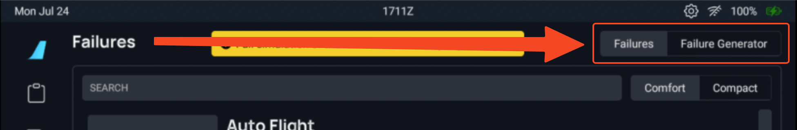

<link rel="stylesheet" href="../../../../../stylesheets/efb-interactive.css">

# flyPad Failures

## Overview

Although far from complete, some A32NX systems are already capable of simulating failures.

To manage and trigger these failures, this flyPad page gives the user structured access to two types of systems:

- Simple on demand triggering of failures by mouse click.
- A more complex failure generator that can be customized to create failures at certain points during your flight for a more "randomized" feel. [Jump to Failure Generator](#failure-generator).

These two systems can be selected by clicking on the respective buttons in the top right corner of the Failures page.

{loading=lazy}

There are further extensions planned for the failures feature, incl. more systems and trigger-based failures. This page will therefore change alongside the implementation of the failure system.

## On Demand Failures

The on demand failures are triggered by clicking on the respective buttons in the "On Demand Failures" section of the page.

!!! info ""
    Please ensure that you are on the Failures tab to trigger on demand failures.

    {loading=lazy}

### Comfort View

    
    <a href="../dashboard/">   
Dashboard
</a>
    <a href="../dispatch/">    
Dispatch
</a>
    <a href="../ground/">      
Ground
</a>
    <a href="../performance/"> 
Performance
</a>
    <a href="../charts/">      
Navigation & Charts
</a>
    <a href="../online-atc/">  
Online ATC
</a>
    <a href="failures">    
Failures
</a>
    <a href="../checklists/">  
Checklists
</a>
    <a href="../presets/">     
Presets
</a>
    <a href="../settings/">    
Settings
</a>
    Click on the menu icons in this image to see other flyPad pages.

### Compact View

    
    <a href="../dashboard/">   
Dashboard
</a>
    <a href="../dispatch/">    
Dispatch
</a>
    <a href="../ground/">      
Ground
</a>
    <a href="../performance/"> 
Performance
</a>
    <a href="../charts/">      
Navigation & Charts
</a>
    <a href="../online-atc/">  
Online ATC
</a>
    <a href="failures">    
Failures
</a>
    <a href="../checklists/">  
Checklists
</a>
    <a href="../presets/">     
Presets
</a>
    <a href="../settings/">    
Settings
</a>
    Click on the menu icons in this image to see other flyPad pages.

### System View

    
    <a href="../dashboard/">   
Dashboard
</a>
    <a href="../dispatch/">    
Dispatch
</a>
    <a href="../ground/">      
Ground
</a>
    <a href="../performance/"> 
Performance
</a>
    <a href="../charts/">      
Navigation & Charts
</a>
    <a href="../online-atc/">  
Online ATC
</a>
    <a href="failures">    
Failures
</a>
    <a href="../checklists/">  
Checklists
</a>
    <a href="../presets/">     
Presets
</a>
    <a href="../settings/">    
Settings
</a>
    Click on the menu icons in this image to see other flyPad pages.

### Active Failure View

When a failure is actively simulated, the system will be highlighted with a red color. 

    
    <a href="../dashboard/">   
Dashboard
</a>
    <a href="../dispatch/">    
Dispatch
</a>
    <a href="../ground/">      
Ground
</a>
    <a href="../performance/"> 
Performance
</a>
    <a href="../charts/">      
Navigation & Charts
</a>
    <a href="../online-atc/">  
Online ATC
</a>
    <a href="failures">    
Failures
</a>
    <a href="../checklists/">  
Checklists
</a>
    <a href="../presets/">     
Presets
</a>
    <a href="../settings/">    
Settings
</a>
    Click on the menu icons in this image to see other flyPad pages.

    
    <a href="../dashboard/">   
Dashboard
</a>
    <a href="../dispatch/">    
Dispatch
</a>
    <a href="../ground/">      
Ground
</a>
    <a href="../performance/"> 
Performance
</a>
    <a href="../charts/">      
Navigation & Charts
</a>
    <a href="../online-atc/">  
Online ATC
</a>
    <a href="failures">    
Failures
</a>
    <a href="../checklists/">  
Checklists
</a>
    <a href="../presets/">     
Presets
</a>
    <a href="../settings/">    
Settings
</a>
    Click on the menu icons in this image to see other flyPad pages.

### Search

Enter a search term to filter for specific systems. 

    
    <a href="../dashboard/">   
Dashboard
</a>
    <a href="../dispatch/">    
Dispatch
</a>
    <a href="../ground/">      
Ground
</a>
    <a href="../performance/"> 
Performance
</a>
    <a href="../charts/">      
Navigation & Charts
</a>
    <a href="../online-atc/">  
Online ATC
</a>
    <a href="failures">    
Failures
</a>
    <a href="../checklists/">  
Checklists
</a>
    <a href="../presets/">     
Presets
</a>
    <a href="../settings/">    
Settings
</a>
    Click on the menu icons in this image to see other flyPad pages.

## Failure Generator

These options are found on the "Failure Generators" tab on the Failure page.

!!! info ""
    Please ensure that you are on the correct tab to trigger or set up the correct generator.

    {loading=lazy}

-- TODO -- 

- Add short overview here
- add images of each page on the failures page

!!! note "Configuration Options"
    Each generator can be configured in the following 4 modes:

    - OFF : Generator is disabled but settings are kept
    - ONCE : The generator will trigger a set of failures only once and go to OFF mode
    - TAKE OFF : The generator will wait until FL or TOGA thrust is set to arm itself. It will trigger a set of failures only once until another take off event occurs.
    - REPEAT : The generator will trigger a set of failures every time the conditions are met.

### Max Failures and Number of Failures

Each generator defines a specific number of failures to be triggered at the same time, and a maximum number of failures.

Failures will activate up to the total number of failures configured for the flight.

### Failure Pool Selection

Each failure generator allows to select specifically which failures can be triggered. You may select any combination of failures: 

- Individual failures
- Entire systems 
- or all at once. 
 
Only a specified number of failures, randomly picked from this set, will be triggered by the generator.

!!! tip ""
    You can create several failure generators of the same type so that specific failures may happen at specific conditions different to other sets of failures.

### Altitude Failure Generator

This generator triggers a set of failures among the selected failure pool when the airplane reaches a random altitude set between the specified minimum and maximum altitude.

It may be configured either to trigger while the plane climbs or descends.

### Ground Speed Failure Generator

This generator triggers a set of failures among the selected failure pool when the airplane reaches a random ground speed set between the specified minimum and maximum ground speed.

It may be configured either to trigger while the plane accelerates or decelerates.

### Timed Failure Generator

This generator triggers a set of failures among the selected failure pool when the time since the arming of the generator reaches a random delay set between the specified minimum and maximum delay.

- When configured in the "repeat" or "Once" arming modes, the timer will start right away.
- When configured in the "Take Off" arming, the timer will start once FLEX or TOGA thrust is set for the first time.

### Probability Over Time Generator

At any moment, this generator may trigger a set of failures among the selected failure pool by using the probability specified through the average number of failure per hour.
The mean time to failure (MTTF) is provided as an indication of the delay it may take in average to trigger one failure for the probability of failure per hour.

!!! note ""
    Rates of failure in aviation vary between 10e-3 per hour and 10e-9 per hour depending on the criticality of the system.

For simulation purposes, it is advised to set this value at a much higher level up to 10e-1 (0.1 failure / hour or 1 failure every 10 hours) in order to experience failures once every simulator session.

### Take Off Failure Generator

This generator triggers a set of failures among the selected failure pool with a specified probability at each take off.
If a failure will occur during the next take off, it may happen at any moment, during one of these three take off phases:

- Low ground speed phase :
    - The take off phase when the plane exceeds the minimum ground speed and is slower than the low-med transition ground speed.
- Medium ground speed phase :
    - The take off phase when the plane exceeds the low-med transition ground speed and is slower than the med-high transition ground speed.
- High ground speed & climb phase :
    - The take off phase when the plane exceeds the med-high transition ground speed and is lower than the specified height above the runway. 

The choice between the 3 phases will be random, using the probability of each phase defined in the settings.
