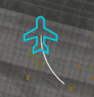

<link rel="stylesheet" href="../../../../stylesheets/efb-interactive.css">

# flyPad Ground

    
    <a href="../dashboard/">   
Dashboard
</a>
    <a href="../dispatch/">    
Dispatch
</a>
    <a href="../ground/">      
Ground
</a>
    <a href="../performance/"> 
Performance
</a>
    <a href="../charts/">      
Navigation & Charts
</a>
    <a href="../online-atc/">  
Online ATC
</a>
    <a href="../failures/">    
Failures
</a>
    <a href="../checklists/">  
Checklists
</a>
    <a href="../presets/">     
Presets
</a>
    <a href="../settings/">    
Settings
</a>
    Click on the menu icons in this image to see other flyPad pages.

## Ground Service

This page allows managing ground operation similar to the in-sim ATC ground services but without having to use the in-sim ATC.

### Connect Jet Bridge

When standing at a gate this connects and disconnects the gate's jetway if a jetway is available at the current gate.

### Door Fwd

Opens and closes the forward door.

### Call Fuel Truck

Calls the fuel truck if available at the current airport. It will take quite a while until the fuel truck while 
arrive. 5-10 minutes is not unusual. When the fuel truck arrives the MSFS fuel page appears.

!!! warning ""
    We have deactivated the MSFS Fuel Page and you can't use it with the FlyByWire A32NX.
    Fuel and payload should be loaded through the [Fuel](#fuel-page) page only. 

### Call Baggage Truck

Calls the baggage service if available at the current airport and gate. Baggage service will open the cargo door, 
load baggage and then close the cargo door automatically.

### Connect External Power

Calls a ground power unit (GPU) if available at the current airport and gate or stand. This can be used if there is 
otherwise no external power available.

### Door Aft

Opens and closes the aft door.

### Call Catering Truck

Calls the catering service if available at the current airport and gate. The catering service will open the aft 
door and automatically closes it after it has virtually supplied the aircraft.

### Ground Equipment 

See [Wheel Chocks and GSE Safety Cones](../wheel-chocks-cones.md)

For settings see: [flyPad Sim Options Settings](settings.md#sim-options)

## Pushback

{--

The flyPadOS 3 pushback system is in general not compatible with other pushback add-ons as they all use 
the same sim variables and will conflict with each other.

See [Pushback System On/Off](#pushback-system-onoff).

--}

    
    <a href="../dashboard/">   
Dashboard
</a>
    <a href="../dispatch/">    
Dispatch
</a>
    <a href="../ground/">      
Ground
</a>
    <a href="../performance/"> 
Performance
</a>
    <a href="../charts/">      
Navigation & Charts
</a>
    <a href="../online-atc/">  
Online ATC
</a>
    <a href="../failures/">    
Failures
</a>
    <a href="../checklists/">  
Checklists
</a>
    <a href="../presets/">     
Presets
</a>
    <a href="../settings/">    
Settings
</a>
    Click on the menu icons in this image to see other flyPad pages.

The flyPad pushback system provides comfortable pushback from within the cockpit using buttons or controllers and the 
built-in map.  

### Pushback System On/Off

As pushback add-ons all use the same sim variables to control and move the aircraft during pushback the flyPad 
pushback system and these add-ons can usually not be used at the same time. Because of this the flyPad pushback system 
can be disabled completely to avoid any interference with other pushback add-ons.

!!! block ""
    {align=center width=49% loading=lazy}
    {align=center width=49% loading=lazy}

A warning message will appear if you enable the system to remind users of these potential incompatibilities.  

External add-ons can recognize the flyPad pushback system and also deactivate it if they choose to do so by 
reading/setting this LVAR variable: `L:A32NX_PUSHBACK_SYSTEM_ENABLED`.

### Call/Release Tug

Pressing this button will call and attach the pushback tug or release it in case it was already attached. 

!!! warning "Tug Animation"
    From the point of view of the aircraft the tug appears to be immediately attached. This is a sim issue as the tug's 
    animation is not in sync with the tug-attached signal to the aircraft. This also allows to pushback immediately 
    although the visual tug is not yet connected to the aircraft.
    

    To overcome this limitation the sim's pushback tug model would need to be changed which would conflict with 
    other pushback add-ons which use this method. We have therefore chosen not to implement this at this time.

When releasing the tug the button will stay amber until the pushback pin is removed and the ECAM memo "NW STRG DISC" 
has disappeared (~15sec). The aircraft cannot be steered with the nose wheel steering pin installed. 

!!! block ""
    {align=center width=32% loading=lazy}
    {align=center width=32% loading=lazy}
    {align=center width=32% loading=lazy}

### Parking Brake

Convenience button to set or release the parking brake while using the pushback system.  

### Forward/Backward

The forward and backward buttons control the speed of the pushback tug. 

The `Forward` button changes the speed in forward direction:

- increase speed when already moving forwards
- decrease speed when moving backwards

The `Backward`button is vice versa. 

### Pause Movement

Pauses all movement and resets speed and direction to zero. 

### Left/Right

The `Left` and `Right` buttons control the direction of the tug-aircraft movement. 

`Left` changes the direction towards the left: 

- more left when already in a left turn
- less right when in a right turn 

`Right` is vice versa. 

### Tug Direction Slider

The tug direction slider can be dragged with the mouse to quickly set the desired direction.

### Tug Speed Slider

The tug speed slider can be dragged with the mouse to quickly set the desired speed.

### Using Rudder and Elevator Control for Pushback

You can use the standard sim rudder axis control for steering left and right.

You can use the standard elevator axis (pitch) for controlling the speed of the pushback tug. 

### Map

The pushback map allows to execute the pushback without leaving the cockpit view. It depicts the airport and ground 
markings so that a precise pushback can be accomplished. 

!!! block ""
    {align=left width=5% loading=lazy}    
    

    The map allows to zoom in and out as require using the zoom buttons. 

!!! block ""
    {align=left width=5% loading=lazy} 
    {align=left width=5% loading=lazy}
    

    If the aircraft symbol is filled the map is in centered aircraft mode and moves with the aircraft movement. 
    If it is outlined the map is fixed and the aircraft symbol is moving.
    

    The map can also be dragged and moved with the mouse. To reset the map to be centered on the aircraft press the 
    aircraft symbol.

!!! block "" 
    {align=left width=15% loading=lazy}
    

    The map also features a turn prediction indicator providing a visual aid while turning. 

## Fuel Page

The fuel page provides accurate information about the quantity of fuel in the different tanks of the aircraft. It 
also allows fueling or de-fueling the aircraft to the desired fuel quantity.

    
    <a href="../dashboard/">   
Dashboard
</a>
    <a href="../dispatch/">    
Dispatch
</a>
    <a href="../ground/">      
Ground
</a>
    <a href="../performance/"> 
Performance
</a>
    <a href="../charts/">      
Navigation & Charts
</a>
    <a href="../online-atc/">  
Online ATC
</a>
    <a href="../failures/">    
Failures
</a>
    <a href="../checklists/">  
Checklists
</a>
    <a href="../presets/">     
Presets
</a>
    <a href="../settings/">    
Settings
</a>
    Click on the menu icons in this image to see other flyPad pages.

### Fuel and De-Fuel

To set the fuel quantity simply click into the input field and change the value to the desired quantity.

If you have loaded a SimBrief flight plan you can import the required fuel directly by pressing the import symbol 
(cloud with down arrow). 

Press the "play" symbol to start the refuelling process (de-fueling if the new quantity is lower than the current).

### Realism Settings for Fuel Time

Set this setting to the desired duration of refueling. Either instant refueling (Instant - but unrealistic), realistic refuel time (Real) or a middle ground (Fast).

After starting the engines only "Instant" is available. 
