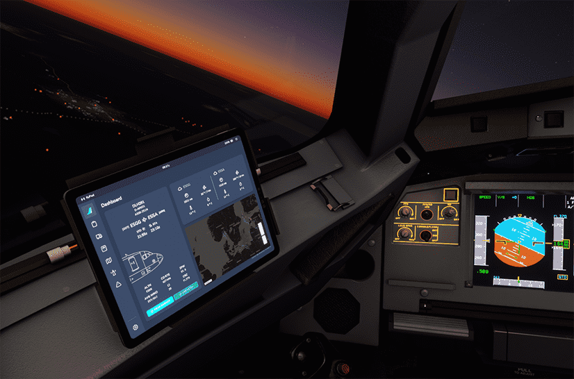
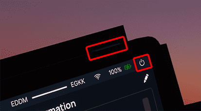

<link rel="stylesheet" href="../../../../stylesheets/efb-interactive.css">
<link rel="stylesheet" href="../../../../stylesheets/toc-tables.css">

# flyPadOS 3 EFB

!!! warning "flyPadOS 3 is only available in the Development version."

    
    <a href="./dashboard/">   
Dashboard
</a>
    <a href="./dispatch/">    
Dispatch
</a>
    <a href="./ground/">      
Ground
</a>
    <a href="./performance/"> 
Performance
</a>
    <a href="./charts/">      
Navigation & Charts
</a>
    <a href="./online-atc/">  
Online ATC
</a>
    <a href="./failures/">    
Failures
</a>
    <a href="./checklists/">  
Checklists
</a>
    <a href="./presets/">     
Presets
</a>
    <a href="./settings/">    
Settings
</a>
    Click on the menu icons in this image to see other flyPad pages.

## Description

!!! warning "Please Note"
    This guide covers the flyPad version and features available in the latest FlyByWire [Development Version](../../fbw-versions.md#version-overview).

    If you use the FlyByWire Stable version you might not have these features available.

!!! abstract "From Wikipedia: [Electronic Flight Bag](https://en.wikipedia.org/wiki/Electronic_flight_bag){target=new}:"

    An electronic flight bag (EFB) is an electronic information management device that helps flight crews perform flight management tasks more easily and efficiently with less paper providing the reference material often found in the pilot's carry-on flight bag, including the flight-crew operating manual, navigational charts, etc. In addition, the EFB can host purpose-built software applications to automate other functions normally conducted by hand, such as take-off performance calculations. The EFB gets its name from the traditional pilot's flight bag, which is typically a heavy (up to or over 18 kg or 40 lb) documents bag that pilots carry to the cockpit.
    
    An EFB is intended primarily for cockpit/flightdeck or cabin use. For large and turbine aircraft, FAR 91.503 requires the presence of navigational charts on the airplane. If an operator's sole source of navigational chart information is contained on an EFB, the operator must demonstrate the EFB will continue to operate throughout a decompression event, and thereafter, regardless of altitude.

The flyPad is FlyByWire's version of an EFB which allows the user to manage the aircraft and the flight by providing access to aircraft settings, flight plans, ground services, performance calculations,navigational charts, online ATC frequencies and more.

The FlyByWire team is in the process of moving all aircraft settings to the EFB and will also add more functionality in the near future.

This documentation takes you through all pages and functions of the flyPad EFB.

## General Usage

The flyPad is organized into several pages. Links to their documentation are below.

To **TURN ON** and **TURN OFF** the flyPad you can either:

!!! block ""
    {loading=lazy align=left width=50%}

    - To turn it on or off click on the "hardware" button on the top right of the tablet.
        - Turning it off via this "hardware" button will also reset the tablet. 
    - To turn it on click anywhere on the screen.
    - To turn it off (standby) click on the On-Off symbol in the top right corner.
    - Turn off and reset the flyPad by clicking and holding the the On-Off symbol.

## Battery Life

The battery life of the flyPad is simulated by discharging the battery over time (9h) when the aircraft is not 
powered. 

This can happen quickly if you change the time of day of the sim after starting the flight.

If the flyPad is empty, it will show a red empty battery symbol. To charge it you only need to power up the aircraft 
(Ext. Pwr, APU or at least one engine).

## flyPad Pages

|                      Quick Links                       |
|:------------------------------------------------------:|
|            [flyPad Dashboard](dashboard.md)            |
|             [flyPad Dispatch](dispatch.md)             |
|               [flyPad Ground](ground.md)               |
|          [flyPad Performance](performance.md)          |
|        [flyPad Navigation & Charts](charts.md)         |
|           [flyPad Online ATC](online-atc.md)           |
|             [flyPad Failures](failures.md)             |
|           [flyPad Checklists](checklists.md)           |
|              [flyPad Presets](presets.md)              |
|             [flyPad Settings](settings.md)             |
| [flyPad Throttle Calibration](throttle-calibration.md) |

