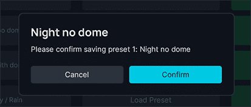

<link rel="stylesheet" href="../../../../stylesheets/efb-interactive.css">

# Interior Lighting and Aircraft Presets

## Interior Lighting Presets

    
    <a href="../dashboard/">   
Dashboard
</a>
    <a href="../dispatch/">    
Dispatch
</a>
    <a href="../ground/">      
Ground
</a>
    <a href="../performance/"> 
Performance
</a>
    <a href="../charts/">      
Navigation & Charts
</a>
    <a href="../online-atc/">  
Online ATC
</a>
    <a href="../failures/">    
Failures
</a>
    <a href="../checklists/">  
Checklists
</a>
    <a href="../presets/">     
Presets
</a>
    <a href="../settings/">    
Settings
</a>
    Click on the menu icons in this image to see other flyPad pages.

### Usage

The Interior Lighting Presets page allows you to save and load up to 8 presets for lighting levels of all internal 
lights and display brightness settings. 

!!! tip "Lighting Preset can only be loaded and saved when the aircraft is powered." 

#### Changing Preset Name

To change a preset's name click on the current name of the preset and change the name to any string up to 16 
characters. When you leave the input field a confirmation dialog will ask you to confirm the name change. Press 
`Confirm` to save the new name.   

#### Load a Preset

To load a preset please click on the "Load Preset" button. The aircraft must be powered for the buttons to be enabled. 

#### Save a Preset

To save a preset please click on the "Save Preset" button. The aircraft must be powered for the buttons to be enabled.

A confirmation dialog will appear to prevent you to accidentally overwrite existing presets. 

## Aircraft Presets

Aircraft presets allow you to automatically let a virtual co-pilot set up your aircraft to the requested preset state. 

When loading a preset the virtual co-pilot will perform all necessary setup tasks in real time. Therefore, systems 
like ADIR alignment, APU start, Engine starts will take the usual time to start up. 

You as the pilot can use the time to set up the FMGC (MCDU), Flight Control Unit (FCU), Transponder-Ident and radios.

!!! warning "It is important that you still set up the MCDU and FCU correctly for a successful flight."

!!! tip "Aircraft presets can only be used on the ground."

!!! tip "Interference While Loading a Preset" 
    You can interfere with the setup of the virtual co-pilot any time, but it will be your own responsibility to make sure 
    the setup is correct after the virtual co-pilot has finished setting up. Also, there is the risk that the virtual 
    co-pilot will wait for certain steps to complete forever if you interrupt these steps before they complete. 

    E.g. if the virtual co-pilot started the APU and you turn it off before the procedure is complete it can happen 
    that the virtual co-pilot waits in vain for this step to complete. In this case you must cancel the loading with 
    the `Cancel` button. 

### Loading a Preset

    
    <a href="../dashboard/">   
Dashboard
</a>
    <a href="../dispatch/">    
Dispatch
</a>
    <a href="../ground/">      
Ground
</a>
    <a href="../performance/"> 
Performance
</a>
    <a href="../charts/">      
Navigation & Charts
</a>
    <a href="../online-atc/">  
Online ATC
</a>
    <a href="../failures/">    
Failures
</a>
    <a href="../checklists/">  
Checklists
</a>
    <a href="../presets/">     
Presets
</a>
    <a href="../settings/">    
Settings
</a>
    Click on the menu icons in this image to see other flyPad pages.

To load a preset click on the corresponding preset button. 

    
    <a href="../dashboard/">   
Dashboard
</a>
    <a href="../dispatch/">    
Dispatch
</a>
    <a href="../ground/">      
Ground
</a>
    <a href="../performance/"> 
Performance
</a>
    <a href="../charts/">      
Navigation & Charts
</a>
    <a href="../online-atc/">  
Online ATC
</a>
    <a href="../failures/">    
Failures
</a>
    <a href="../checklists/">  
Checklists
</a>
    <a href="../presets/">     
Presets
</a>
    <a href="../settings/">    
Settings
</a>
    Click on the menu icons in this image to see other flyPad pages.

To avoid accidentally loading a preset a confirmation dialog will appear. 

    
    <a href="../dashboard/">   
Dashboard
</a>
    <a href="../dispatch/">    
Dispatch
</a>
    <a href="../ground/">      
Ground
</a>
    <a href="../performance/"> 
Performance
</a>
    <a href="../charts/">      
Navigation & Charts
</a>
    <a href="../online-atc/">  
Online ATC
</a>
    <a href="../failures/">    
Failures
</a>
    <a href="../checklists/">  
Checklists
</a>
    <a href="../presets/">     
Presets
</a>
    <a href="../settings/">    
Settings
</a>
    Click on the menu icons in this image to see other flyPad pages.

During the loading the status bar will show the currently executed step. 

    
    <a href="../dashboard/">   
Dashboard
</a>
    <a href="../dispatch/">    
Dispatch
</a>
    <a href="../ground/">      
Ground
</a>
    <a href="../performance/"> 
Performance
</a>
    <a href="../charts/">      
Navigation & Charts
</a>
    <a href="../online-atc/">  
Online ATC
</a>
    <a href="../failures/">    
Failures
</a>
    <a href="../checklists/">  
Checklists
</a>
    <a href="../presets/">     
Presets
</a>
    <a href="../settings/">    
Settings
</a>
    Click on the menu icons in this image to see other flyPad pages.

It will also show when the execution pauses for certain steps to complete. For example ADIR alignment, the 
APU start and the engines starts.

    
    <a href="../dashboard/">   
Dashboard
</a>
    <a href="../dispatch/">    
Dispatch
</a>
    <a href="../ground/">      
Ground
</a>
    <a href="../performance/"> 
Performance
</a>
    <a href="../charts/">      
Navigation & Charts
</a>
    <a href="../online-atc/">  
Online ATC
</a>
    <a href="../failures/">    
Failures
</a>
    <a href="../checklists/">  
Checklists
</a>
    <a href="../presets/">     
Presets
</a>
    <a href="../settings/">    
Settings
</a>
    Click on the menu icons in this image to see other flyPad pages.

### Canceling Loading a Preset

You can cancel loading of a preset any time by pressing the `Cancel` button. The currently executed step will be 
completed and the aircraft will be in between presets in the state up to the last executed step. You can then either 
complete the setup manually or simply click another preset (or the same) to be loaded.   

### Aircraft States Overview

| State              | System                      |
|--------------------|-----------------------------|
| Cold & Dark        | All Systems Off             |
|                    |                             |
| Turnaround         | BAT 1+2 On                  |
|                    | EXT PWR On                  |
|                    | APU Master On               |
|                    | APU Start On                |
|                    | AC BUS Avail Check          |
|                    | Nav & Logo Lt On            |
|                    | ADIRS 1,2,3 Nav             |
|                    | GND CTL On                  |
|                    | Crew Oxy On                 |
|                    | NO SMOKING Auto             |
|                    | EMER EXT Lt Arm             |
|                    | APU Avail Check             |
|                    | APU Bleed On                |
|                    |                             |
| Ready for Pushback | EXT PWR Off                 |
|                    | FUEL PUMP 1-6 On            |
|                    | PWS Auto                    |
|                    | Transponder On              |
|                    | ATC ALT RPTG On             |
|                    | TCAS TRAFFIC ABV            |
|                    | COCKPIT DOOR LCK            |
|                    | Strobe Auto                 |
|                    | Beacon On                   |
|                    | SEAT BELTS On               |
|                    | ADIRS 1,2,3 Await Alignment |
|                    |                             |
| Ready for Taxi     | ENG MODE SEL START          |
|                    | ENG 2 ON                    |
|                    | ENG 2 Avail Check           |
|                    | ENG 1 ON                    |
|                    | ENG 1 Avail Check           |
|                    | ENG MODE SEL NORM           |
|                    | APU Bleed Off               |
|                    | APU Master Off              |
|                    | Autobrake Max               |
|                    | Spoiler Arm                 |
|                    | Rudder Trim Reset           |
|                    | Flaps 1                     |
|                    | NOSE Lt Taxi                |
|                    | RWY TURN OFF Light L&R On   |
|                    |                             |
| Ready for Takeoff  | WX Radar On                 |
|                    | WX Radar Mode               |
|                    | TCAS Switch TA/RA           |
|                    | NOSE Light Takeoff          |
|                    | Landing Light L&R On        |

## Quick Help

For convenience there is also a summarized help page in the flyPad for your reference. 

    
    <a href="../dashboard/">   
Dashboard
</a>
    <a href="../dispatch/">    
Dispatch
</a>
    <a href="../ground/">      
Ground
</a>
    <a href="../performance/"> 
Performance
</a>
    <a href="../charts/">      
Navigation & Charts
</a>
    <a href="../online-atc/">  
Online ATC
</a>
    <a href="../failures/">    
Failures
</a>
    <a href="../checklists/">  
Checklists
</a>
    <a href="../presets/">     
Presets
</a>
    <a href="../settings/">    
Settings
</a>
    Click on the menu icons in this image to see other flyPad pages.

