# Throttle Calibration

!!! warning "Please Note"
    Throttle Calibration is required for all versions of the FlyByWire A32NX.

## Introduction

This guide will help you set up your throttles for use with the FlyByWire A32NX.

There are many controllers available to use in Microsoft Flight Simulator. Many have dedicated throttle levers/sliders and some have sliders which can be used as throttle levers/sliders.

Although configuration and calibration is similar for most controllers there are subtle differences between different brands and models.

The major differences between different throttle controllers are:

- Number of axis (levers/sliders).
- Having detents or not.
- Having a reverser range on the throttle axis or not.
- Button on the lever/slider to engage reverser or not.

!!! warning "Please read this guide carefully and follow it step-by-step. Do not just skim over and skip steps as the calibration might then fail."

??? note "Collection of Controllers and their Features"

    | Controller                                |    Reverser     | # of axis | Detents  |
    |:------------------------------------------|:---------------:|:---------:|:--------:|
    | Thrustmaster TCA                          |     On Axis     |     2     |    3     |
    | Thrustmaster TWCS                         |   Any Button    |     1     |    0     |
    | Honeycomb Bravo Throttle Quadrant         | Reverser Button |     2     |    ?     |
    | Thrustmaster T.16000M FCS (Flight Stick)  |   Any Button    |     1     |    0     |
    | Thrustmaster TCA Sidestick Airbus edition | Reverser Button |     1     | 1 (Idle) |

    Use this table to identify how to configure and calibrate your controller with the steps described below.

---

<style>
.md-typeset summary {
    font-size: .8rem;
    font-weight: inherit;
}
.md-typeset details {
    font-size: .8rem;
}
.md-typeset .admonition.danger {
    font-size: 0.9rem;
    margin-bottom: 0;
}
</style>

!!! tip "Resetting to Defaults"
    Before you start with calibration consider resetting your settings to default values as described here: [Resetting To Defaults](#resetting-to-defaults)

## Microsoft Flight Simulator Control Options

!!! danger "PLEASE DO NOT SKIP THIS SECTION!"

### 1. Create a Separate Controller Profile in Microsoft Flight Simulator

Before you change anything in the controller profile make sure to create a dedicated controller profile for the FlyByWire A32NX in Microsoft Flight Simulator so that any changes to the throttle configuration does not impact any other aircraft.

??? note "How to Create a New Controller Profile"
    Microsoft Flight Simulator allows you to create separate profiles for different controllers. To do that change to the `DEFAULT` profile of your controller and create a copy of it (`DUPLICATE`).

    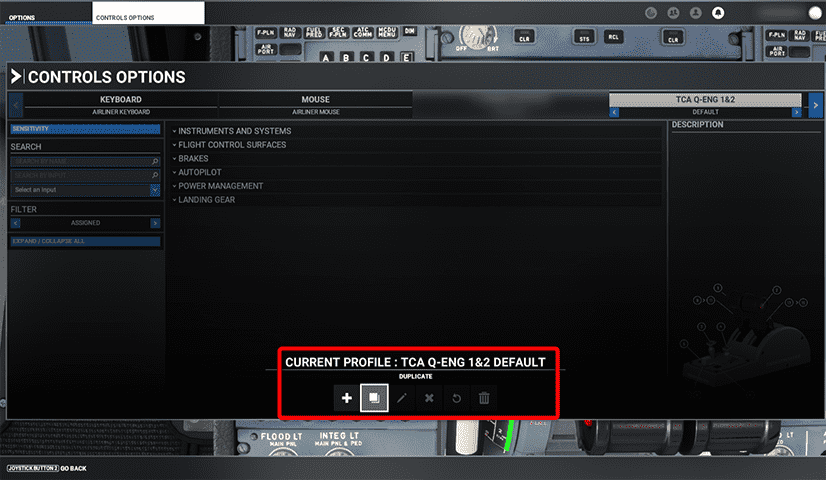{loading=lazy}

### 2. Set Sensitivity to Linear

Set all sensitivity settings to 0%. This includes Sensitivity + and -, Dead Zone, Neutral and Extremity Dead Zone. Leave Reactivity at 100%.

??? note "How to Set Sensitivity to Linear"
    Set your Sensitivity settings exactly like this:

    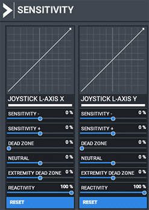{loading=lazy}

### 3. Axis Mapping

Check that the axis mappings are correct.

??? note "How to Set Axis Mapping"

    Your controller needs to have an axis which can be used as a throttle lever. This axis needs to be mapped to the throttle input of Microsoft Flight Simulator. Most controllers will be mapped automatically by Microsoft Flight Simulator in the default profile.

    If this is not the case you can find out which controller axis is used by your controller by using the Sensitivity dialog and move the lever to see which axis is moving.

    You can use ^^either^^ of these MSFS inputs:

    - `THROTTLE 1 AXIS (0 TO 100%)` and `THROTTLE 2 AXIS (0 TO 100%)`<br/>(for a throttle with two levers)
        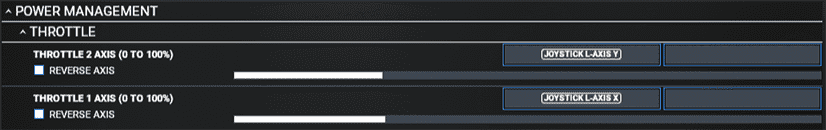{loading=lazy}

    - `THROTTLE 1 AXIS` and `THROTTLE 2 AXIS`<br/>(for a throttle with two levers)
        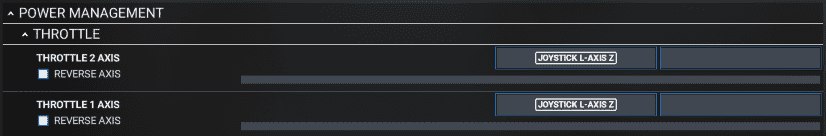{loading=lazy}

    - `THROTTLE AXIS`<br/>(for a throttle with one lever)
        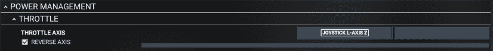{loading=lazy}

    Make sure if you move the throttle all the way from lowest setting to highest setting that the white bar underneath the mapping line also moves all the way in both directions.

??? tip "You can't see all options? Try this!"

    Make sure to set the filter to show all options like this:

    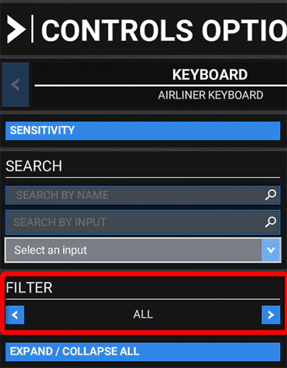

??? tip "Test the Movement of the Throttle in the Cockpit Now!"
    The throttle in the cockpit should now move in the correct direction. If not check the `Reverse Axis` box here:

    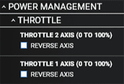{loading=lazy}

    !!! warning "Don't worry if the throttle does move all the way or moves too far into reverse now. Only the movement direction is important at this point. "

### 4. Reverser Setup (when not on axis)

If your throttle does not have a range for the reverser there are two ways to activate and simulate reverser with buttons.

??? note "How to Set Up Reverser: Controller With a Separate Button or Key"
    Microsoft Flight Simulator allows the mapping of a key or button to use the normal throttle axis as the reverser axis. To configure this chose a key or button on your controller and map it like this:

     {loading=lazy}

    To activate the reverser hold the configured button while applying thrust with your thrust lever. Instead of forward thrust this will apply reverse thrust. The cockpit levers will move backwards into the reverser range.

    Alternatively you can use `TOGGLE THROTTLE REVERSE THRUST` to use a button or key to activate reverse thrust. While this is active you can push the throttle forward to increase reverse thrust. To deactivate reverse thrust you need to press the mapped key/button again.

    

??? note "How to Set Up Reverser: Controllers With Buttons Built Into the Throttle"
    Some controllers have built in buttons that activate when the throttle is moved into the reverse position. With these controllers you can't use the above method as you would have to move the throttles forward to increase reverse thrust. But this would release the reverse button and apply normal forward thrust.

    To simulate reverse thrust with these throttle controllers you can map the reverser button(s) to the `THROTTLE 1/2 DECREASE`. So as long as you keep the controller levers in the reverse position the throttle will be decreased up to full reverse thrust. To stop reverse thrust you would move the throttle forward (button will be released) and apply a little thrust so the throttle moves to a non-reverse value again.

    ??? note "Example: Honeycomb Bravo Throttle Quadrant"
        The mapping required for the Bravo is shown in this screenshot:

        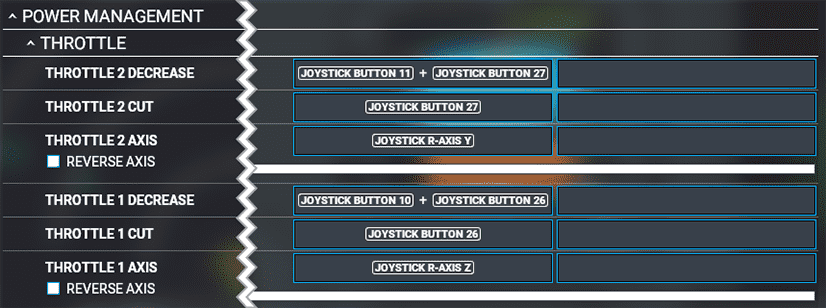{loading=lazy}

        The `THROTTLE 1/2 DECREASE` mapping to `Buttons 10,26` and `Buttons 11,27` simulates the reverser when the Bravo's reverser lever is lifted (buttons 10 and 11) and the thrust lever is pulled back (buttons 26 and 27). This activates the buttons configured in the image above and in turn decreases throttle power to negative values for the reverser.

        If you release the reverser levers (buttons 10+11) the mapping to `THROTTLE CUT` activates and put the thrust back to idle.

        If you use the GA levers you will need to map the reverser to some other button, e.g. on your yoke/side stick, as the reverser buttons (10, 11) will not be there.

### 5. Test

??? tip "Do not go on with the guide without successfully testing the following:"

    - The throttle in the cockpit should now move in the correct direction.
    - The throttle in the cockpit should move to TOGA when you set your controller to full thrust.
    - The throttle in the cockpit should move to IDLE or FULL REVERSE when you set your controller to the lowest possible setting.

If the tests are successful please move to the next chapter. Otherwise, go through this chapter again to fix any issues.

!!! danger "PLEASE DO NOT SKIP THE SECTION ABOVE"

---

## A32NX flyPad (EFB) Detent Calibration

### 1. flyPad Calibration Page

??? note "Where Is the Throttle Configuration?"
    Open the flyPad (maybe pop it out to a separate window next to the throttle with ++ralt+left-button++) and go to **Sim Options (Tab)** -> **Calibrate**.
    <p/>
    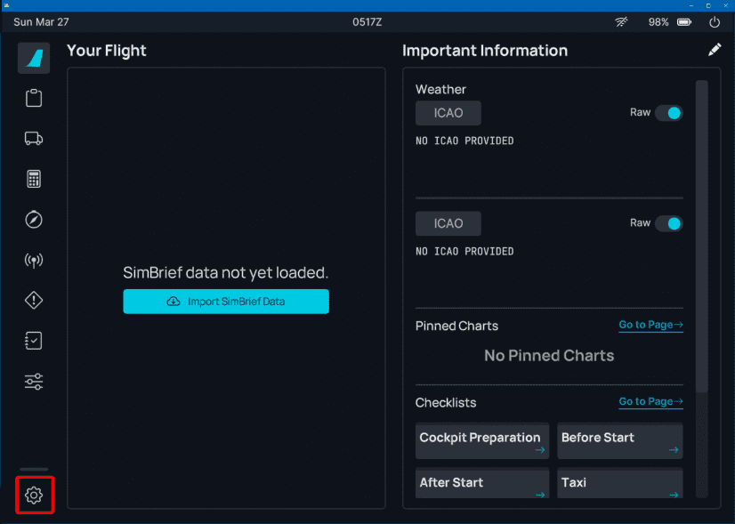{loading=lazy}
    <p/>
    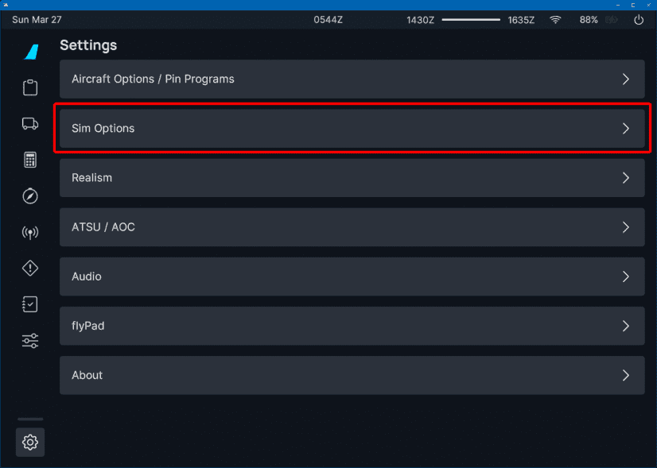{loading=lazy}
    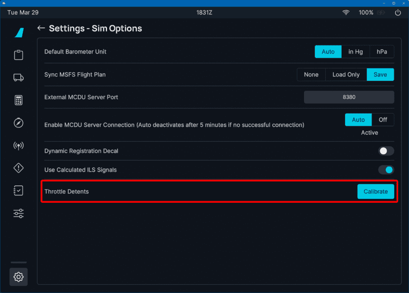{loading=lazy}
    <p/>
    Throttle Calibration Page:
    <p/>
    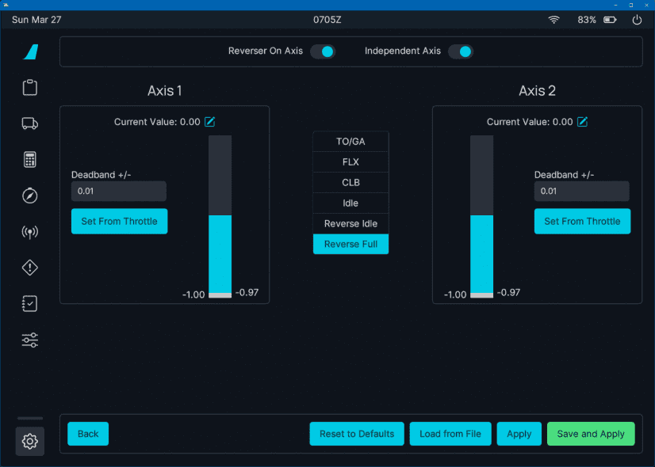{loading=lazy}

### 2. Set Up Your Controller Characteristics

Configure the basic characteristics of your controller at the top of the calibration page.

??? note "How to Set Up the Controller Basics"
    {loading=lazy}

    Set `Reverser on Axis` to ON if your throttle has a range for the reverser thrust (lowest setting is full reverse).

    Set `Reverser on Axis` to OFF if your throttle does not have a range for the reverser thrust (lowest setting is idle).

    Set `Independent Axis` to ON if you have two throttle levers. If you only have one throttle lever set it to OFF.

    Examples for Common Hardware:

    | Controller                        | Reverser on Axis | Independent Axis |
    |:----------------------------------|:----------------:|:----------------:|
    | Thrustmaster TCA                  |        ON        |        ON        |
    | Thrustmaster TWCS                 |       OFF        |       OFF        |
    | Honeycomb Bravo Throttle Quadrant |       OFF        |        ON        |
    | Keyboard / Xbox (buttons)         |       OFF        |       OFF        |

### 3. Deadband / Range Setting

Analog controllers always have some imprecision, and it is necessary to define a range of values which should be 
treated as a valid range for a detent. This is called a `deadband`.

{==

Usually there is no need to change the deadbands for the detents as the default values are sufficient in most cases!

==}

??? note "How to Check and Change the Deadbands"
    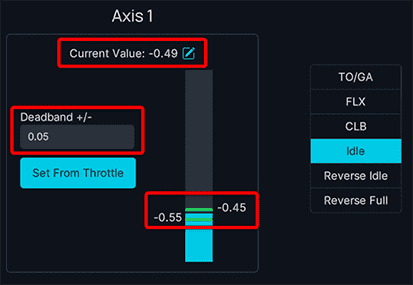{loading=lazy}

    The image above shows the controller in the `IDLE` position with a
    control value of -0.50.

    As some controllers might be at a lower or higher value than -0.50
    and even the same controller might sometimes have slightly different values although in the same position, the `deadband` of 0.05 ensures that small differences in actual values are treated as within a valid range for the `IDLE` position. In this case all values from -0.55 to -0.45 are valid `IDLE` positions.

    Notice that the blue bar correspondents to current throttle position and is between two green lines. The green lines mark your deadband range for the detent. As long as the blue bar is between them, the throttle reads this as the corresponding detent. If your throttle is outside these green bars they become gray as you no longer are in the corresponding detent.

    If your controller values vary a lot although in the same position the value might sometimes be outside the deadband range. In this case carefully increase the deadband value to include the value variations of the controller.

    !!! warning "Do not change the deadband if not necessary and also never set a too large value as deadband ranges mustn't overlap!"

### 4. Start With Full Reverser (or Idle)

We start the detent calibration with the lowest throttle setting.

??? note "How to Calibrate: Controllers With Reverser on Axis"
    For controllers with Reverser the lowest setting is `Full Reverse`.
    Pull your controller levers all the way back into the `Full Reverse` position.
    <p/>
    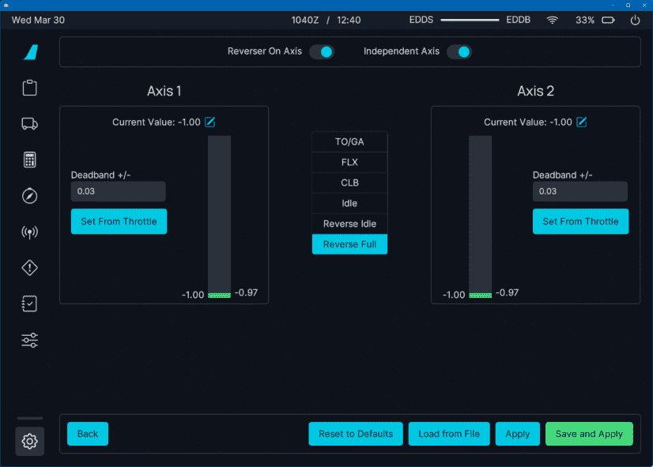{loading=lazy}
    <p/>
    The "Current Value" should be close to -1.0.
    <p/>
    {== Press "Set From Throttle" on both sides. ==}

??? note "How to Calibrate: Controllers Without Reverser on Axis"
    For controllers without Reverser the lowest setting is `IDLE`.
    Pull your controller levers all the way back into the `IDLE` position.
    <p/>
    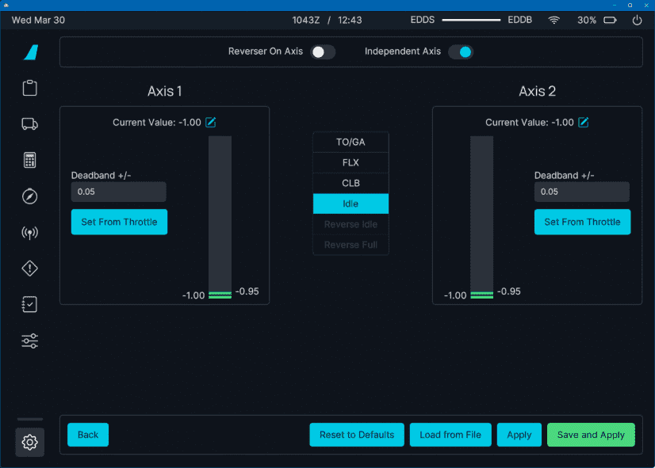{loading=lazy}
    <p/>
    The "Current Value" should be close to -1.0.
    <p/>
    {== Press "Set From Throttle" on both sides. ==}

### 5. Go Through All Detents

Go through all detents from the lowest thrust to the highest thrust carefully and
repeat the process from [Step 4.](#4-start-with-full-reverser-or-idle) for each detent.

??? note "How to Calibrate All Detents"
    Set the controller lever to the desired position and click the corresponding button on the calibration page.

    {== Press "Set From Throttle" on both sides for each detent. ==}

    1. Reverse Full (if you have reverser on axis)
    2. Reverse Idle (if you have reverser on axis)
    3. Idle
    4. CLB
    5. FLX
    6. TO/GA

### 6. Save and Apply

Click on "Save & Apply".

??? note "Save & Apply"
    {loading=lazy}

### 7. Test

??? tip "How to Test Calibration"
    Test each setting with a view like this. Make sure the mouse is outside the pop-out window otherwise the 
    aircraft's throttles won't move.
    <p/>
    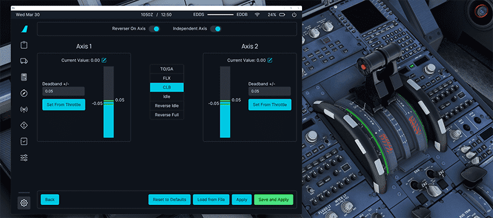{loading=lazy}
    <p/>
    Do a short test flight to confirm that all detents work as expected and also that reversers work as expected.

---

## Controller Specifics

??? note "Thrustmaster TCA Throttle"
    ### Thrustmaster TCA Throttle

    #### Full Reverse

    - Make sure that your TCA throttles are all the way back to Full Reverse (pull the **Reverse Levers** up to do so).

        {loading=lazy}

    - Open the flyPad (maybe pop it out to a separate window next to the throttle with ++ralt+left-button++) and go to **Settings** -> **Calibrate**.

        Throttle Calibration Page:

        {loading=lazy}

    - Set **`Reverser on Axis`**  to ON (see **1** in image).

    - Set **`Independent Axis`** to ON (see **2** in image).

    - Click on **`Reverse Full`** in the middle **(3)**
        - Confirm that the value for Axis 1 **(4)** and Axis 2 is -1.0 (or very close to).

        !!! info ""
            To get the current throttle values it might be necessary to move the mouse outside the EFB window if you popped out the window with ++ralt+left-button++

    - Click on **`Set From Throttle`** for Axis 1 **(6)** and Axis 2 **(7)**.

    #### Reverse Idle

    - Move your TCA throttle forward until the **Reverse Levers** snap back and then pull the **Reverse Levers** up again and move the throttle back a bit. There is no detent for **Reverse Idle** so just make sure it is not all the way back but well out of the **Idle Detent**.

        !!! info ""
            To get the current throttle values it might be necessary to move the mouse outside the EFB window if you popped out the window with ++ralt+left-button++

        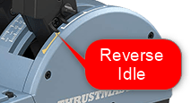{loading=lazy}

    - Click on **Reverse Idle** in the middle **(3)**
    - Click on **Set From Throttle** for Axis 1 **(6)** and Axis 2 **(7)**.

        {loading=lazy}

        !!! info ""
            Notice how the blue bar (current throttle position) is between two green lines. These green lines are your deadband range for the detent. As long as the blue bar is between them, the throttle reads this as the corresponding detent (in this case **Reverse Idle**). If you move the throttle outside these green bars they become gray as you now no longer are in the corresponding detent.

            You can enlarge the deadband by increasing the value above the "Set From Throttle" button. Currently this is 0.05 - set it as required which will move the green lines down/up.

            **Usually the default values are sufficient.**

    #### Idle

    - Move the TCA throttle into the IDLE detent by moving it forward until the **Reverse Levers** snap back then pull the throttle levers back against the reverse lock.
    - Click on **Idle** in the middle **(3)**.
    - Click on **Set From Throttle** for Axis 1 **(6)** and Axis 2 **(7)**.

        {loading=lazy}

    #### CLB

    - Move the TCA throttle forward one detent (CLB detent).
    - Click on **CLB** in the middle **(3)**.
    - Click on **Set From Throttle** for Axis 1 **(6)** and Axis 2 **(7)**.

        {loading=lazy}

    #### FLX/MCT

    - Move the TCA throttle forward one detent (FLX/MCT detent).
    - Click on **FLX** in the middle **(3)**.
    - Click on **Set From Throttle** for Axis 1 **(6)** and Axis 2 **(7)**.

        {loading=lazy}

    #### TOGA

    - Move the TCA throttle all the way forward (TO GA).
    - Click on **TOGA** in the middle **(3)**
    - Click on **Set From Throttle** for Axis 1 **(6)** and Axis 2 **(7)**.

        {loading=lazy}

    - Click on "SAVE AND APPLY" **(8)**

        {loading=lazy}

    - Test each setting with a view like this. Make sure the mouse is outside the pop-out window otherwise the 
      aircraft's throttles won't move.

        {loading=lazy}

    **Congratulations! You have successfully calibrated your TCA Throttle!**


??? note "Thrustmaster TWCS Throttle"
    ### Thrustmaster TWCS Throttle

    This describes the calibration of a single axis throttle with no Reverser on Axis and also no detents.

    {loading=lazy}

    #### Throttle Mapping

    "){loading=lazy}

    This throttle does not have reversers on its axis, so we need to map the reverser activation onto a button on the throttle or key on the keyboard (see **2** below). In the example below we used the button "3" for this.

    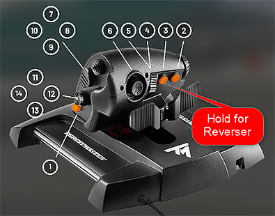{loading=lazy}

    Hold this button and push the throttle forward to increase reverse thrust.

    #### Calibrating in the FlyByWire flyPad (EFB)

    - Go to the flyPad Throttle Calibration page

        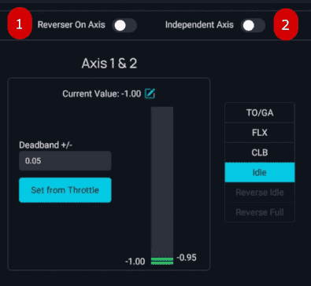{loading=lazy}

    - As this throttle has no reverse and only one real axis, set the `Reverser on Axis` to OFF **(1)** and also the `Independent Axis` to OFF **(2)**

    - Move the throttle all the way back to idle.

    - As described above we go through all detents and set the values accordingly with `Set From Throttle`. The easiest way to do that is by having the flyPad in a separate window next to the throttle as in the screenshot below.

        {loading=lazy}

    - For the detents CL, FLX and TO GA you can increase the dead zone to make it easier to move your throttle into the detents.

        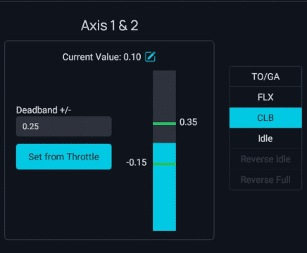{loading=lazy}

        In this example we have set the dead zone to 0.25 on either side of the actual setting. For FLX and TO GA you can use 0.10 or 0.15.

    !!! warning "Do not overlap any deadband ranges between detents!"

    - Click on "SAVE AND APPLY" **(8)** and test everything

        {loading=lazy}

    **Congratulations! You have successfully calibrated your throttle!**

??? note "Honeycomb Bravo Throttle Quadrant"
    ### Honeycomb Bravo Throttle Quadrant

    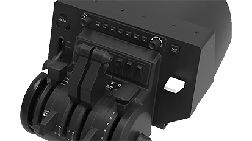

    The Honeycomb Bravo Throttle Quadrant does not have a real reverser on axis but emulates this by using a button when pulled back into the reverser position.

    This makes configuration a bit awkward because Microsoft Flight Simulator is not capable to directly use this setup for a realistic reverser functionality.

    To realistically use the reverser the pilot would lift the reverser lever and the pull the throttle back into the reverser range of the throttle axis.

    There is however a way to simulate this with MSFS and the FlyByWire Throttle Calibration as described below.

    #### Throttle Mapping

    The mapping required for the Bravo is shown in this screenshot:

    {loading=lazy}

    You might need to use `THROTTLE 1/2 AXIS` and not `THROTTLE 1/2 AXIS (0 TO 100%)`.

    Also do make sure to have `REVERSE AXIS` unchecked!

    The `THROTTLE 1/2 DECREASE` mapping to `Buttons 10,26` and `Buttons 11,27` simulates the reverser when the Bravo's reverser lever is lifted (buttons 10 and 11) and the thrust lever is pulled back (buttons 26 and 27). This activates the buttons configured in the image above and in turn decreases throttle power to negative values for the reverser.

    If you release the reverser levers (buttons 10+11) the mapping to `THROTTLE CUT` activates and put the thrust back to idle.

    If you use the GA levers you will need to map the reverser to some other button, e.g. on your yoke/side stick, as the reverser buttons (10, 11) will not be there.

    #### Calibrating in the FlyByWire flyPad (EFB)

    ??? tip "Tip: Default Values for Bravo"
        You can use these default values for the Bravo throttle. See [Manual Configuration](#manual-configuration) on how to do this.

        You still should verify the configurations as described below as all hardware units are slightly different.

        ```ini title="ThrottleConfiguration.ini"
        [throttle_common]
        reverse_on_axis = false

        [throttle_axis_1]
        reverse_low = -1.000000
        reverse_high = -0.950000
        reverse_idle_low = -0.720000
        reverse_idle_high = -0.620000
        idle_low = -1.000000
        idle_high = -0.900000
        climb_low = -0.161230
        climb_high = 0.138770
        flex_mct_low = 0.840000
        flex_mct_high = 0.940000
        toga_low = 0.950000
        toga_high = 1.000000
    
        [throttle_axis_2]
        reverse_low = -1.000000
        reverse_high = -0.950000
        reverse_idle_low = -0.720000
        reverse_idle_high = -0.620000
        idle_low = -1.000000
        idle_high = -0.900000
        climb_low = -0.169348
        climb_high = 0.130652
        flex_mct_low = 0.820000
        flex_mct_high = 0.920000
        toga_low = 0.950000
        toga_high = 1.000000
        ```

    - Go to the flyPad Throttle Calibration page

    - As this throttle has no reverser on the axis, set the `Reverser on Axis` to OFF but set `Independent Axis` to ON.

        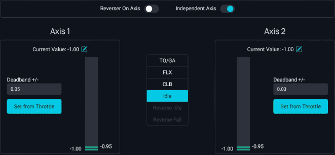{loading=lazy}

    - Move the throttle all the way back to idle.

    - As described above we go through all detents and set the values accordingly with `Set From Throttle`.

    - For the detents CL, FLX and TO GA you can increase the dead zone to make it easier to move your throttle into the detents.

        {loading=lazy}

        In this example we have set the dead zone to 0.25 on either side of the actual setting. For FLX and TO GA you can use 0.10 or 0.15.

    - Click on "SAVE AND APPLY" **(8)** and test everything

        {loading=lazy}

    **Congratulations! You have successfully calibrated your throttle!**

??? note "Keyboard"
    ### Keyboard

    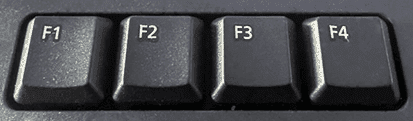{loading=lazy}

    ==No calibration required for keyboard - read below!==

    The keyboard does not have any axis which could be used for controlling the throttles. It uses various keys to increase and decrease the throttles or to set the throttles to predetermined positions.

    !!! warning "Please Note the Following"
        If you have trouble hitting the detents with the keyboard you might have an old configuration which has detents defined that are smaller than the 0.05 button stroke step size. To fix this you either:

        - Manually remove the old ThrottleConfiguration.ini in our work folder.
            - See [Work Folder Section](#work-folder) for details.
        - Fix the problematic detent's deadband size to be large than 0.05.

    The default Microsoft Flight Simulator mappings is:

    - ++ctrl+f1++: Set throttles to `IDLE`
    - ++ctrl+f2++: `Decrease` throttle by 1/40th  (below IDLE this engages the reverser)
    - ++ctrl+f3++: `Increase` throttle by 1/40th
    - ++ctrl+f4++: Set throttles to `TO/GA`

    The A32NX throttle calibration uses values from -1.0 to +1.0:

    - `Full Reverse` is at -1.0
    - `IDLE` detent is at -0.5
    - `CLB` detent is at 0.0
    - `MCT/FLX` is at 0.5
    - `TO/GA` is at +1.0.

    The step size for ++f2++ and ++f3++ is 0.05. This result in 40 steps in total from `Full Reverse` to `TO/GA`. The `CLB` detent is right in the middle at 20 steps.

    With the default throttle configuration built into the A32NX this results in the following number of steps:

    **Counting from `IDLE` (-0.5):**

    - 10 times ++ctrl+f2++ (decrease) for `Full Reverse` (-1.0)
    - 10 times ++ctrl+f3++ (increase) for `CLB` detent (-0.0)
    - 10 times ++ctrl+f3++ (increase) for `MCT/FLX` detent (0.5)
    - 10 times ++ctrl+f3++ (increase) for `TO/GA` detent (1.0)

    **Congratulations! You can use the keyboard for throttle control!**

??? tip "Keyboard Special Mapping"
    ### Keyboard Special Mapping

    To make your life a bit easier when using a keyboard for your throttles, you
    can follow the tips described here.

    Create the following key mapping:

    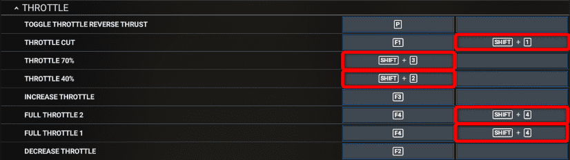{loading=lazy}

    Of course instead of ++shift+1++ to ++shift+4++ you can use any key or controller buttons you like.

    You can now use the [above](#a32nx-flypad-efb-detent-calibration) described method to calibrate your keyboard throttle positions to the correct detents.

    This should look similar to this although the exact number may vary a bit.

    - Press IDLE = ++shift+1++ and check that the throttle is at IDLE
        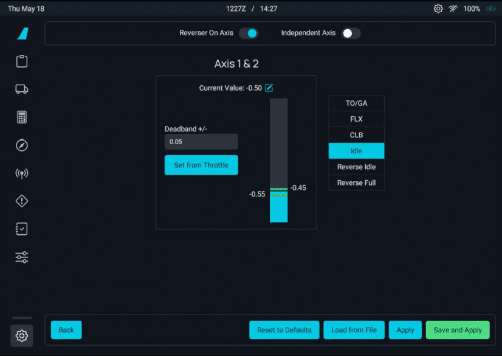{loading=lazy}

    - CLB = ++shift+2++
        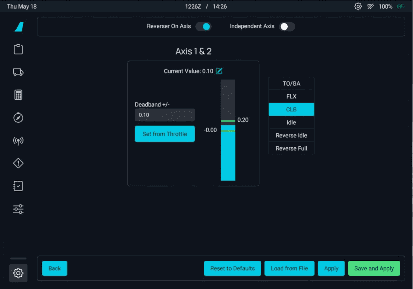{loading=lazy}

    - FLX/MCT = ++shift+3++
        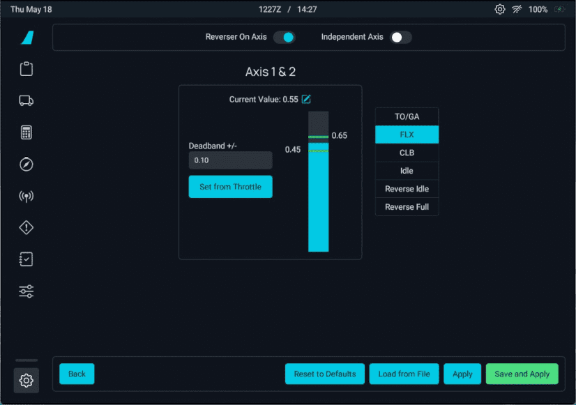{loading=lazy}

    - TOGA = ++shift+4++
       {loading=lazy}

    - REV IDLE = from IDLE position press 3 times ++F2++
        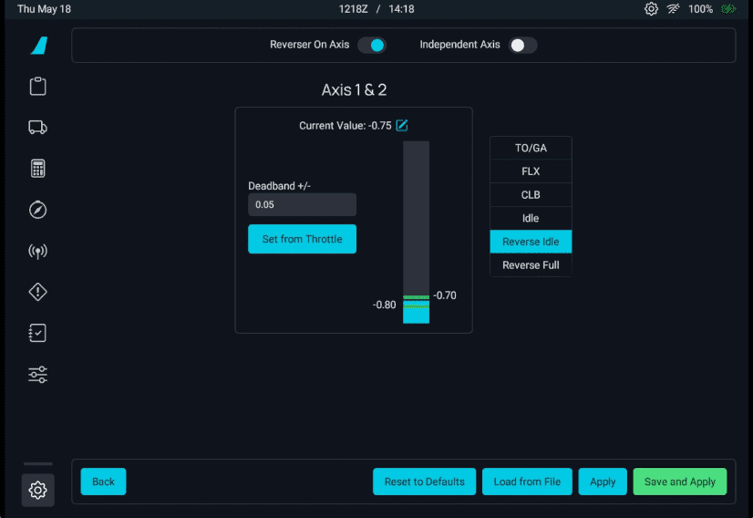{loading=lazy}

    - REV FULL = from IDLE position keep ++F2++ pressed
        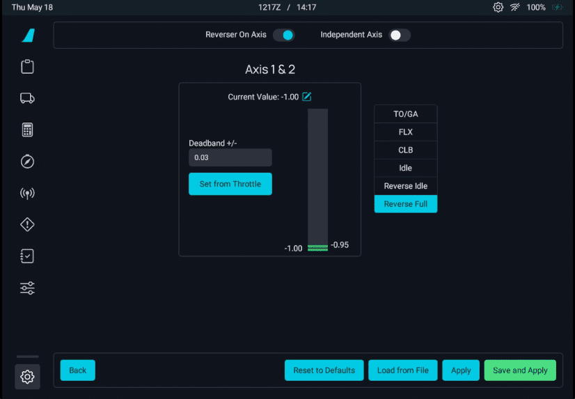{loading=lazy}

    **Congratulations! You can use the keyboard for throttle control!**

??? note "Xbox Controller"
    ### Xbox Controller

    {loading=lazy}

    ==No calibration required for the Xbox controller - read below!==


    The Xbox-Controller (or any other game controller) is very similar to controlling the throttle with the keyboard. It uses buttons to increase and decrease the throttles.

    Therefore read the [Keyboard](#keyboard) section section but instead of ++f2++ or ++f3++ use the buttons mapped to throttle increase and decrease on your controller.
    See also the [Keyboard Special Mapping](#keyboard-special-mapping) as this also works for the Xbox buttons.

    For the Xbox-Controller the default buttons are:

    - A: Increase throttle
    - B: Decrease throttle

    Of course you can map different buttons in MSFS. Also other controllers might have different default buttons for the throttle.

    !!! block ""
        {loading=lazy align=right}

        We recommend to also map a button to set the throttles to `IDLE` during landing. This can be done by mapping the `THROTTLE CUT` function to a controller button.

    **Congratulations! You can use your Xbox controller for throttle control!**

---

## Troubleshooting

### Resetting To Defaults

!!! warning "Not available in the Stable version"

If you have done a previous calibration or if you have trouble with the calibration you can reset the calibration to its default values by pressing the reset button.

{loading=lazy}

After clicking the Reset button you can also click the Apply button so the default settings are sent to the aircraft.

### Detents Overlap

One of the most common issues is overlapping detents. Especially when coming from a different throttle (e.g. without reverser axis).

**You can't Save and/or Apply** while this error message is shown!

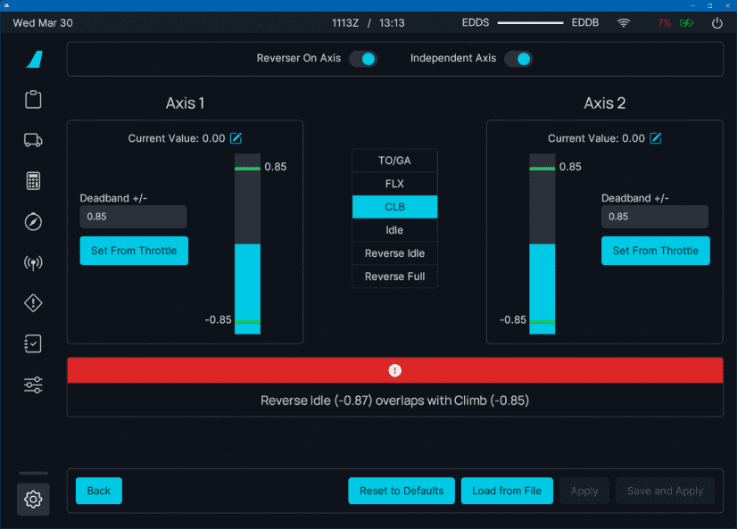{loading=lazy}

This can easily be fixed by carefully following the steps [above](#4-start-with-full-reverser-or-idle) which will remove the error message which then in turn allows to `SAVE & APPLY`.

Another solution is to simply delete the current configuration file (as described in the next chapter) and start over your configuration from default values.

---

## Manual Configuration

!!! warning "Expert Advice - use with care!"
    This configuration is meant for users who are comfortable finding and changing setting-files manually.
    It is important to create a backup copy of each file you modify before changing anything to be able to revert to the previous state in case things go wrong!

To set up or correct throttle calibration values directly we follow these steps which are detailed below.

1. Shut down Microsoft Flight Simulator.
2. Locate your "**work***" folder.
3. Locate the "**ThrottleConfiguration.ini**" file.
4. Create a backup copy of the "**ThrottleConfiguration.ini**" file.
5. Delete or Edit the "**ThrottleConfiguration.ini**" file as required!
6. Start Microsoft Flight Simulator and test.

### Work Folder

Microsoft Flight Simulator allows mods like FlyByWire A32NX to store configuration and other data in a folder called "**work**": This folder is located in different places for the **MS Store version** and the **Steam version** of Microsoft Flight Simulator. The folder's location is described in the next paragraphs.

!!! info ""
    If you can't find the folders these folders might be hidden from you by Windows. Follow the directions on ["View hidden files and folders in Windows 10" on Microsoft's support site](https://support.microsoft.com/en-us/windows/view-hidden-files-and-folders-in-windows-10-97fbc472-c603-9d90-91d0-1166d1d9f4b5){target=new}.

#### Microsoft Store Version

The folder can be found here:

`%LOCALAPPDATA%\Packages\Microsoft.FlightSimulator_8wekyb3d8bbwe\LocalState\packages\flybywire-aircraft-a320-neo\work`

!!! warning ""
    This is not your community directory

#### Steam Version

The folder can be found here:

`%APPDATA%\Microsoft Flight Simulator\Packages\flybywire-aircraft-a320-neo\work`

!!! warning ""
    This is not your community directory

### ThrottleConfiguration.ini

The "**ThrottleConfiguration.ini**" file stores the configuration values from the flyPad Throttle Calibration page.

You can edit or delete this file while Microsoft Flight Simulator is shut down, and it will be loaded when you start 
the next flight with the FlyByWire A32NX.

To restore the default values you can just delete this file. It will be regenerated the next time you start a flight with the FlyByWire A32NX and use the flyPad Throttle Configuration page to `SAVE & APPLY` a configuration.

!!! warning
    The below example file can be used as a starting point for a **Thrustmaster TCA Throttle Quadrant** although it is easier to just  delete the config file and restart configuration.

    Be aware that each throttle is a little different and you MUST verify that these values work for your hardware!

Example "**ThrottleConfiguration.ini**" file based on the default values:

```ini title="ThrottleConfiguration.ini"
[throttle_common]
reverse_on_axis = true

[throttle_axis_1]
reverse_low = -1.00
reverse_high = -0.95
reverse_idle_low = -0.72
reverse_idle_high = -0.62
idle_low = -0.50
idle_high = -0.40
climb_low = -0.03
climb_high = -0.07
flex_mct_low = 0.42
flex_mct_high = 0.52
toga_low = 0.95
toga_high = 1.00

[throttle_axis_2]
reverse_low = -1.00
reverse_high = -0.95
reverse_idle_low = -0.72
reverse_idle_high = -0.62
idle_low = -0.50
idle_high = -0.40
climb_low = -0.03
climb_high = -0.07
flex_mct_low = 0.42
flex_mct_high = 0.52
toga_low = 0.95
toga_high = 1.00
```
