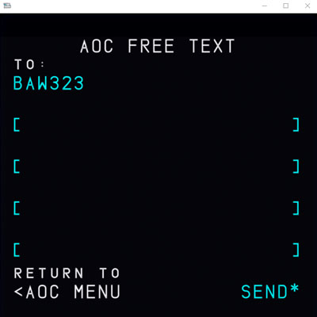

# Free Text

This page explains in detail how to use the free text feature in the AOC Menu to message other sim pilots flying the A32NX. To begin using the free text feature you first need to enable the TELEX feature through the flyPad - [Guide Here](flypados3/settings.md#usage_3).

Once the TELEX feature is enabled you need to input a valid (not already in use) flight number on the INIT A page on the MCDU. Afterwards navigate to the free text menu:

- Click on `MCDU MENU`
- Click on `ATSU`
- Click on `AOC MENU`
- Click on `FREE TEXT`

!!! block ""
    {loading=lazy align=left width=50%}

    Once on this page enter the flight number of the flight you want to send a message to into the scratchpad and press on LSK1L to input it into the `TO:` field.

!!! block ""
    {loading=lazy align=left width=50%}

    You may type your message using the MCDU keys into the scratchpad.

    Press LSK2L to add it into the add it into an empty field. Pictured to the left is a sample message to flight BAW323 with the message "Hello" ready to be sent.

    Use LSK6R to send your message.

To see your sent and recieved messages return to the `AOC MENU` and choose the corresponding option to view your messages.