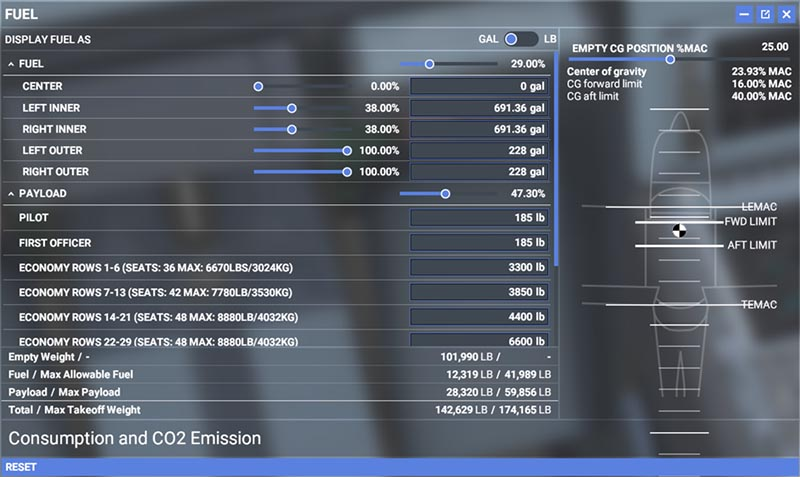

# Fuel and Weight

## Overview

This page provides information on the A32NX weights configuration and insight on how to utilize and reference onboard/sim features to configure the aircraft appropriately for departure.

!!! danger "Please do not touch values in MSFS Fuel & Weights window in the toolbar."

### A32NX Configuration

**Development + Experimental Version Only** - See our [simBrief Profile](../installation.md#simbrief-airframe)

- OEW (Empty Weight): 42500 (in kilograms)
- MZFW (Max Zero Fuel Weight): 64300 (in kilograms)
- MTOW (Max Takeoff Weight): 79000 (in kilograms)
- MLW (Max Landing Weight): 67400 (in kilograms)
- Max Fuel Capacity: 19045 (in kilograms)
- Passenger Weight: 104 (in kilograms)
    - 84 kg for passenger (including clothing and carry-on bags)
    - 20 kg for checked luggage

!!! info "A Note on OEW"
    It is important to understand that the term "operating empty weight" can seem a little generic. OEW is typically calculated as "manufacturer's empty weight + standard items + operator items". These items can be the following (not all inclusive):

    - Crew members
    - Manuals
    - Food and Beverage
    - Emergency Equipment
    - and any equipment/supplies considered standard by the operator

    When considering your ZFW below please keep into consideration the above information with OEW with particular regard that this weight does include the flight crew.

## Zero Fuel Weight

In simple terms the zero fuel weight (ZFW) = OEW + payload. The payload would be passengers, baggage, and no fuel on board. In a situation where your payload would be something like 14000 KG - *based on our new airframe:* 

!!! tip ""
    Your ZFW would total - 56500 KG

You can reference this against any OFP you may have generated through simBrief. For usage of our simBrief integration - [read here](simbrief.md).

## Zero Fuel Weight Center of Gravity

The A32NX will auto calculate the ZFW and ZFWCG on the INIT B page (once the aircraft and associated payload is loaded into the simulator) based on the payload in each loading station.

- See our [Weights and Balance](simbrief.md#weights-and-balance) section in the simBrief integration feature guide.
- You can read about INIT B configuration [here](../../pilots-corner/beginner-guide/preparing-mcdu.md#init-b).

## Center of Gravity

An acceptable range for takeoff CG in the A32NX is between 16-40%. An easy way to check your takeoff CG is to open the MSFS fuel and weights window from the toolbar. It will show you the current CG of the aircraft.

!!! info ""
    It would be best to check MSFS fuel and weights window shortly before takeoff to account for taxi fuel burned. **You may have to expand this window to see the CG information.** Sample image provided below.

{loading=lazy}

Trimming the aircraft for takeoff can be optional and technically not required. However, please reference the above image in your simulator to find takeoff CG and use the [FBW Checklist](../../pilots-corner/SOP.md) to set the appropriate trim. "Auto-rotation" indicates an issue with your CG being well aft of the limits (and/or THS too far nose up).

Ideally, anything less than 25% CG is considered FWD load, and anything more than 25% is considered an AFT load. While opting to choose between either CG configuration (aft/fwd) please consider the information below.

!!! info "Notes on Differing CG Configurations"
    There are a few arguments worth considering when it comes to favoring an aft CG or fwd CG. Generally an aft CG would provide for better aircraft performance (lower stall speed, drag, and angle of attack for a given lift coefficient) but generally worse for pitch stability. 

    For a smaller aircraft as the A320neo, most operators would favor an aft CG loading for fuel consumption benefits when considering the lifetime of the a fleet and how easy the benefits can be obtained.