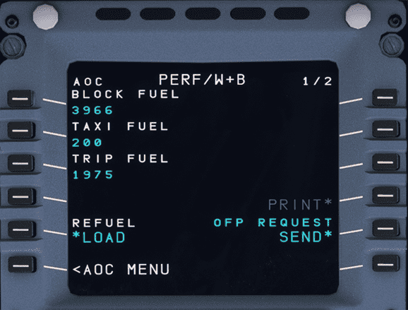

# Loading Fuel and Weight

## Customizing Fuel and Weight

{==

There may be slight differences when using our Stable version vs. Development version. Please take note when reading the information on this page. 

==}

!!! danger "Development Version - MSFS Fuel & Weights window in the toolbar"
    We have blocked the UI elements in the MSFS fuel and weights window. However, the sliders in the MSFS window are movable but in a matter of 1-3 seconds the fuel and payload levels should return to the initial value.

    **PLEASE NOTE** we have changed fuel and payload loading.

    - Fuel: Now done via the [EFB](../flyPad/dispatch.md#fuel-page).
    - Payload: Done through the [W&B in the MCDU](#weights-and-balance)

The AOC menu is found in the MCDU MENU and should be used for certain apsects of this guide.

* Click on `MCDU MENU`
* Click on `ATSU`
* Click on `AOC MENU`
* Click on `PERF/W&B`

### Fuel

!!! warning "Stable vs Development Fuel Loading"
    There are differences between how you load fuel depending on the version you are currently flying. Please reference the correct instructons below.

=== "Development"
    Fuel loading is now exclusively done via our EFB which has a great UI to see the status of fuel tanks and other options. [Guide Here](../flyPad/dispatch.md#fuel-page)

=== "Stable"
    {loading=lazy}

    You are presented with the `Fuel Page` first then the `Weights and Balance` page. On the first page you can automatically load your fuel.

    * Press LSK5L to instantly load your planned simBrief fuel. (The load button will flash momentarily).
    * You can verify fuel has loaded by looking at your upper ECAM FOB.

    Using the horizontal slew keys you can switch to the weights and balance page.

---

### Weights and Balance

In our development version we have introduced a new flight model paired with a new weight and balance payload method that incorporates seat rows and the correct center of gravity. Please use the correct instructions for your corresponding installed version.

!!! warning "Read additional information on [Fuel and Weights](index.md)"

=== "Development"
    !!! info "Dynamic Fields and Colors"
        Payload, ZFW, ZFWCG are dynamic fields that are updated alongside the loading/boarding process.

        - Payload = Pax Weight + Baggage Weight + Cargo
        - ZFW (Zero Fuel Weight) = OEW (Operating Empty Weight) + Payload
        - ZFWCG = CG based on ZFW (**Not to be mistaken for takeoff CG**)

        Stations in CYAN indicate they are reading/waiting to board/load.

        Stations that are fully loaded will turn GREEN.

    !!! block ""
        {align=right width=50% loading=lazy}

        Once on `W&B` page it should look like the sample image even if you have pressed OFP REQUEST in a different section.

        === "PAX Rows Format"
            - X (Y)
            - X denotes PAX already boarded into the relevant station
            - Y denotes PAX target (awaiting boarding) for the relevant station.

        === "Cargo Hold Format"
            - X (Y)
            - X denotes cargo loaded in the hold
            - Y denotes cargo target for the hold (includes baggage)

    ---

    !!! block ""
        {align=right width=50% loading=lazy}

        Press OFP Request for this specific page and your `W&B` page will show total pax, pax per row and cargo hold (in metric tonnes) which populate automatically. 

        Note: this does not start the boarding process. (Cargo will be limited as a protection to a max capacity if the simBrief OFP cargo exceeds the cargo hold limits).

    !!! info "Loading Manually"
        It is possible to input these values manually to customize your passenger loading. Please note the following information when customizing your pax loading manually:

        - To assign a value to a row (station) enter the amount into your scratchpad using the MDCU keyboard and press the relevant LSK next to the desired station.
        - If inputting a value into the `TOTAL PAX` using LSK1L this will automatically distribute passengers based on an ideal CG.
        - Make sure to input pax values (either total or individual row-wise values) BEFORE inputting cargo. Check-in baggage weight is calculated automatically (Pax * 20 KG).
        - Once the above weights are accounted for you can input remaining weight (cargo weight) in a `X.X` format denoting metric tonnes.
            - Cargo weight is limited to max capacity if it exceeds the cargo hold limits.

    ---

    !!! block ""
        {align=right width=50% loading=lazy}

        You can now start boarding by selecting LSK6L (the indication will change from `START` to `STOP` in yellow) and watch as the passengers board the aircraft. 

        **You do not need to remain on this page as boarding continues.**

        [Setting boarding simulation time on the EFB](../flyPad/settings.md#usage_2)

    !!! block ""
        {align=right width=50% loading=lazy}
    
        Once boarding has completed all rows and total pax should turn green and the boarding indication returns to `START`. Verify your ZFW on this screen and check your lower ECAM that GW has been updated.

    ---

    #### ^^Deboard Passengers^^

    ##### Complete Deboard

    !!! block ""
        {align=right width=50% loading=lazy}

        Once you have completed your flight you can opt to deboard passengers from the aircraft. Return to the AOC MENU and head to page 2 of `W&B`. 

        To perform a complete deboard (all pax and cargo) input 0 into the scratchpad and select `LSK1L` into the TOTAL PAX field. 

        Press START to begin the process.

    ---

    ##### Partial Deboard

    !!! block ""    
        {align=right width=50% loading=lazy}

        In case of a partial offload you can input the desired remaining pax and cargo for leg 2. The example to the right shows a planned retention of 142 passengers. 

        **NOTE:** Cargo will show only bag weight for 142 pax. Please ensure that you re-add any additional cargo that you may have been carrying originally.

        Press START to begin the process.

    [Return to Top - Weights and Balance](#weights-and-balance){.md-button}

=== "Stable"
    Once on the `W&B` page (2/2) you can adjust payload here or accept the numbers provided to you via your simBrief OFP.

    - Press LSK5L to instantly load your planned payload and pax.
    - You can verify the weight has changed by looking at the lower ECAM towards the lower right-hand side.
