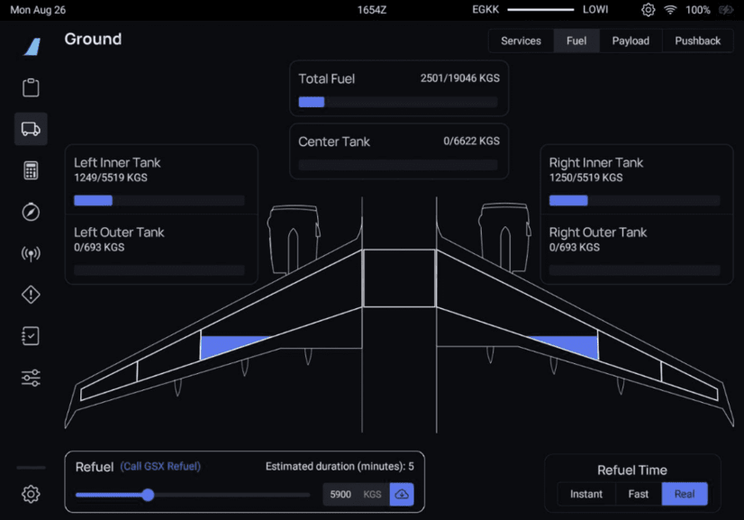

# Fuel Synchronization

!!! warning ""
    You must enable [Fuel Sync](../flypados3/settings.md#3rd-party-options) on the 3rd Party Options settings page on the EFB for this to function.

This page explains, how to use the fueling "synchronization" as-well as any caveats you should be made aware of when using it.

## Caveats
!!! danger "READ ME"
    Please read these caveats in full to better understand what is and isn't possible regarding GSX integrations.

    Failure to understand these caveats can result in you having to disable integration to amend mistakes and possibly restarting the Couatl Engine.

- GSX acts as a visual indicator, the actual fueling is managed by the aircraft's own systems. Notice that this is very different from how [payload](payload.md) functions. However, this allows you the freedom of [various fueling times](#realism-settings-for-fuel-time).

- GSX does not support defueling, which will result in a tooltip loop requesting that you adjust the fuel in the EFB. Refer to the [Usage](#usage) section on how this is handled.

## Usage

Much of the refuelling process between the A32NX and GSX is automated; However some input is required from the user to set the fuel and initiate refuelling.

1. Fueling
      - To use GSX as part of the refuelling process, 'Refuel Time' should be `Real` or `Fast`. Selecting `Instant` will add the fuel immediately, and will not involve GSX.
      - Ensure you have synchronised your required fuel with your SimBrief flight plan, or manually adjust the slider to set how much fuel you require.
      - Above the slider, you will see `(Call GSX Refuel)` - you need to select `Request Refuelling` within the GSX main menu. Be aware that you cannot adjust the fuel slider/amount once you have clicked this.
      - GSX will now send the fuel truck to the aircraft. The `(Call GSX Refuel)` will disappear during this process.
      - When the fuel truck has set up and connected the fuel hose to the aircraft it will begin to load fuel into the tanks. Above the slider you will see `(Refuelling...)` and the 'Total Fuel' at the top of the EFB page should begin to increase until it reaches the amount you requested.
      - Once complete, `(Refuelling...)` will disappear and the fuel truck will leave.

2. Defueling
     - Due to limitations with GSX, this is not supported. To defuel, disable [Fuel Sync](../flypados3/settings.md#3rd-party-options) temporarily and use the play button to initiate the defuelling process.