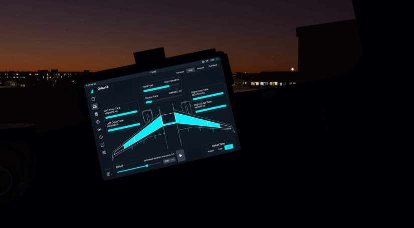

# Fuel Synchronization

!!! warning ""
    You must enable [Fuel Sync](../flypados3/settings.md#3rd-party-options)

This page explains, how to use the fueling "synchronization" as-well as any caveats you should be made aware of when using it.

## Caveats
!!! danger "READ ME"
    Please read these caveats in full to better understand what is and isn't possible regarding GSX integrations.

    Failure to understand these caveats can result in you having to disable integration to amend mistakes and possibly restarting the Couatl Engine.

- GSX acts as a visual indicator, the actual fueling is managed by the aircraft's own systems. Notice that this is very different from how [payload](payload.md) functions. However, this allows you the freedom of [various fueling times](#realism-settings-for-fuel-time).

- GSX does not support defueling, which will result in a tooltip loop requesting that you adjust the fuel in the EFB. Refer to the [Usage](#usage) section on how this is handled.

## Usage

You may notice the fuel page is slightly different, with the Play button being greyed out. This is because for the sake of GSX flow, you cannot begin fueling until the fuel hose is connected.

1. Fueling
      - The "play" button is disabled until the fuel truck has arrived, and the hose is connected.
      - Select `Request Fueling` from the GSX Menu.
      - Wait for the fuel truck to arrive and connect the fuel hose.
      - Set the [fuel quantity](../flypados3/ground.md#fuel-and-de-fuel) that you desire and press the "play" button.
      - You can witness outside as the fuel truck begins to re-fuel your aircraft.
2. Defueling
     - Due to limitations with GSX, this is not supported. To defuel, disable [Fuel Sync](../flypados3/settings.md#3rd-party-options) temporarily.