# Hoppie ACARS

!!! bug "D R A F T"

!!! warning "Not available in the Stable Version"

## Hoppie System

The Hoppie system is developed by Jeroen "Hoppie" Hoppenbrouwers which provides text-based communication between aircrafts, virtual airlines and virtual ATC stations.
It provides multiple communication protocols to communicate between different stations. The system is used by controllers on VATSIM and IVAO.

The A32NX implements the TELEX and CPDLC communication between ATC stations and the aircraft.
[CPDLC](https://skybrary.aero/articles/controller-pilot-data-link-communications-cpdlc) stands for Controller Pilot Data Link Communication.
It allows a communication from ATC stations with the aircraft without the use of voice, but it is still required that the pilot monitors the voice frequency.

CPDLC is used to request changes from the ATC station or the ATC station requests flight information or gives commands to the pilot.
Additionally is PDC (Pre-Departure Clearance) used to request an IFR-clearance from ATC via text and the communication is handled via CPDLC afterwards.

The A32NX MCDU and DCDU provide the communication to the Hoppie system to communicate with the ATC stations.

### Create a logon code

Every pilot needs a unique logon code that is used to identify the communication.
This code needs to be requested on the website of Hoppie: [Logon request](http://www.hoppie.nl/acars/system/register.html)

The resulting code needs to be stored and hidden from other users.

It is suggested to define if the logon code is used on VATSIM or IVAO. The default configuration assumes a connection to the VATSIM network.
The configuration can be set [here](http://www.hoppie.nl/acars/system/account.html)

The logon code will be deleted after three months without any logon.
A single logon renews the lifetime of the code.

## Configuration of the A32NX

It is required to configure the A32NX to use the Hoppie system.
All configuration entries are set in the Settings-pages of the EFB.

### ATSU/AOC

The Hoppie logon code needs to be set in the ATSU/AOC page.
{loading=lazy}

The logon code needs to be set in "Hoppie User ID".

The toggle "Connect to Hoppie system" is reset with every restart of the simulator or reloading of the aircraft.
It is required to activate it if the CPDLC system shall be used.

### Realism

The real CPDLC system guarantees a maximum communication time between sending and transmitting a message of 240 seconds.
A datalink system is simulated and all AOC and ATC requests are synchronized via this module.

The datalink simulation speed can be configured in the Realsim-page.
{loading=lazy}

It is possible to configure the simulated waiting time between a send and a receive of messages.
Three different transmission times can be defined:
 - instant: sends and receives messages within two seconds
 - fast: sends and receives messages within twenty seconds
 - real: sends and receives messages within sixty seconds

## Example flight

This chapter shows an example how a usual flight on VATSIM is handled with PDC and CPDLC.
It is important to call the controller on an initial call per voice and monitor the frequency after a CPDLC logon.
The CPDLC system is only a convenience to relax the voice frequency. Time critical instructions will be given via voice.

### Pre-Departure Clearance

After the aircraft preparation is an IFR clearance required which can be requested via PDC (Pre-Departure Clearance).
The request page can be found in the AOC menu.
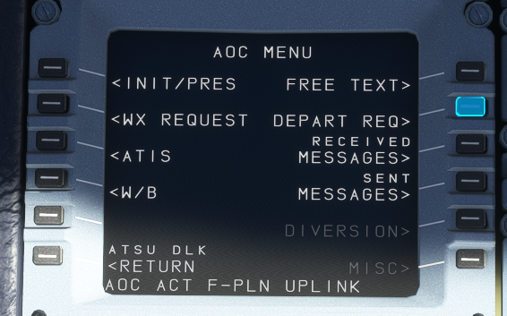{loading=lazy}

The DEPART REQ page requires the current ATIS, an optional gate and it is possible to add some freetext.
A possible reason for a freetext can be the unability for specific SIDs or the request of a dedicated SID.
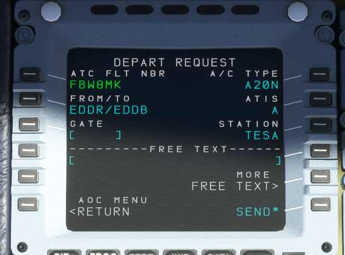{loading=lazy}

The controller sends the clearance with all relevant information.
This information includes usually the departure runway, the SID, the assigned squawk code and a startup time.
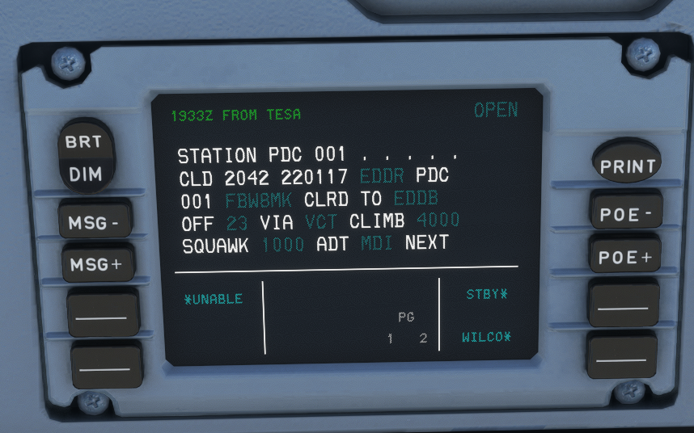{loading=lazy}

It is required to confirm or deny a clearance. A denied clearance requires a voice communication with the delivery controller.
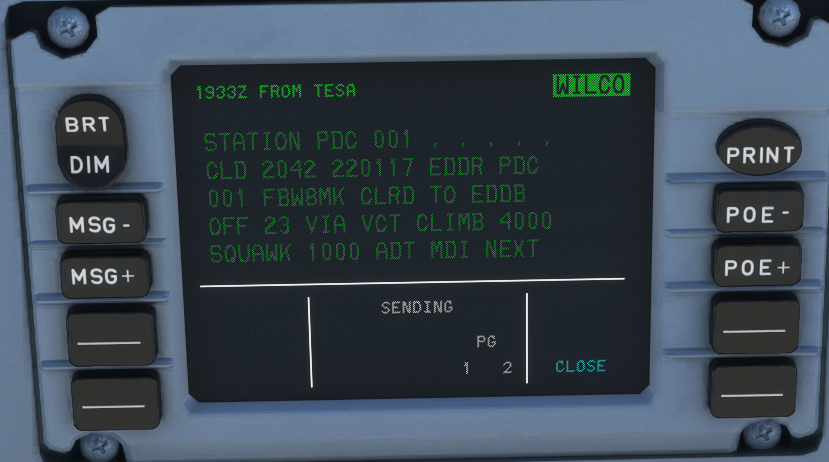{loading=lazy}

### Enroute CPDLC

On ATC CTR sectors is it possible to use CPDLC. It is not provided on the ground or in the approach or departure sectors.
Due to the long delays in the communication via CPDLC is this type of communication dedicated to the enroute stations.

If the responsible ATC sector provides CPDLC is a notification required. This notification requests internally a logon at the defined ATC station.
Before a notification request is a check-in via voice mandatory, otherwise will the request be rejected.
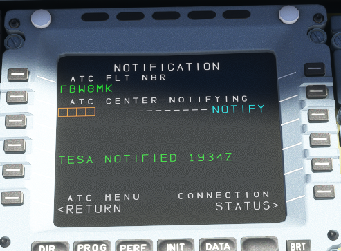{loading=lazy}

A logon can fail due to several reasons. One is that the controller does not provide CPDLC and the request times out after five minutes.
An other reason can be that the request is rejected by ATC. A failed notification is indicated via a "NOTIF FAILED"
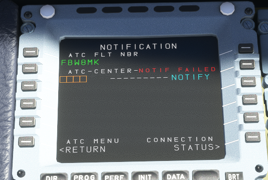{loading=lazy}

It is possible to find the reason for the failed notification in the message record.
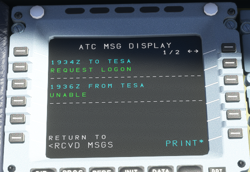{loading=lazy}

After a successful logon is a "CURRENT ATC" message shown on the DCDU which indicates the responsible ATC station.
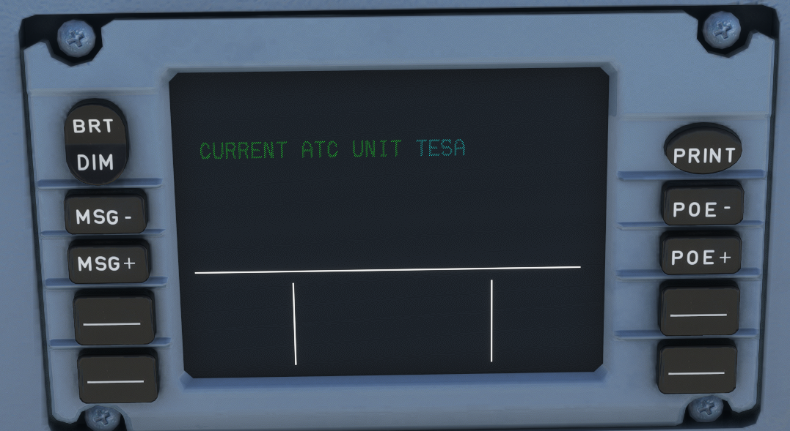{loading=lazy}

The controller can send instructions to the A32NX and it visualizes all kinds of CPDLC instructions or requests.
Most of the instructions or requests require an answer from the pilot via the buttons on the DCDU.
It is also possible to print important messages.
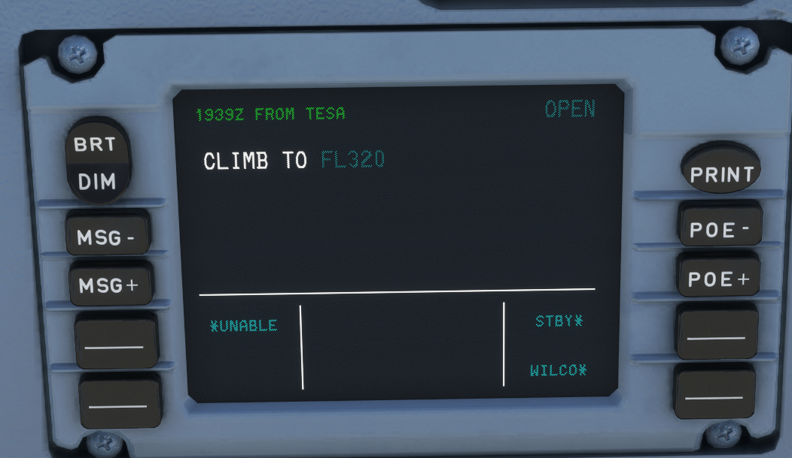{loading=lazy}

A frequency change can be given via CPDLC. This message contains the next station and the frequency.
It is required to set the frequency in the radio and to confirm the message.
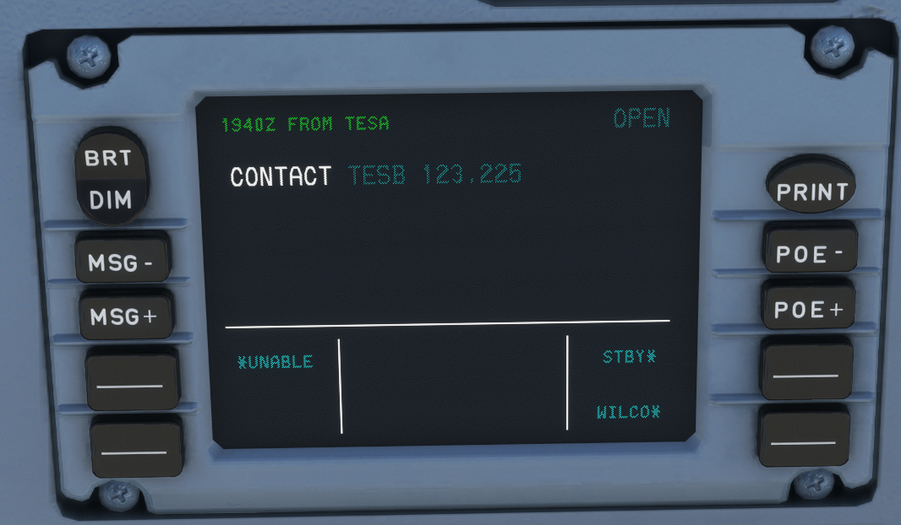{loading=lazy}

After the confirmation sends the ATC a logoff or a handover if the next controller provides CPDLC.
The A32NX handles both types internally via a logoff at the current station and in case of an handoff a new logon at the next station.
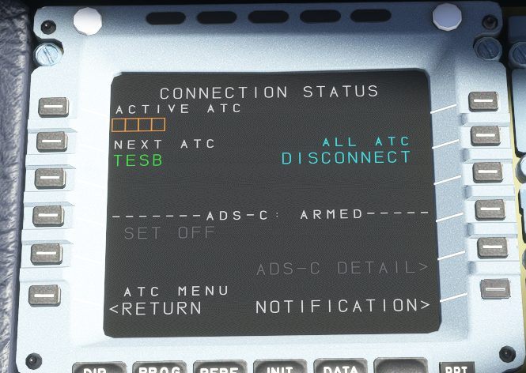{loading=lazy}

## Troubleshooting

Sometimes can it happen that the ATC station does not react on PDC or CPDLC message.
It can happen due to aircraft, ATC or Hoppie issues.
This chapter gives some hints to check if the missing communication is caused by the A32NX.

### Find online stations

It is possible to find all currently online stations. This is helpful to check if the responsible ATC station provides CPDLC or PDC.
A complete list can be found [here](http://www.hoppie.nl/acars/system/online.html).

### Find sent and received messages

It can be helpful to check if messages are sent to the Hoppie network.
A website shows all sent and received messages to and from a specific callsign.

The link follows the the following syntax:
http://www.hoppie.nl/acars/system/callsign.html?network=&lt;NETWORK&gt;&callsign=&lt;CALLSIGN&gt;

&lt;NETWORK&gt; needs to be set as IVAO or VATSIM, depending on the used network.
&lt;CALLSIGN&gt; is the used callsign of the A32NX in the Hoppie network. It is the same as the callsign on the init-page of the MCDU.

