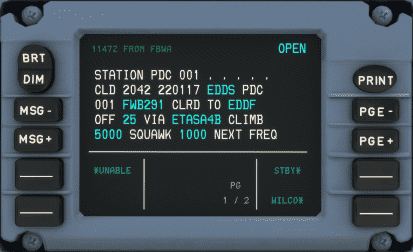
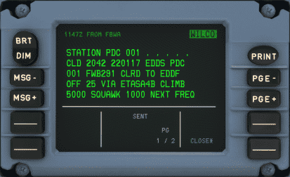

# Hoppie ACARS

!!! warning "Not available in the Stable Version"

!!! warning "Development in progress"
    The Hoppie ACARS system is a complex system and we have decided to develop and release it step-by-step. So please be aware that not all features are available in the early releases and that we will add additional functionality in the future.

    The currently planned future releases are adding these features:

    - Datalink Status
    - Automatic D-ATIS, DCL, OCL
    - Vert, Lat requests, Text
    - Other requests, when can we expect
    - Emergency
    - Automatic preparation of replies for report-requests
    - FPL changes for Lat requests
    - Flight Monitoring for conditional reports

    This plan might change at any time.


## Hoppie System

The Hoppie system is developed by Jeroen "Hoppie" Hoppenbrouwers which provides text-based communication between aircraft, virtual airlines and virtual ATC stations. It provides multiple communication protocols to communicate between different stations. The system is used by controllers on VATSIM and IVAO.

[Hoppie Homepage](http://www.hoppie.nl/pub/){target=new}

The A32NX implements the TELEX and CPDLC communication between ATC stations and the aircraft.

!!! note "[CPDLC](https://skybrary.aero/articles/controller-pilot-data-link-communications-cpdlc){target=new} stands for Controller Pilot Data Link Communication."

It allows a communication from ATC stations with the aircraft without the use of voice, but it is still required that the pilot monitors the voice frequency.

CPDLC is used to send requests to the ATC station or from the ATC station requesting flight information or issuing instructions to the pilot.

Additionally PDC (Pre-Departure Clearance, also DCL) is used to request an IFR-clearance from ATC via text.

The A32NX MCDU and DCDU provide the interface for communication to and from the Hoppie system to communicate with the ATC stations.

!!! warning "CPDLC Availability"
    Unfortunately not all controllers provide the CPDLC option. See [Find online stations](#find-online-stations).

    Also the Hoppie network is unfortunately not always reliable. Repeat your request via voice when in doubt. See [Troubleshooting](#troubleshooting).

### Create a logon code

Every pilot needs a unique logon code that is used to identify the communication. This code needs to be requested on the website of Hoppie: [Logon request](http://www.hoppie.nl/acars/system/register.html){target=new}

The resulting code needs to be stored and hidden from other users.

It is suggested to define if the logon code is used on VATSIM or IVAO. The default configuration assumes a connection to the VATSIM network.
The configuration can be set [here](http://www.hoppie.nl/acars/system/account.html){target=new}

The logon code will be deleted after three months without any logon. A single logon renews the lifetime of the code.

## Configuration of the A32NX

It is required to configure the A32NX to use the Hoppie system. All configuration entries are set in the Settings-pages of the EFB.

### ATSU/AOC

The Hoppie logon code needs to be set in the [EFB Settings ATSU/AOC](./flyPad/settings.md#atsuaoc) page.

{loading=lazy}

The logon code needs to be set in "Hoppie User ID".

### Turning on Hoppiew ACARS

You need to turn on the Hoppie ACARS Connection on the EFB ATC page every time before doing a flight.


{==

The button "Connect" is reset with every restart of the simulator or reloading of the aircraft. It is required to activate it if the CPDLC system shall be used.

This is necessary to avoid traffic on the Hoppie Network when not using the feature.

==}

### Realism

The real CPDLC system guarantees a maximum communication time between sending and transmitting a message of 240 seconds. A datalink system is simulated and all AOC and ATC requests are synchronized via this module.

The datalink simulation speed can be configured in the [EFB Settings Realsim](./flyPad/settings.md#realism) page.
{loading=lazy}

It is possible to configure the simulated waiting time between sending and receiving messages.

Three different transmission times can be defined:

 - Instant: sends and receives messages within two seconds
 - Fast: sends and receives messages within twenty seconds
 - Real: sends and receives messages within sixty seconds

## Example flight

This chapter shows an example how a normal flight on VATSIM is handled with PDC and CPDLC.

{==

It is important to call the controller on an initial call per voice and monitor the frequency after a CPDLC logon.

==}

The CPDLC system is only a convenience to relax the voice frequency. Time critical instructions will be given via voice.

### Pre-Departure Clearance

After preparation of the aircraft an IFR clearance is required which can be requested via PDC (Pre-Departure Clearance).

The request page can be found in the MCDU ATSU-AOC menu.

!!! note "MCDU ATSU AOC Menu"
    {loading=lazy}

The DEPART REQ page requires the current ATC station code and the current ATIS. Providing a gate and freetext is optional.

!!! note "Departure Request"
    !!! block ""
        {align=center width=48% loading=lazy}
        {align=center width=48% loading=lazy}

The `ATC FLT NBR` and `FROM/TO` is taken from the INIT A page. So it is important that the aircraft is set up before requesting the IFR clearance.

Freetext can and should be used to provide additional information to the controller. E.g. the inability for specific SIDs or the request of a dedicated SID.

The controller sends the clearance with all relevant information.
This information includes usually the departure runway, the SID, the assigned squawk code and a startup time.

!!! note "Received Clearance"
    !!! block ""
        {align=center width=48% loading=lazy}
        {align=center width=48% loading=lazy}

It is required to confirm or deny a clearance. A denied clearance requires a voice communication with the delivery controller.

!!! note "Confirmed Clearance"
    {loading=lazy}

### Enroute CPDLC

Usually it is only possible to use CPDLC on ATC CTR (Center or Radar stations) or for clearance (DEL) stations.

It is not provided on ground (TWR, GND), approach (APP) or departure (DEP) stations. Due to the long delays in the communication via CPDLC this type of communication would be too slow for these stations.

#### Station Handover / Notification

If the responsible ATC sector provides CPDLC a Notification is required. This Notification requests a logon at the defined ATC station.

{==

Before a Notification request is sent a check-in via voice mandatory, otherwise will the request be rejected.

==}

!!! note "Notifying fictional station FBWA"
    {loading=lazy}

A logon can fail due to several reasons. One is that the controller does not provide CPDLC and the request times out after five minutes.
An other reason can be that the request is rejected by ATC. A failed notification is indicated via a "NOTIF FAILED"

!!! note "Failed notification to fictional station FBWA"
    {loading=lazy}

To understand the reason for the failed notification check the the message record.

!!! note "Message record of failed notification to fictional station FBWA"
    {loading=lazy}

After a successful logon a "CURRENT ATC" message is shown on the DCDU which indicates the responsible ATC station.

!!! note "Successful connection to fictional station FBWA"
    {loading=lazy}

#### Enroute Instructions from Controller to Pilot

The ATC controller can send instructions to the pilot at any time. Most of the instructions or requests require an answer from the pilot via the buttons on the DCDU.

Find some examples below.

##### Climb Instruction

!!! note "Climb instruction"
    {loading=lazy}

Possible responses usually are `WILCO` ("will comply"), `STDBY` ("standby by") or `UNABLE` ("unable to comply").

If you select STBY the message will be marked with `STDBY` and you can respond with `WILCO` or `UNABLE` after we have checked our ability to comply.

{loading=lazy}

##### Frequency Change

A frequency change can be given via CPDLC. This message contains the next station and the frequency. It is required to set the frequency in the radio and to confirm the message.

!!! note "Instruction to contact ATC station via voice"
    {loading=lazy}

If the next ATC station provides CPDLC we can notify this next station which would log us off the current station when accepted. See [Station Handover / Notification](#station-handover--notification).

### Logoff From Station

You can logoff from the current station if the next station does not provide CPDLC.

{loading=lazy}

## Troubleshooting

Sometimes can it happen that the ATC station does not respond to PDC or CPDLC messages. This can happen due to aircraft, ATC or Hoppie issues.

This chapter gives some hints to check if the missing communication is caused by the A32NX.

### Find online stations

It is possible to find all currently online stations. This is helpful to check if the responsible ATC station provides CPDLC or PDC.
A complete list can be found [here](http://www.hoppie.nl/acars/system/online.html).

### Find sent and received messages

It can be helpful to check if messages are sent to the Hoppie network. The Hoppie website shows all sent and received messages to and from a specific call sign.

The link follows the the following syntax:

```
http://www.hoppie.nl/acars/system/callsign.html?network=<NETWORK>&callsign=<CALLSIGN>
```

Example: [http://www.hoppie.nl/acars/system/callsign.html?network=VATSIM&callsign=FWB291](http://www.hoppie.nl/acars/system/callsign.html?network=VATSIM&callsign=FWB291){target=new}

- &lt;NETWORK&gt;: Needs to be set as IVAO or VATSIM, depending on the used network.
- &lt;CALLSIGN&gt;: Is the used callsign of the A32NX in the Hoppie network. It is the same as the callsign on the init-page of the MCDU.


