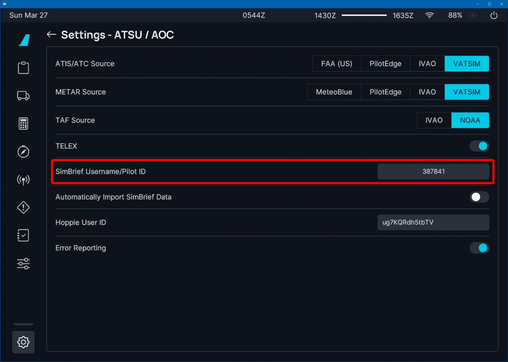
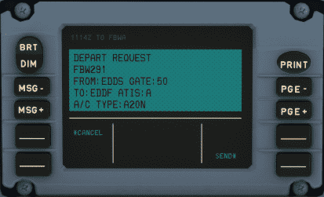
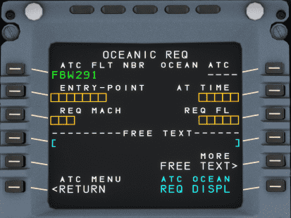
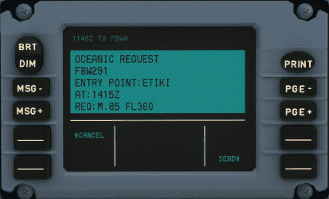
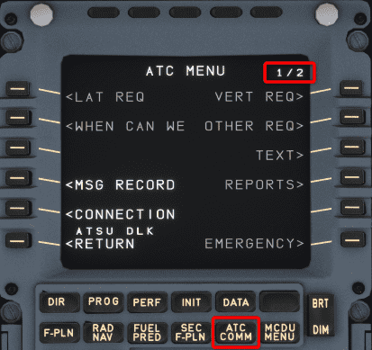
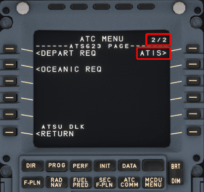
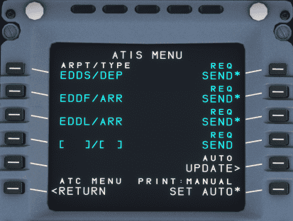
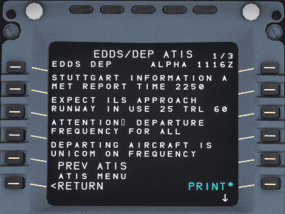

# Hoppie ACARS

!!! warning "Requires credentials with Hoppie service"

The Hoppie ACARS system is a complex system, and we have decided to develop and release it step-by-step. 

[//]: # (So please be aware that not all features are available in the early releases and there may be differences between the **Stable Version** and **Development Version** as outlined below. We will add additional functionality over time.)

[//]: # (???+ tip "Development Version - Features &#40;Click to Open&#41;")

[//]: # (    Our development version has the following features:)

??? tip "Stable Version - Features (Click to Open)"
    !!! danger ""
        This section will be current for Stable version 0.10.0. Any changes to our development branch will be noted with the appropriate flag or indicator. Please be aware of any differences when 
        using our CPDLC implementation.

    The current version has the following features:

    - Automatic D-ATIS
    - Automatic position reports
    - Controller report-requests and automatic preparation of pilot replies
    - Controller to pilot: All Instructions including requests, confirmations, etc.
    - Datalink status
    - Departure Clearance (DCL)
    - Flight Monitoring for conditional reports
    - Handover
    - Logon/Logoff
    - Oceanic Clearance (OCL)
    - Pilot requests: All kinds, incl. emergency
    - Pilot requests: Vert & Lat requests, Text
    - Realistic datalink communication simulation (VHF+VDL3)
    - Simulation of FANS-A+ and FANS-B+ with automatic mode selection based on logon-code of ATC
    - Station identifier
    - LPPC FNAS B area updated with newly introduced codes.

??? warning "In Progress Features (Click to Open)"
    - FPL changes for Lat requests

    This plan might change at any time.

## Hoppie System

The Hoppie system is developed by Jeroen "Hoppie" Hoppenbrouwers which provides text-based communication between aircraft, virtual airlines and virtual ATC stations. It provides multiple communication protocols to communicate between different stations. The system is used by controllers on VATSIM and IVAO.

[Hoppie Homepage](http://www.hoppie.nl/pub/){target=new}

The A32NX implements the TELEX and CPDLC communication between ATC stations and the aircraft.

!!! note "[CPDLC](https://skybrary.aero/articles/controller-pilot-data-link-communications-cpdlc){target=new} stands for Controller Pilot Data Link Communication."

It allows communication between ATC stations and the aircraft without the use of voice, but it is still required that the pilot monitors the voice frequency.

CPDLC is used to send requests to the ATC station or from the ATC station requesting flight information or issuing instructions to the pilot.

Additionally, PDC (Pre-Departure Clearance, also DCL) is used to request an IFR-clearance from ATC via text.

The A32NX MCDU and DCDU provide the interface for communication to and from the Hoppie system to communicate with the ATC stations.

!!! warning "CPDLC Availability"
    Unfortunately, not all controllers provide the CPDLC option. See [Find online stations](#find-online-stations).

    Moreover, the Hoppie network is unfortunately not always reliable. Repeat your request via voice when in doubt. See [Troubleshooting](#troubleshooting).

### Create a logon code

Every pilot needs a unique logon code that is used to identify the communication. This code needs to be requested on the website of Hoppie: [Logon request](http://www.hoppie.nl/acars/system/register.html){target=new}

The resulting code needs to be stored and hidden from other users.

It is suggested to define if the logon code is used on VATSIM or IVAO. The default configuration assumes a connection to the VATSIM network.
The configuration can be set [here](http://www.hoppie.nl/acars/system/account.html){target=new}

The logon code will be deleted after three months without any logon. A single logon renews the lifetime of the code.

## Configuration of the A32NX

It is required to configure the A32NX to use the Hoppie system. All configuration entries are set in the Settings-pages of the EFB.

### ATSU/AOC

The Hoppie logon code needs to be set in the [EFB Settings ATSU/AOC](flypados3/settings.md#atsuaoc) page.

{loading=lazy}

The logon code needs to be set in "Hoppie User ID".

### Turning on Hoppie ACARS

!!! tip ""
    Please ensure that the Hoppie toggle is set to `Enabled` within the EFB. This can be found on the EFB Settings page under ATSU/AOC. (*Not pictured above*).

    This is important to ensure that a connection is established.

Once the above toggle is set appropriately, the Hoppie ACARS system will log you in automatically, provided the following items are complete:

- Logon code is entered.
- A flight number is set.
- The weather source is set to VATSIM or IVAO.
    - See [EFB Settings ATSU/AOC](flypados3/settings.md#atsuaoc).

## Example flight

This chapter shows an example how a normal flight on VATSIM is handled with PDC and CPDLC.

{==

It is important to call the controller on an initial call per voice and monitor the frequency after a CPDLC logon.

==}

The CPDLC system is only a convenience to relax the voice frequency. Time-critical instructions will be given via voice.

### Departure Clearance

After preparation of the aircraft, an IFR clearance is required, which can be requested via DCL (Departure Clearance).

The DEPART REQ page requires the current ATC station code and the current ATIS. Providing a gate and freetext is optional.

!!! note "Departure Request"
    !!! block ""
        {align=center width=48% loading=lazy}
        {align=center width=48% loading=lazy}

The `ATC FLT NBR` and `FROM/TO` are taken from the INIT A page. So it is important that the INIT A page is set up before requesting the IFR clearance.

Freetext can and should be used to provide additional information to the controller. E.g., the inability for specific SIDs or the request of a dedicated SID.

Press `REQ DISPL` to transfer the request to the DCDU.

You can then check the message in the DCDU and send it by pressing the button next to `SEND*`

!!! note "DCDU Departure Request"
    !!! block ""
        {align=center width=48% loading=lazy}
        {align=center width=48% loading=lazy}

The controller sends the clearance with all relevant information.
This information usually includes the departure runway, the SID, the assigned squawk code and a startup time.

!!! note "Received Clearance"
    !!! block ""
        {align=center width=48% loading=lazy}
        {align=center width=48% loading=lazy}

It is required to confirm or deny a clearance. A denied clearance requires a voice communication with the delivery controller.

!!! note "Confirmed Clearance"
    {loading=lazy}

### Enroute CPDLC

Usually, it is only possible to use CPDLC on ATC CTR (Center or Radar stations) or for clearance (DEL) stations.

It is not provided on ground (TWR, GND), approach (APP) or departure (DEP) stations. Due to the long delays in the communication via CPDLC, this type of communication would be too slow for these stations.

#### Station Handover / Notification

If the responsible ATC sector provides CPDLC, a Notification is required. This Notification requests a logon at the defined ATC station.

{==

Before a Notification request is sent, a check-in via voice mandatory, otherwise will the request be rejected.

==}

!!! note "Notifying fictional station FBWA"
    {loading=lazy}

A logon can fail due to several reasons. One is that the controller does not provide CPDLC and the request times out after five minutes.
Another reason can be that the request was rejected by ATC. A failed notification is indicated via a "NOTIF FAILED"

!!! note "Failed notification to fictional station FBWA"
    {loading=lazy}

To understand the reason for the failed notification, check the message record.

!!! note "Message record of failed notification to fictional station FBWA"
    {loading=lazy}

After a successful logon, a "CURRENT ATC" message is shown on the DCDU which indicates the responsible ATC station.

!!! note "Successful connection to fictional station FBWA"
    {loading=lazy}

#### Enroute Instructions from Controller to Pilot

The ATC controller can send instructions to the pilot at any time. Most of the instructions or requests require an answer from the pilot via the buttons on the DCDU.

Find some examples below.

##### Climb Instruction

!!! note "Climb instruction"
    {loading=lazy}

Possible responses are usually `WILCO` ("will comply"), `STDBY` ("standby") or `UNABLE` ("unable to comply").

If you select STBY the message will be marked with `STDBY` and you can respond with `WILCO` or `UNABLE` after we have checked our ability to comply.

{loading=lazy}

##### Frequency Change

A frequency change can be given via CPDLC. This message contains the next station and the frequency. It is required to set the frequency in the radio and to confirm the message.

!!! note "Instruction to contact ATC station via voice"
    {loading=lazy}

If the next ATC station provides CPDLC, we can notify this next station, which would log us off the current station when accepted. See [Station Handover / Notification](#station-handover-notification).

### Logoff From Station

You can log off from the current station if the next station does not provide CPDLC.

{loading=lazy}

## Oceanic clearance

It is also possible to request an Oceanic Clearance (OCL) from ATC.

The OCEANIC REQ page requires you to be on the last station before an oceanic route. You need to enter your planned entry point, time at entry point, speed, and flight level.

In the example below this would be station `EGGX` (Shanwick Oceanic FIR) and the entry point would be `ETIKI` for NAT D.

You would ask for the oceanic clearance about 30 min before reaching the entry point.

!!! note "Oceanic Request"
    !!! block ""
        {align=center width=48% loading=lazy}
        {align=center width=48% loading=lazy}

!!! note "Oceanic Clearance Request and ATC Response"
    !!! block ""
        {align=center width=48% loading=lazy}
        {align=center width=48% loading=lazy}

Fifteen (15) minutes after passing the entry point, you need to set your squawk to 2000. You will receive a new squawk when entering a domestic sector again.

##  ATIS Auto-Update

To receive ATIS information and setup auto-update of specific ATIS go to the ATC COMM menu and click on `ATIS`.

The source for your ATIS information can be configured in the EFB Settings page: [EFB ATSU-AOC Options](flypados3/settings.md#atsuaoc)

!!! note "MCDU ATC COMM Menu"
    !!! block ""
        {align=center width=48% loading=lazy}
        {align=center width=48% loading=lazy}

From the `ATIS Menu` page, you can request ATIS information directly by pushing the right side LSK next to `REQ SEND*`. You also can CLR, change and add additional airports (example formats, see screenshots).

You can choose to update ATIS information automatically by pressing the LSK R4 `AUTO UPDATE`and then configure the auto-updates on the next page.

!!! note "ATIS and Auto-Update"
    !!! block ""
        {align=center width=48% loading=lazy}
        {align=center width=48% loading=lazy}
        <br/>
        {align=center width=48% loading=lazy}
        {align=center width=48% loading=lazy}
        <br/>
        {align=center width=48% loading=lazy}
        {align=center width=48% loading=lazy}

Pressing the LSK R6 allows you to automatically print ATIS information to the printer.

## Troubleshooting

Sometimes the ATC station does not respond to PDC or CPDLC messages. This mostly happens because of ATC controllers not responding, an issue in the Hoppie network, or potentially an issue with the A32NX.

This chapter will give you some hints to check what the actual cause of the issue is.

### Find online stations

It is possible to find all currently online stations. This is helpful to check if the responsible ATC station provides CPDLC or PDC.
A complete list can be found [here](http://www.hoppie.nl/acars/system/online.html){target=new}.

### Find sent and received messages

It can be helpful to check if messages are sent to the Hoppie network. The Hoppie website shows all sent and received messages to and from a specific call sign.

The link follows the following syntax:

```title="Example Link"
http://www.hoppie.nl/acars/system/callsign.html?network=<NETWORK>&callsign=<CALLSIGN>
```

Example: [http://www.hoppie.nl/acars/system/callsign.html?network=VATSIM&callsign=FBW291](http://www.hoppie.nl/acars/system/callsign.html?network=VATSIM&callsign=FBW291){target=new}

- &lt;NETWORK&gt;: Needs to be set as IVAO or VATSIM, depending on the used network.
- &lt;CALLSIGN&gt;: Is the used callsign of the A32NX in the Hoppie network. It is the same as the callsign on the init-page of the MCDU.


