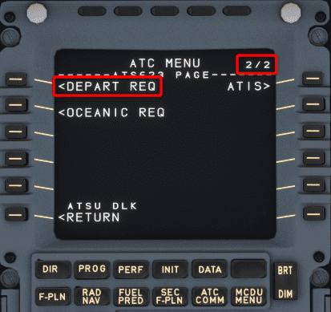
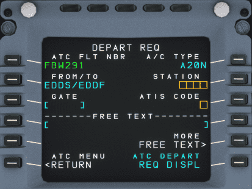
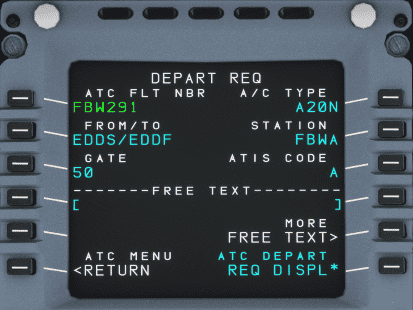
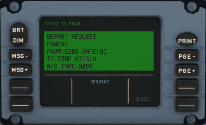
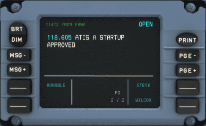
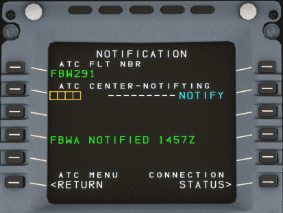
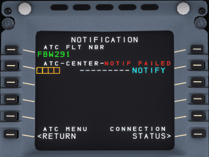
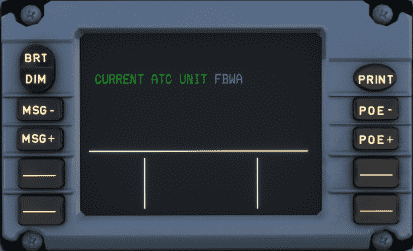
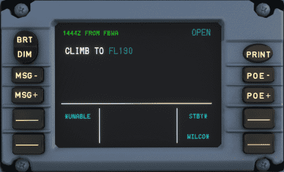
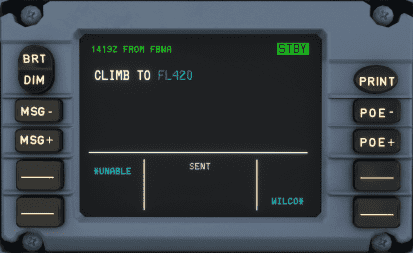

# Example Flight

This chapter shows an example how a normal flight on VATSIM is handled with PDC and CPDLC.

{==

It is important to call the controller on an initial call per voice and monitor the frequency after a CPDLC logon.

==}

The CPDLC system is only a convenience to relax the voice frequency. Time critical instructions will be given via voice.

## Departure Clearance

After preparation of the aircraft an IFR clearance is required which can be requested via DCL (Departure Clearance).

The request page can be found in the MCDU ATC COMM menu page 2:

!!! note "MCDU ATC COMM Menu"
!!! block ""
{align=center width=48% loading=lazy}
{align=center width=48% loading=lazy}

The DEPART REQ page requires the current ATC station code and the current ATIS. Providing a gate and freetext is optional.

!!! note "Departure Request"
!!! block ""
{align=center width=48% loading=lazy}
{align=center width=48% loading=lazy}

The `ATC FLT NBR` and `FROM/TO` is taken from the INIT A page. So it is important that the INIT A page is set up before requesting the IFR clearance.

Freetext can and should be used to provide additional information to the controller. E.g. the inability for specific SIDs or the request of a dedicated SID.

Press `REQ DISPL` to transfer the request to the DCDU.

You can then check the message in the DCDU and send it by pressing the button next to `SEND*`

!!! note "DCDU Departure Request"
!!! block ""
{align=center width=48% loading=lazy}
{align=center width=48% loading=lazy}

The controller sends the clearance with all relevant information.
This information includes usually the departure runway, the SID, the assigned squawk code and a startup time.

!!! note "Received Clearance"
!!! block ""
{align=center width=48% loading=lazy}
{align=center width=48% loading=lazy}

It is required to confirm or deny a clearance. A denied clearance requires a voice communication with the delivery controller.

!!! note "Confirmed Clearance"
{loading=lazy}

## Enroute CPDLC

Usually it is only possible to use CPDLC on ATC CTR (Center or Radar stations) or for clearance (DEL) stations.

It is not provided on ground (TWR, GND), approach (APP) or departure (DEP) stations. Due to the long delays in the communication via CPDLC this type of communication would be too slow for these stations.

### Station Handover / Notification

If the responsible ATC sector provides CPDLC a Notification is required. This Notification requests a logon at the defined ATC station.

{==

Before a Notification request is sent a check-in via voice mandatory, otherwise will the request be rejected.

==}

!!! note "Notifying fictional station FBWA"
{loading=lazy}

A logon can fail due to several reasons. One is that the controller does not provide CPDLC and the request times out after five minutes.
An other reason can be that the request is rejected by ATC. A failed notification is indicated via a "NOTIF FAILED"

!!! note "Failed notification to fictional station FBWA"
{loading=lazy}

To understand the reason for the failed notification check the the message record.

!!! note "Message record of failed notification to fictional station FBWA"
{loading=lazy}

After a successful logon a "CURRENT ATC" message is shown on the DCDU which indicates the responsible ATC station.

!!! note "Successful connection to fictional station FBWA"
{loading=lazy}

### Enroute Instructions from Controller to Pilot

The ATC controller can send instructions to the pilot at any time. Most of the instructions or requests require an answer from the pilot via the buttons on the DCDU.

Find some examples below.

#### Climb Instruction

!!! note "Climb instruction"
{loading=lazy}

Possible responses usually are `WILCO` ("will comply"), `STDBY` ("standby") or `UNABLE` ("unable to comply").

If you select STBY the message will be marked with `STDBY` and you can respond with `WILCO` or `UNABLE` after we have checked our ability to comply.

{loading=lazy}

#### Frequency Change

A frequency change can be given via CPDLC. This message contains the next station and the frequency. It is required to set the frequency in the radio and to confirm the message.

!!! note "Instruction to contact ATC station via voice"
{loading=lazy}

If the next ATC station provides CPDLC we can notify this next station which would log us off the current station when accepted. See [Station Handover / Notification](#station-handover-notification).

## Logoff From Station

You can logoff from the current station if the next station does not provide CPDLC.

{loading=lazy}