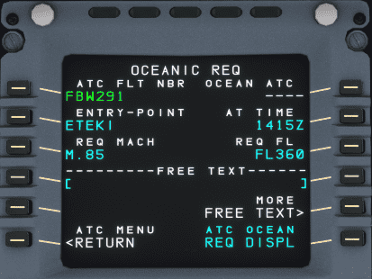
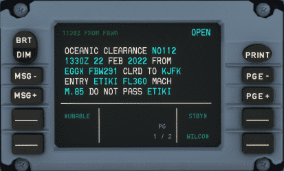
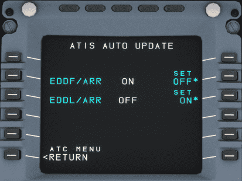
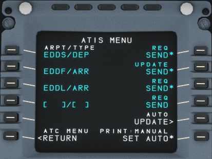
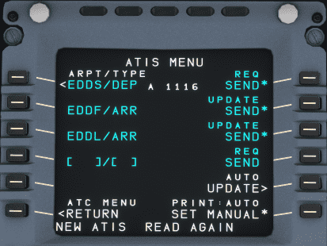
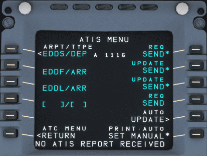

# Hoppie ACARS

!!! warning "Requires credentials with Hoppie service"

The Hoppie ACARS system is a complex system and we have decided to develop and release it step-by-step. So please be aware that not all features are available in the early 
releases and that we will add additional functionality over time. Please see the appropriate feature set below for the version you are flying.

??? tip "Development Version - Features (Click to Open)"
    Our development version has the following features:

    - Automatic D-ATIS
    - Automatic position reports
    - Controller report-requests and automatic preparation of pilot replies
    - Controller to pilot: All Instructions including requests, confirmations, etc.
    - Datalink status
    - Departure Clearance (DCL)
    - Flight Monitoring for conditional reports
    - Handover
    - Logon/Logoff
    - Oceanic Clearance (OCL)
    - Pilot requests: All kinds, incl. emergency
    - Realistic datalink communication simulation (VHF+VDL3)
    - Simulation of FANS-A+ and FANS-B+ with automatic mode selection based on logon-code of ATC
    - Station identifier

??? tip "Stable Version - Features (Click to Open)"
    !!! danger ""
        This page will be current for Stable version 0.8.0. Any changes to our development branch will be noted with the appropriate flag or indicator. Please be aware of any 
        differences when using our CPDLC implementation.

    The current version has the following features:

    - Automatic D-ATIS
    - Controller to pilot: All Instructions
    - Departure Clearance (DCL)
    - Handover
    - Logon/Logoff
    - Oceanic Clearance (OCL)
    - Pilot requests: Vert & Lat requests, Text
    - Realistic datalink communication simulation (VHF+VDL3)
    - Station identifier

??? warning "In Progress Features (Click to Open)"
    - FPL changes for Lat requests

    This plan might change at any time.

## Quick Links

Table of Contents to Directory Goes here

## Hoppie System

The Hoppie system is developed by Jeroen "Hoppie" Hoppenbrouwers which provides text-based communication between aircraft, virtual airlines and virtual ATC stations. It provides multiple communication protocols to communicate between different stations. The system is used by controllers on VATSIM and IVAO.

[Hoppie Homepage](http://www.hoppie.nl/pub/){target=new}

The A32NX implements the TELEX and CPDLC communication between ATC stations and the aircraft.

!!! note "[CPDLC](https://skybrary.aero/articles/controller-pilot-data-link-communications-cpdlc){target=new} stands for Controller Pilot Data Link Communication."

It allows communication between ATC stations and the aircraft without the use of voice, but it is still required that the pilot monitors the voice frequency.

CPDLC is used to send requests to the ATC station or from the ATC station requesting flight information or issuing instructions to the pilot.

Additionally PDC (Pre-Departure Clearance, also DCL) is used to request an IFR-clearance from ATC via text.

The A32NX MCDU and DCDU provide the interface for communication to and from the Hoppie system to communicate with the ATC stations.

!!! warning "CPDLC Availability"
    Unfortunately not all controllers provide the CPDLC option. See [Find online stations](#find-online-stations).

    Also the Hoppie network is unfortunately not always reliable. Repeat your request via voice when in doubt. See [Troubleshooting](#troubleshooting).

### Create a logon code

Every pilot needs a unique logon code that is used to identify the communication. This code needs to be requested on the website of Hoppie: [Logon request](http://www.hoppie.nl/acars/system/register.html){target=new}

The resulting code needs to be stored and hidden from other users.

It is suggested to define if the logon code is used on VATSIM or IVAO. The default configuration assumes a connection to the VATSIM network.
The configuration can be set [here](http://www.hoppie.nl/acars/system/account.html){target=new}

The logon code will be deleted after three months without any logon. A single logon renews the lifetime of the code.

## Configuration of the A32NX

It is required to configure the A32NX to use the Hoppie system. All configuration entries are set in the Settings-pages of the EFB.

### ATSU/AOC

The Hoppie logon code needs to be set in the [EFB Settings ATSU/AOC](../flypados3/settings.md#atsuaoc) page.

{loading=lazy}

The logon code needs to be set in "Hoppie User ID".

### Turning on Hoppie ACARS

!!! tip ""
    Please ensure that the Hoppie toggle is set to `Enabled` within the EFB. This can be found on the EFB Settings page under ATSU/AOC. (*Not pictured above*).

    This is important to ensure that a connection is established.

Once the above toggle is set appropriately, the Hoppie ACARS system will log you in automatically provided the following items are complete:

- Logon code is entered.
- A flight number is set.
- The weather source is set to VATSIM or IVAO.
    - See [EFB Settings ATSU/AOC](../flypados3/settings.md#atsuaoc).

## Oceanic clearance

It is also possible to request an Oceanic Clearance (OCL) from ATC.

!!! note "MCDU ATC COMM Menu"
    !!! block ""
        {align=center width=48% loading=lazy}
        {align=center width=48% loading=lazy}

The OCEANIC REQ page requires you to be on the last station before an oceanic route. You need to enter your planned entry point, time at entry point, speed and flight level.

In the example below this would be station `EGGX` (Shanwick Oceanic FIR) and the entry point would be `ETIKI` for NAT D.

You would ask for the oceanic clearance about 30min before reaching the entry point.

!!! note "Oceanic Request"
    !!! block ""
        {align=center width=48% loading=lazy}
        {align=center width=48% loading=lazy}

!!! note "Oceanic Clearance Request and ATC Response"
    !!! block ""
        {align=center width=48% loading=lazy}
        {align=center width=48% loading=lazy}

Fifteen (15) minutes after passing the entry point you need to set your squawk to 2000. You will receive a new squawk when entering a domestic sector again.

##  ATIS Auto Update

To receive ATIS information and setup auto update of specific ATIS go to the ATC COMM menu and click on `ATIS`.

The source for your ATIS information can be configured in the EFB Settings page: [EFB ATSU-AOC Options](../flypados3/settings.md#atsuaoc)

!!! note "MCDU ATC COMM Menu"
    !!! block ""
        {align=center width=48% loading=lazy}
        {align=center width=48% loading=lazy}

From the `ATIS Menu` page you can request ATIS information directly by pushing the right side LSK next to `REQ SEND*`. You also can CLR, change and add additional airports (example formats see screenshots).

You can chose to automatically update ATIS information by pressing the LSK R4 `AUTO UPDATE`and then configure the auto updates on the next page.

!!! note "ATIS and Auto Update"
    !!! block ""
        {align=center width=48% loading=lazy}
        {align=center width=48% loading=lazy}
        <br/>
        {align=center width=48% loading=lazy}
        {align=center width=48% loading=lazy}
        <br/>
        {align=center width=48% loading=lazy}
        {align=center width=48% loading=lazy}

Pressing the LSK R6 allows you to automatically print ATIS information to the printer.

## Troubleshooting

Sometimes the ATC station does not respond to PDC or CPDLC messages. This mostly happens because of ATC controllers not responding, an issue in the Hoppie network or potentially an issue with the A32NX.

This chapter will give you some hints to check what the actual cause of the issue is.

### Find online stations

It is possible to find all currently online stations. This is helpful to check if the responsible ATC station provides CPDLC or PDC.
A complete list can be found [here](http://www.hoppie.nl/acars/system/online.html){target=new}.

### Find sent and received messages

It can be helpful to check if messages are sent to the Hoppie network. The Hoppie website shows all sent and received messages to and from a specific call sign.

The link follows the the following syntax:

```
http://www.hoppie.nl/acars/system/callsign.html?network=<NETWORK>&callsign=<CALLSIGN>
```

Example: [http://www.hoppie.nl/acars/system/callsign.html?network=VATSIM&callsign=FBW291](http://www.hoppie.nl/acars/system/callsign.html?network=VATSIM&callsign=FBW291){target=new}

- &lt;NETWORK&gt;: Needs to be set as IVAO or VATSIM, depending on the used network.
- &lt;CALLSIGN&gt;: Is the used callsign of the A32NX in the Hoppie network. It is the same as the callsign on the init-page of the MCDU.


