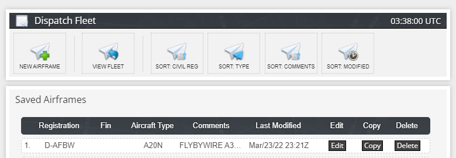

# Fuel and Weight

<link rel="stylesheet" href="/../../stylesheets/fuel-weight.css">

This section provides information on the A32NX weights configuration and insight on how to utilize and reference onboard/sim features to configure the aircraft appropriately for departure.

<!-- Saving this section for any future changes
{==

There are differences when using our Stable version vs. Development version.<br/>
Please select the correct version below.

==}

[Development Version](#development-version){ .md-button }
[Stable Version](#stable-version){ .md-button }
-->

---

??? info "General Fuel and Weight Information (Click to expand)"
    ## General Fuel and Weight Information

    ### Operating Empty Weight
    
    It is important to understand that the term "operating empty weight" can seem a little generic. OEW is typically calculated as "manufacturer's empty weight + standard items + operator items". These items can be the following (not all inclusive):
    
    - Crew members
    - Manuals
    - Food and Beverage
    - Emergency Equipment
    - and any equipment/supplies considered standard by the operator
    
    When considering your ZFW below please keep into consideration the above information with OEW with particular regard that this weight does include the flight crew.
    
    ### Zero Fuel Weight
    
    In simple terms the zero fuel weight (ZFW) = OEW + payload.
    
    Payload is defined as passengers, baggage and cargo.
    
    In a situation where your payload would be something like 14000 kg - *based on our new airframe:* your ZFW would total - 56.500 kg (42.500kg + 14.000kg)
    
    You can reference this against any OFP you may have generated through simBrief. For usage of our simBrief integration - [read here](simbrief.md).
    
    ### Zero Fuel Weight Center of Gravity
    
    The A32NX will auto calculate the ZFW and ZFWCG on the INIT B page once the aircraft and associated payload is loaded into the simulator.
    
    !!! warning "This is not your Center of Gravity for trimming."
    
    - See our [Weights and Balance](loading-fuel-weight.md#weights-and-balance) section in the simBrief integration feature guide.
    - You can read about INIT B configuration [here](../../pilots-corner/beginner-guide/preparing-mcdu.md#init-b).
    
    ### Center of Gravity
    
    An acceptable range for takeoff CG in the A32NX is between 16-40%. The CG is balanced during the passenger loading process.

    Trimming the aircraft for takeoff is usually optional and technically not required. Please reference our the [FBW Checklist](../../pilots-corner/SOP.md) to set the appropriate trim should you wish to.
    
    Ideally, anything less than 25% CG is considered FWD load, and anything more than 25% is considered an AFT load. While opting to choose between either CG configuration (aft/fwd) please consider the information below.
    
    !!! info "Notes on Differing CG Configurations"
    
    There are a few arguments worth considering when it comes to favoring an aft CG or fwd CG. Generally an aft CG would provide for better aircraft performance (lower stall speed, drag, and angle of attack for a given lift coefficient) but generally worse for pitch stability.

    For a smaller aircraft as the A320neo, most operators would favor an aft CG loading for fuel consumption benefits when considering the lifetime of the a fleet and how easy the benefits can be obtained.

---

## A32NX Configuration

Make sure you have our latest [simBrief Profile](../installation.md#simbrief-airframe)

!!! danger "MSFS Fuel & Weights window in the toolbar"
    We have blocked the UI elements in the MSFS fuel and weights window. However, the sliders in the MSFS window are movable but in a matter of 1-3 seconds the fuel and payload levels should return to the initial value.

    {--

    **PLEASE NOTE** we have changed fuel and payload loading.

    --}

    - Fuel: Now done via the [EFB](flypados3/dispatch.md#fuel-page).
    - Payload: Done through the [W&B in the MCDU](#weights-and-balance)


### Weights
- OEW (Empty Weight): 42500 kg / 93697 lbs
    - Also referred to as DOW (Dry Operating Weight) which can be seen in other simBrief OFP formats such as EZY
- MZFW (Max Zero Fuel Weight): 64300 kg / 141757 lbs
- MTOW (Max Takeoff Weight): 79000 kg / 174165 lbs
- MLW (Max Landing Weight): 67400 kg / 148591 lbs

### Fuel
- Max Fuel Capacity: 41989lbs/19.046kg
- Fuel tanks: 5
    - 2x Outer Tanks: 1528lbs/693kg each
    - 2x Inner Tanks: 12167lbs/5519kg each
    - 1x Center Tank: 14599lbs/6622kg

### Passengers
- Max Passenger Capacity: 18096kg (174 seats * 104kg)
- Passenger Weight: 104 (in kilograms)
    - 84 kg for passenger (including clothing and carry-on bags)
    - 20 kg for checked baggage
    - These default values can be overwritten by changing the used simBrief airframe. See [Changing Default Weights Using simBrief](#changing-default-weights-using-simbrief).
- Passenger compartments: 4
    - ECONOMY ROWS 1-6 (seats: 36 max: 6670lbs/3024kg)
    - ECONOMY ROWS 7-13 (seats: 42 max: 7780lb/3530kg)
    - ECONOMY ROWS 14-21 (seats: 48 max: 8880lb/4032kg)
    - ECONOMY ROWS 22-29 (seats: 48 max: 8880lb/4032kg)

### Cargo
- Max Cargo Capacity: 20800lb/9435kg
- Cargo Compartments: 4
    - FWD BAGGAGE/CONTAINER (max: 7500lb/3402kg)
    - AFT CONTAINER (max: 5350lb/2426kg)
    - AFT BAGGAGE (max: 4650lb/2110kg)
    - AFT BULK/LOOSE (max: 3300lb/1497kg)

## Changing Default Weights Using simBrief

The A32NX uses the following default weights for passengers and their baggage.

- 84 kg for passenger (including clothing and carry-on bags)
- 20 kg for checked baggage

These default weights cannot be changed in the aircraft at the moment. It is planned to provide an option to change these defaults with a future weights and balance flyPad EFB page.

It is possible to change these defaults by changing the simBrief airframe.

To do this open your simBrief airframe on the simBrief website under "MY FLEET" by clicking the Edit button.



Scroll down to find the entries for Passenger Weight and Baggage Weight.


Change the default weights as required and make sure you select Save Aircraft at the bottom of the page. The A32NX will use these new values the next time you import an operational flight plan based on this airframe.

!!! warning "Do Not Overload the Aircraft"
    It is the responsibility of the pilot to make sure the aircraft is not overloaded and within the specified limits.

    Especially important are:

    - MZFW (Max Zero Fuel Weight): 64300 kg / 141757 lbs
    - Maximum payload (passengers, baggage, freight) is determined by the lowest of these calculations:
        - MZFW - OEW, or  64300 kg - 42500 kg = 21800 kg
        - MTOW  - empty weight - (fuel load - taxi out fuel), or 79000 - 42500 - (fuel load - taxi out fuel)
        - MLW - empty weight - (all reserve/contingency fuel + extra fuel) , or 67400 - 42500 - (all reserve fuel/contingency/extra fuel).
    - When manually loading the payload, the MLW and MTOW limits are currently not checked and are the responsibility of the pilot.
    - Simbrief does manage payload limits by reducing the number of bags or passengers automatically. This is picked up by the aircraft correctly then.
    
    !!! danger ""
        If you manually specify a custom number of passengers that exceeds aircraft weight limitations please be aware that the OFP will still reflect the user-selected number of passengers.

        This is in part due to the fact that at the time when the OFP was generated, it interprets the passenger count as "booked passengers" and not current passengers on board the aircraft.

## Loading Fuel and Weight

!!! danger "MSFS Fuel & Weights window in the toolbar"
    We have blocked the UI elements in the MSFS fuel and weights window. However, the sliders in the MSFS window are movable but in a matter of 1-3 seconds the fuel and payload levels should return to the initial value.

    **PLEASE NOTE** we have changed fuel and payload loading.

    - Fuel: Now done via the [EFB](flypados3/dispatch.md#fuel-page).
    - Payload: Done through the [W&B in the MCDU](#weights-and-balance)

### Fuel

Fuel loading is now exclusively done via our EFB which has a great UI to see the status of fuel tanks and other options. [Guide Here](flypados3/ground.md#fuel-page).

### Weights and Balance

We have introduced a new flight model paired with a new weight and balance payload method that incorporates seat rows and the correct center of gravity.

Get our [simBrief Profile](../installation.md#simbrief-airframe).

{==

Please note the following:

- The cargo hold field now depicts either metric tons or thousands of pounds depending on the unit selected in the EFB Settings for aircraft configuration.
- **Highly recommend** ensuring that you select the same weights (KGS or LBS) in the EFB and in simBrief's OFP/Airframe before importing to prevent any mismatch in values.

See [flyPadOS 2 - Stable Version](flypados2/settings.md#aircraft-configuration) or [flyPadOS 3 - Development Version](flypados3/settings.md#aircraft-options--pin-programs) settings 
page if you wish to change the weight unit used by the aircraft systems.

==}

!!! warning "Fuel, Weights and Balance When Not Starting Cold & Dark"
    The process described in this section is for starting the flight at a gate/ramp in a cold and dark state.

    If you start your flight on the runway or in the air the loading process will only work if the Boarding Time [settings](flypados3/settings.md#sim-options) in the flyPad EFB 
    are set to `Instant`. This is deliberate as simulating the entire fueling or boarding process when starting from the runway does not make sense.

??? info "Dynamic Fields and Colors"
    Payload, ZFW, ZFWCG are dynamic fields that are updated alongside the loading/boarding process.

    - Payload = Pax Weight + Baggage Weight + Cargo
    - ZFW (Zero Fuel Weight) = OEW (Operating Empty Weight) + Payload
    - ZFWCG = CG based on ZFW (**Not to be mistaken for takeoff CG**)

    Stations in <span style="color:cyan">CYAN</span> indicate they are reading/waiting to board/load.

    Stations that are fully loaded will turn <span style="color:green">GREEN</span>.

    See also [General Fuel and Weight Information](#general-fuel-and-weight-information)

??? info "AOC Menu"

    The AOC (Airline Operational Center) menu is found in the MCDU MENU and should be used for certain apsects of this guide.

    * Click on `MCDU MENU`
    * Click on `ATSU` (ATSU = Air Traffic Service Unit)
    * Click on `AOC MENU` (AOC = Airline Operational Center)
    * Click on `W/B`

???+ tip "Information on Loading A32NX Manually"

    ##### Loading Manually

    It is possible to input these values manually to customize your passenger loading. Please note the following information when customizing your pax loading manually:

    - To assign a value to a row (station) enter the amount into your scratchpad using the MCDU keyboard and press the relevant LSK next to the desired station.
        - When inputting pax into individual rows this only accounts for the passenger's weight (84 kg or 185 lbs per passenger). Baggage and additional freight needs to be added 
        separately.
    - If inputting a value into the `TOTAL PAX` using LSK1L this will automatically distribute passengers based on an ideal CG.
        - The check-in baggage weight (20 kg or 44 lbs) is added to the cargo hold when using the `TOTAL PAX` field.
    - Once the above weights are accounted for you can input remaining weight (cargo weight) in a `X.X` format denoting either metric tons or thousands of pounds depending what 
    the unit selected in the EFB Settings.
        - Cargo weight is limited to max capacity if it exceeds the cargo hold limits (9435 kg or 20800 lbs).

#### Load OFP Payload Info

!!! block ""
    {align=right width=50% loading=lazy}

    Once on `W&B` page it should look like the sample image even if you have pressed OFP REQUEST in a different section.

    === "PAX Rows Format"
        - X (Y)
        - X denotes PAX already boarded into the relevant station
        - Y denotes PAX target (awaiting boarding) for the relevant station.

    === "Cargo Hold Format"
        - X (Y)
        - X denotes cargo loaded in the hold
        - Y denotes cargo target for the hold (includes baggage)

!!! block ""
    {align=right width=50% loading=lazy}

    Press OFP Request for this specific page and your `W&B` page will show total pax, pax per row and cargo hold which populate automatically.

    Note: this does not start the boarding process. Also Cargo will be limited as a protection to a max capacity if the simBrief OFP cargo exceeds the cargo hold limits).

#### Board Passengers

!!! block ""
    {align=right width=50% loading=lazy}

    You can now start boarding by selecting LSK6R (the indication will change from `START` to `STOP` in yellow) and watch as the passengers board the aircraft.

    **You do not need to remain on this page as boarding continues.**

    !!! warning ""
        Make sure boarding and loading is completed before filling the INIT B page's ZFW and CG!

    !!! tip ""
        [Setting boarding simulation time on the EFB](flypados3/settings.md#usage_2)

!!! block ""
    {align=right width=50% loading=lazy}

    Once boarding has completed all rows and total pax should turn green and the boarding indication returns to `START`. Verify your ZFW on this screen and check your lower ECAM that GW has been updated.

#### Deboard Passengers

##### Complete Deboard

!!! block ""
    {align=right width=50% loading=lazy}

    Once you have completed your flight you can opt to deboard passengers from the aircraft. Return to the AOC MENU and head to page 2 of `W&B`.

    To perform a complete deboard (all pax and cargo) input 0 into the scratchpad and select `LSK1L` into the TOTAL PAX field.

    Press START to begin the process.

##### Partial Deboard

!!! block ""
    {align=right width=50% loading=lazy}

    In case of a partial offload you can input the desired remaining pax and cargo for leg 2. The example to the right shows a planned retention of 142 passengers.

    **NOTE:** Cargo will show only bag weight for 142 pax. Please ensure that you re-add any additional cargo that you may have been carrying originally.

    Press START to begin the process.

---

## Fuel Persistence

!!! warning "Not Available in the Stable Version"

After completing a flight the A32NX saves the amount of fuel on board to a special directory when at least one engine is off. This feature is tied to the aircraft registration 
found in `atc_id` in the `acft.cfg`. 

If you decide to exit the simulator after your flight, loading back in at a later time with the same livery and associated registration 
will use the same amount of fuel from your previous flight.

These files are saved in our Work folder under `AircraftStates` alongside other files we store. The work folder can be found using this guide - [here](../support/index.
md#work-folder).

!!! tip ""
    Reminder: This file is created/updated **ONLY** on the ground and with at least an engine off.

    If no registraiton is found the default value is ASX320.

`AircraftStates/ASX320.ini` example:

```ini title="ASX320.ini"
[fuel]
fuel_center_quantity = 0.000000
fuel_left_quantity = 364.437298
fuel_right_quantity = 343.734621
fuel_left_aux_quantity = 228.000000
fuel_right_aux_quantity = 228.000000
```