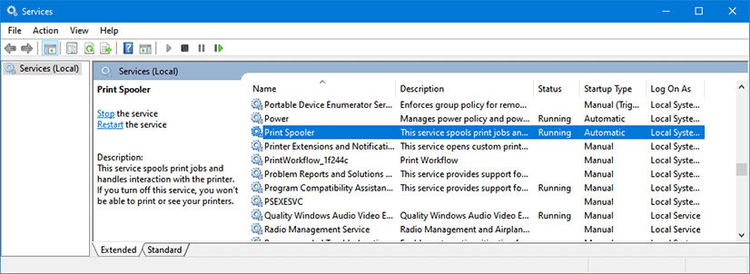

# Local API Server

<link rel="stylesheet" href="/../../stylesheets/web-mcdu.css">

## Overview

The Local API Server is a support application for the FlyByWire aircraft to be able to access local files on the PC or provide network services to access aircraft devices remotely.

This server will facilitate reading and writing of local files to allow usage of locally stored company routes, charts, images or other configurations.

It will also host services like the Remote MCDU Server to access the aircraft's MCDU via a browser from any device connected to the local network.

!!! note "Local API Server Roadmap"
    The Local API Server will be continuously extended and will provide new additional services in the future (e.g. remote access to any display in the aircraft, etc.)

## Start the Local API Server

Locate the `flybywire-aircraft-a320-neo` folder in your MSFS Community folder. Within this folder you will find a an executable file called `local-server.exe`.

{loading=lazy}

Double click on the `local-server.exe` file to start the Local API Server. The Local API Server does not need any command line paramters and is configured completely by the configuration file. See [Local API Server Configuration](#local-api-server-configuration)

**You will need to keep the Local API Server running to use remote web interfaces and local file features like co-routes**.

!!! info "Local API Server Command Window"
    {loading=lazy}

## Local API Server Configuration

The Local API configuration file can be found in the `resources` folder of the addon:

!!! note "Local API Server Configuration File"
    

```json title="Local API Server Configuration"
{
	"server": {
		"port": 8380
	},
	"printer": {
		"enabled": false,
		"printerName": null,
		"fontSize": 19,
		"paperSize": "A4",
		"margin": 30
	}
}
```

- port:
    - This is the port you need to add to your URL in the browser to access the MCDU Web Interface
    - E.g. 8380 for this URL: http://localhost:**==8125==**/interfaces/mcdu

- printer
    - enabled:
        - Set it to true if you want to use the printer.
        - Set it to false otherwise.
    - printerName:
        - Put the name of the printer you want to use here.
        - The names of the printers available is displayed during the Local API Server startup.
        - Make sure to use quotes around the `"Printer Name"`
    - font-size
        - This defines the font size the printer out will use.
        - Default is 19 but for smaller printouts (e.g. thermal printer) a smaller size may be required.
    - margin:
        - This defines the margins for the print out.
    - paper-size:
        - This defines the paper size the printer out uses.
        - See a list of all supported paper sizes below.

??? info "Supported Paper Sizes (click to expand)"
    Based on this list: [PDFKIT Paper Sizes](https://pdfkit.org/docs/paper_sizes.html){target=new}

    - A-series: A0 ... A10
    - B-series: B0 ... B10
    - C-series: C0 ... C10
    - RA-series: RA0 ... RA4
    - SRA-series: SRA0 ... SRA4
    - Common U.S. sizes
        - EXECUTIVE
        - LEGAL
        - LETTER
        - TABLOID
    - Other
        - 4A0
        - 2A0
        - FOLIO

    The exact size can be found here:
    [Overview_of_ISO_paper_sizes](https://en.wikipedia.org/wiki/Paper_size#Overview_of_ISO_paper_sizes){target=new}

## Network Configuration

To access the Local API Server from a remote device you need to make sure that this device is on the same network as the PC running the MCDU Server.

This is typically the case if both, the PC and the device use the same Internet router and the same WiFi.

To check this you can look at the IP address the MCDU server has listed in its command window while starting.

{loading=lazy}

Or check it as described here: [Find your IP address in Windows](https://support.microsoft.com/en-au/windows/find-your-ip-address-in-windows-f21a9bbc-c582-55cd-35e0-73431160a1b9)

In the example above the IP address is `192.168.1.19`.

Your device should typically also have an IP address starting with `192.168.1.x` in this case.

You can check this in the device's network configuration.

??? tip "Examples for Device Network Information (click to expand)"
    **iPad:**

    {loading=lazy}

    **Samsung Android:**

    {loading=lazy}

If you still can't connect to the MCDU server your firewall might be blocking the traffic. See next chapter.

## Firewall Configuration

!!! danger "Disclaimer"
    Changing Windows settings, especially security settings like the firewall comes with certain risks. Please do not change these settings if you are not comfortable doing so. FlyByWire Simulations does not take any responsibility for any issues caused by your changes to Windows or security settings.

If you can't reach your MCDU server from your browser on your device or on your local PC then it is very likely that your PC firewall is blocking this network traffic.

To test and confirm this turn off your firewall and try again to reach your MCDU via your browser. If you now can access your MCDU from your browser you have confirmed that it is indeed the firewall that blocks this access.

{==

 **Turn the firewall back on again.**<br/>
 *(never run a PC without a firewall)*

==}

We now know we need to open the port we want to use. The default port is **TCP 8380** and this must be allowed to pass the firewall.

There are several ways to open ports on your PC firewall.

For the Windows Firewall you can follow this guide here:

[Opening a Port on Windows Firewall Instructions](https://www.howtogeek.com/394735/how-do-i-open-a-port-on-windows-firewall/){target=new  .md-button }

Alternatively you can open a Command Line prompt as Administrator and use this command:

``` cmd title="Windows Powershell"
netsh advfirewall firewall add rule name="Local API Server" dir=in action=allow protocol=TCP localport=8380
```

For an advanced guide of this command see the Microsoft documentation:<br/>
[netsh advfirewall firewall](https://docs.microsoft.com/en-US/troubleshoot/windows-server/networking/netsh-advfirewall-firewall-control-firewall-behavior){target=new}

??? warning "Remove Autogenerated Rules (click to expand)"
    Sometimes Windows has already automatically generated some rules after showing you a firewall dialog when starting the Local API Server.

    If you still can't connect to the Local API Server these rules might be the cause. After adding your own rule as described above you don't need these anymore and they can be deleted.

    They usually look like this:

    

    

    Windows Dialog creating these automatic rules looks likes like this:
    

This should now allow access from your browser to the Local API.

## Occupied Port

Sometimes the default ports 8380 is already used by other services on your PC.

In this case you should get error messages similar to this:

``` cmd title="Windows Command Line"
Error: listen EADDRINUSE: address already in use :::8380
```

??? tip "How To Check If a Port is Already In Use? (click to expand)"
    You can see if a port is occupied by making sure the Local API Server is off and then running this command:

    Windows Command Line:
    ``` cmd title="Windows Command Line"
    netstat -ano | find "8380"
    ```
    or
    Windows Powershell:
    ``` cmd title="Windows Powershell"
    netstat -aon | findstr 8380
    ```

    If the corresponding port is already in use the output should be similar to this:
    ``` cmd title="Output"
      TCP    0.0.0.0:8380       0.0.0.0:0              LISTENING       4
      TCP    [::]:8380          [::]:0                 LISTENING       4
      ...
    ```

If the port is indeed already occupied then you need to change the default port in the configuration file [Local API Server Configuration](#local-api-server-configuration)

You also need to change the port in the [flyPad EFB Sim options page](/fbw-a32nx/feature-guides/flyPad/settings/#sim-options).

Of course now the firewall might need to be opened for this new port.

## Automatically Starting the Local API Server with Microsoft Flight Simulator

Microsoft Flight Simulator has the possibility to automatically start external applications during its own startup.

We can use this feature to also automatically start the Local API Server.

!!! warning "Be aware that this feature has some drawbacks and we do not offer support for this MSFS feature"

For this configuration we need to edit a file called `exe.xml` in the MSFS configuration folder.

You can find this folder here:

``` title="Sim from MS Store"
%localAppData%\Packages\Microsoft.FlightSimulator_8wekyb3d8bbwe\LocalCache
```

``` title="Sim from Steam"
%appData%\Microsoft Flight Simulator
```

This file should similar to this although it already might have entries not shown in this example:

``` xml title="exe.xml"
<?xml version="1.0" encoding="Windows-1252"?>
<SimBase.Document Type="SimConnect" version="1,0">
	<Descr>SimConnect</Descr>
	<Filename>SimConnect.xml</Filename>
	<Disabled>False</Disabled>
	
	<!-- NEW APPLICATIONS TO START HERE -->
	
</SimBase.Document>
```

Add the following section before the `</SimBase.Document>` tag and change the `YOUR_COMMUNITY_FOLDER` placeholder with the path to your Community folder.

``` xml title="exe.xml (partial)"
	<Launch.Addon>
		<Name>FlyByWire Local API Server</Name>
		<Disabled>False</Disabled>
		<Path>YOUR_COMMUNITY_FOLDER\flybywire-aircraft-a320-neo\local-server.exe</Path>
	</Launch.Addon>
```
Now every time Microsoft Flight Simulator starts it will also start the Local API Server.

!!! warning ""
    Unfortunately MSFS does not stop the automatically started applications after shutting down and you need to close the Local API Server window manually.

    If you do not do this there will be an error message the next time you start MSFS or the Local API Server as it is already running.

## Logfile

The command window running the Local API Server displays the servers log file information and provides important information about the started services, the necessary urls and ip addresses.

It also shows the available printer to help with configuring the Remote MCDU service for local printing.

The log file is also stored in a file in this folder, formatted by date:
```
<YOUR_COMMUNITY_FOLDER>\flybywire-aircraft-a320-neo\resources\logs\local-api
```
Please send us the latest logfile to the support channel on discord or on github issues if you're facing issues using the Local API's features.

## Troubleshooting

??? warning "No Local API Server Executable"
    The Local API Server and MCDU Server are only available in the Development Version.

??? warning "Error: listen EADDRINUSE: address already in use xxxx"
    The web socket port you are using is already in use.

    Solution: [Port is Occupied](#port-is-occupied)

??? warning "Local API Server not connecting to simulator although flight is Started"
    The Local API Server does not connect to the flight simulator although the flight is started and aircraft is loaded.

    The port 8380 is already in use.

    Solution: [Port is Occupied](#port-is-occupied)

??? warning "Local API Server Error: Failed to load printers"

    If you you start the server and get this error messages:

    ``` cmd title="Windows Command Line"
    Error: Failed to load printers.
    Make sure the "Print Spooler" Windows service is running.
    ```
    Solution: Make sure the "Printer Spooler" Windows service is turned on:

    {loading=lazy}

    You can find the Services Manager by pressing ++windows+r++ and then type `services.msc`.

??? warning "Local API Server Error: `...Encoding not recognized...`"

    When you start the server and and it crashes immediately with an error message mentioning `...Encoding not recognized...` your Windows OS most likely uses a rare UTF-8 based encoding.

    Solution:

    - Open Windows Control Panel -> Region.
    - Go to the Administrative tab and click Change system locale
    - Make sure the check mark next to Beta: Use UTF-8 for worldwide language support is selected.
    - Click OK and restart your computer.


