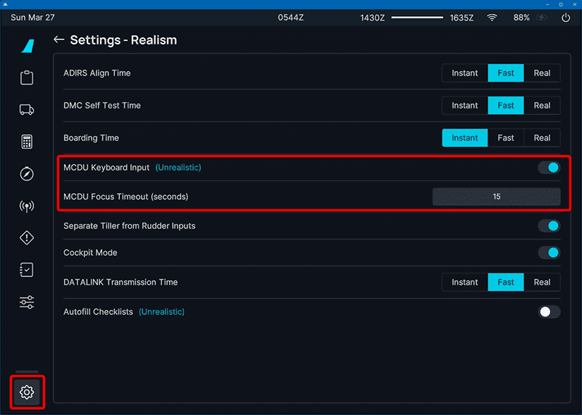

# MCDU Keyboard

---

## Overview

The A32NX is now capable of accepting native keyboard inputs when utilizing the MCDU. Your inputs will be seen in the `scratchpad` area.

What this feature allows:

- [x] Able to input text and numbers into the MCDU with a keyboard
- [x] Cockpit buttons are pressed with keyboard input
- [x] Visual indicator that input is being accepted by MCDU
- [x] Options for MCDU keyboard entry
- [x] A timer can be set to automatically lose focus from the MCDU after a set period
- [x] Normal Sim Keyboard Events (i.e., Camera) will be disabled while MCDU is in focus
- [x] Keyboard shortcuts to delete text in MCDU scratchpad

---

## Usage Guide

!!! warning "Important"
    Focusing the MCDU for keyboard input will stop all sim keybinds from working. Most notably, you will not be able to move the camera. Unfocusing should return control (i.e., camera).

### Enable MCDU keyboard

To begin using your keyboard with the MCDU, you must first enable the function within in the EFB settings:

{loading=lazy}

Once you have completed the above steps, simply click on the MCDU screen to put it into focus. The MCDU will display a visual indicator when input is ready to be accepted. The scratchpad should be highlighted, and the title will be highlighted in cyan as well.

Visual indicator sample:

### Accepted Keys

You may now use any combination of the following on your keyboard to use for entry:

- Letters
- Numbers
- Dots
- Slashes
- ++backspace++ - should perform the same usage as `CLR` on the MCDU
- ++shift+backspace++ - should function as `CLR HELD` keybind on the MCDU (clears the scratchpad)

To use the `Line Select Keys` ++"-"++ (LSK) with your keyboard, use the following keys:

- `LSK1L - LSK6L` uses ++f1++ through ++f6++
- `LSK1R - LSK6R` uses ++f7++ through ++f12++

To unfocus the MCDU, use any of the actions below:

- Click on the MCDU Screen
- Press ++ctrl+z++
- Press ++alt++

### Alternative Scratchpad Deletion

We have added new methods to assist in clearing content in the MCDU scratchpad.

- ++ctrl+backspace++ : Delete word from scratchpad.
- ++ctrl+shift+backspace++ : Delete all contents in the scratchpad.
- ++ctrl+a++ : Toggles a mode that allows user to delete the entire line by just using backspace.

### How to Set a Timeout

The timeout feature will "automatically unfocus" the MCDU screen should you be unable to use any of the actions above to manually unfocus.

Return to the EFB settings page and adjust the `MCDU Focus Timeout` setting.

- Valid range is `5 - 120 seconds`

Sample Image:

{loading=lazy}

---

## Known Issues

- ++esc++ and arrow keys are not captured
- CLR held (> 2 s)
    * Use ++shift+backspace++ together instead of ++backspace++
- Clicking on screen + using camera keybind keys will cause MCDU to move out of the view. Since the camera is locked, it is not possible to click on the screen to unfocus the MCDU
    * Use keyboard shortcuts below to unfocus:
        * ++ctrl+z++
        * ++alt++
- Keybindings are currently optimized for `ANSI/ISO-UK` keyboard layouts. `ISO-DE/ISO-NORD` users will notice that slash keys on their keyboards may not function as expected. This is an unfortunate limitation of the Coherent WebKit based JS Engine.
    * The following keys can be used as substitutes instead:
        * ++greater++
        * ++"#"++ (or ++single-quote++)
    * **Note:** that the numpad will work as expected regardless of keyboard layout.
