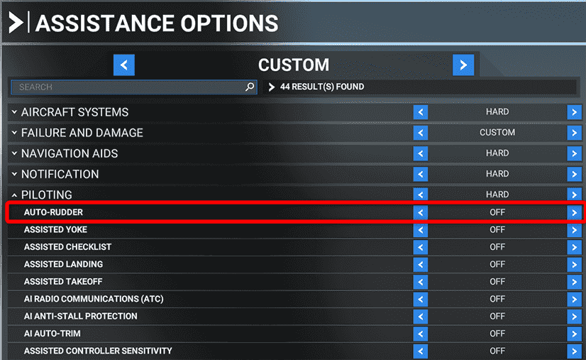
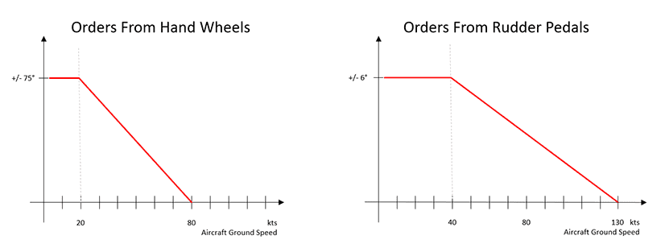
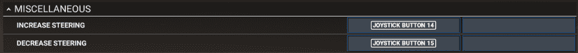

# Nose Wheel and Tiller Operation

We have introduced a feature for using the tiller to steer the nose wheel independently of the rudder. As Microsoft Flight Simulator does not natively support this feature yet we had to become creative to build a solution for this.

{--

This feature is deactivated by default. Before the tiller steering can be used it needs to be mapped to a controller input and activated in the flyPad Settings.

--}

This guides helps to set everything up and will also provide tips how to use it for taxi as this more realistic way of steering needs a bit of practice to master it.

!!! warning "De-activate MSFS Assistance Auto-Rudder"
    This A32NX is not compatible with the Microsoft Flight Simulator feature "Assistance Auto-Rudder". It is required to deactivate this feature in MSFS.

    We recommend to turn off all assistance features in MSFS as they interfere with the A32NX systems.

    {loading=lazy}

## What is the Tiller

The tiller is the handwheel located next to the sidestick on the side consoles.

{loading=lazy}

This handwheel is used on the ground for turning the nose wheel during taxi. It can turn the nose wheel up to 75° in either direction.

The rudder controls only can turn the nose wheel up to 6° and won't be sufficient for taxi operations.

The maximum turn angle of the nosewheel is speed dependent and the limits to which angle it can be turned follows this graph:

{loading=lazy}

The nose wheel steering is operative when:

- Yellow pressure system is available and pressurized
- One engine is running
- Main landing gear is on the ground
- `A/SKID and N/W STRG` is ON
- Towing control is on normal position

The tiller has push button which allows to disconnect any rudder orders from the nose wheel.

The ground crew can deactivate the steering system by using a switch in the electrical towing box for towing. The upper ECAM then shows a MEMO "N/W STEER DISC" (in green while engines are off, in amber when at least one engine is running).

!!! warning "Microsoft Flight Simulator sometimes has an invisible towing tug attached to the aircraft. The ECAM MEMO helps you recognize this."

## Mapping of the Tiller Axis

### Using an Axis

Microsoft Flight Simulator introduced a separate nose wheel axis with the launch of Sim Update 9. 

For compatibility, we currently have two settings available for use with our Nose Wheel Tiller implementation. Originally we were utilizing an unused axis to map the movement 
of your desired controller. Please see the two options below:

- `NOSE WHEEL STEERING AXIS` - **Recommended Setting**
- `MIXTURE 4 AXIS (-100% to 100%)` - To be depreciated soon.

#### How to Configure NOSE WHEEL STEERING AXIS

Find the following setting:

{loading=lazy}

Map `NOSE WHEEL STEERING AXIS` to the controller axis you want to use for the tiller. This needs to be different from the axis you use for the rudder.

??? warning "How to configure MIXTURE 4 AXIS (-100% to 100%) - OLD"

    Please this note this configuration will be depreciated soon.

    {loading=lazy}

    Map `MIXTURE 4 AXIS (-100% to 100%)` to the controller axis you want to use for the tiller. It needs to be different from the axis you use for the rudder.

    !!! bug "French Version of MSFS"
        Unfortunately MSFS does not show the `MIXTURE 4 AXIS (-100% to 100%)` axis in the French translation of Microsoft Flight Simulator. The axis should be called `AXE MÉLANGE 4 (-100 À 100%)`. To map the axis you need to switch MSFS to the English language. After mapping (and testing) you can switch MSFS back to French.

!!! tip "Example"
    If you have a twistable flight stick like the Thrustmaster TCA Sidestick Airbus Edition and you also have rudder pedals you can map the rudder to your hardware pedals (as it should be) and the sidestick's twist axis for the tiller.

If you use externally configured controls using SPAD.neXt, FSUIPC or Axis and Ohs you can use the `SIMCONNECT:AXIS_STEERING_SET` event. The parameter for full left is -16383, for straight it is 0 and for full right it is +16383.

### Using Keyboard or Controller Buttons

As an alternative to mapping an axis you can also map keys from the keyboard or buttons from the controller.

Use these or similar mappings on your controller or keyboard:

{loading=lazy}

Increase will turn the tiller and nose wheel to the right.

Decrease will turn the tiller and nose wheel to the left.

If you use externally configured controls using SPAD.neXt, FSUIPC or Axis and Ohs you can use the `SIMCONNECT:STEERING_DEC` and `SIMCONNECT:STEERING_INC` events.

### Pedal Disconnect Button

The tiller handwheel has a button to disconnect any input from the rudder pedals to the nose wheel. This button is commonly used when performing rudder checks while taxing so there is no unexpected nosewheel movement.

Again Microsoft Flight Simulator does not support this directly so we again reused an existing option to map a key or button to this.

The MSFS Controller Option we are using is `TOGGLE WATER RUDDER` and your mapping should look similar to this:

{loading=lazy}

!!! warning "This key/button is not used as a toggle! You need to hold the button/key for the disconnect to work!"

## Activating the Feature in the flyPad

To activate the tiller feature you need to go to the flyPad Settings page and navigate to the `Realism` tab. From there enable the `Separate Tiller from Rudder` feature.

{loading=lazy}

## Using the Tiller and Rudder

### Taxi

As described above taxiing with the tiller controlling the nose wheel will be different than using the rudder and nose wheel steering before.

The most noticeable change is that steering with the rudder on the ground will only turn the nose wheel up to 6° which will not be sufficient for normal taxi operations and most turns.

The second important change is that you need to operate the tiller steering with foresight and slowly as the nose wheel is turning rather slow. This means you need to start steering earlier and slower to make your turns and also start earlier to end your turn steering.

It is much more important to watch the aircraft ground speed as the nose wheel angle is limited as a function of speed. So make sure to slow down before doing sharp turns.

We recommend to practice this a bit until you get used to it.

!!! tip "We recommend to use an axis for the tiller as keys or buttons are much harder to use for steering the nose wheel."

### Takeoff and Landing

During takeoff and landing you will usually only use the rudder and you need to be aware that this only gives some turning authority over the nose wheel (up to 6°). This is especially critical if you are at a slow speed when the rudder has limited effect.

## Known Issues

As the current solution is a workaround of a missing Microsoft Flight Simulator feature there are some small issues in the implementation:

- Full tiller one way and rudder the opposite way can move the steering even without hydraulic power
- Full rudder action can overcome to some extent our system implementation. It is possible to move the nose wheel even with no hydraulic power, as MSFS will turn the wheel even when our internal implementation is not moving at all.

Modifying steering animation so it shows our internal system state will mask those issues and allow for perfect visual behaviour. But it can cause strange plane rotation behaviour when these issues will be triggered.

## YouTube Videos

### 320 Sim Pilot Video

<iframe width="790" height="450" src="https://www.youtube-nocookie.com/embed/2gWx0EblS30" title="YouTube video player" frameborder="0" allow="accelerometer; autoplay; clipboard-write; encrypted-media; gyroscope; picture-in-picture" allowfullscreen></iframe>

### Easyjetsimpilot

<iframe width="790" height="450" src="https://www.youtube-nocookie.com/embed/JM6WrwJJjIo" title="YouTube video player" frameborder="0" allow="accelerometer; autoplay; clipboard-write; encrypted-media; gyroscope; picture-in-picture" allowfullscreen></iframe>

