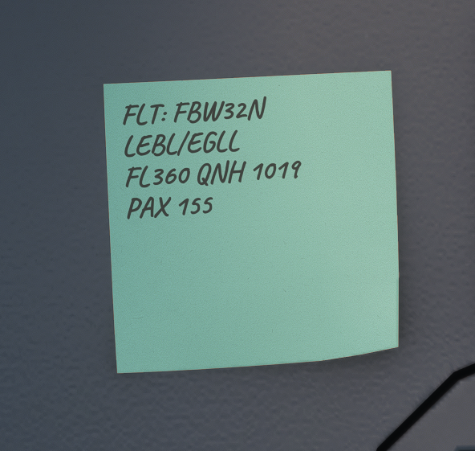

# Postit

This page explains how to use the new feature we are introducing into FlyByWire: Postit Notes. This new feature will help you to quickly write your best notes on the flight deck.
To begin using postit notes feature, you need to activate it through the flyPad - [Guide Here](flyPad/settings.md#sim-options)

Once the Postit feature is enabled you'll see a postit on your flight deck. This Postit paper is fully configurable. It includes:

- 5 different fonts
- 5 pen colors
- 6 paper colors
- Persistent
- Simbrief vitals
- Cut and paste

!!! info "How to write on Postit paper"
    To be able to write on the Postit paper, you have to click on a empty zone of the paper. It will enable and disable editing the paper.

Postit paper has 3 different icons:

- Palette icon changes the Postit's color

  {loading=lazy}

- Pen icon changes the pen's color

  {loading=lazy}

- Letter icon changes the font
  
  {loading=lazy}

!!! info "FBW Tip"
    You can cut and paste text into the Postit paper!

## Simbrief vitals

Activating the `Show Post-It® Simbrief Vitals` option through the flyPad - [Guide Here](flyPad/settings.md#sim-options), you'll see your Postit paper has now information from your latest Simbrief imported Flight Plan. This information includes:

- Flight number
- Destination/arrival airports
- Cruise Flight Level
- Local QNH
- PAX on board

You can still write your personal notes below this information.

  {loading=lazy}