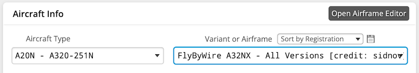

<link rel="stylesheet" href="../../../stylesheets/toc-tables.css">

# SimBrief and Navigraph Integration

We have recently streamlined our SimBrief integration with Navigraph. If you are using the stable version, please see [stable version information](#).

## Quick Links

|                                          Quick Links                                          |
|:---------------------------------------------------------------------------------------------:|
|                              [Flight Planning](#flight-planning)                              |
|                            [SimBrief Airframe](#simbrief-airframe)                            |
|             [Setup A32NX SimBrief Integration](#setup-a32nx-simbrief-integration)             |
|          [Using flyPad SimBrief Integration](#using-the-flypad-simbrief-integration)          |
| [Using the FMS (MCDU) and SimBrief Integration](#using-the-fms-mcdu-and-simbrief-integration) |


## Flight Planning

Check the [Flight Planning guide](flight-planning.md) for more details on Flight Planning in general.

In the world of flight simulation, SimBrief does all the flight planning for the users based on real word databases and sources. SimBrief provides on average ~40,000 flight plans to users each day and is the most commonly used tool for flight planning for non-professional flight simulation.

It is possible to use the SimBrief OFP (Operational Flight Plan) to configure and program the aircraft based on it without any special integration into the flight sim software or aircraft.

### Flight Planning with SimBrief

This is best explained by SimBrief itself - [SimBrief User Guide](https://www.simbrief.com/system/guide.php){target=new}

---

## SimBrief Airframe

SimBrief has a custom airframe available when using the A20N Aircraft type. You can select it as shown in the image below.

{loading=lazy}

This airframe will be updated by FlyByWire Simulations when needed, so you will always have the right configuration available.

## Setup A32NX SimBrief Integration

!!! info "This integration does not require having an active Navigraph subscription."

We have unified our SimBrief Integration with Navigraph. Your Navigraph account needs to be configured in the flyPad EFB.

You can do this by navigating to following page on the flyPad (EFB):

1. Settings Page
- 3rd Party Option
- Navigraph Login

Please follow the steps provided by the flyPad to securely link to your Navigraph account to the aircraft.

[Insert image here of 3rd party options page]

If you are still unsure of where the Settings page is on the EFB please see [flyPad Settings](flypados3/settings.md#settings-page).

??? warning "Stable Version Only" 
    The SimBrief username needs to be configured in the flyPad EFB. See [Setup SimBrief Integration](flypados3/settings.md#simbrief-integration)

## Using the flyPad SimBrief Integration

### Importing the SimBrief OFP to the flyPad

See [flyPad Guide - Load from SimBrief](flypados3/dashboard.md#load-from-simbrief)

See [flyPad Guide - OFP](flypados3/dispatch.md#ofp-page) on how to view the SimBrief Operational Flight Plan.

See [Fuel and Weight](loading-fuel-weight.md) on how to load fuel and payload.

---

## Using the FMS (MCDU) and SimBrief Integration

### Importing the SimBrief OFP to the FMS (MCDU)

We've included a quick method to have your SimBrief OFP automatically loaded into the MCDU.

!!! warning "Please do not select an arrival airport on the MSFS world menu, otherwise the integration will not work."

This portion of the guide assumes that you understand how to generate a SimBrief OFP.
Otherwise, read the [SimBrief User Guide](https://www.simbrief.com/system/guide.php){target=new} first.

!!! warning "Please Enable Detailed Navlog SimBrief Setting"
    {loading=lazy}

    It is important when generating your SimBrief OFP to ensure that the Detailed Navlog setting is enabled. 

    This setting is available when generating a new dispatch. Additionally, we recommend that you save any of your preferred settings here, including Detailed Navlog as the default by clicking on `Save Default`. This ensures that this setting is never disabled when generating a new OFP.

    If the setting is not enabled, the import function may only populate the departure and arrival airports into the flight page on the MCDU.

#### Request Data from SimBrief

- Return to `MCDU MENU`
- Click on `ATSU`
- Click on `AOC MENU`
- Click on `INIT/PRESS`
- Click on `INIT DATA REQ`

{loading=lazy}

This will prepare the MCDU to input the flight plan.

#### Initialize Flight Plan

!!! warning "IMPORTANT"
    Do not select an arrival airport on the MSFS world menu or flight planner. Doing this "initializes" the `FROM/TO` field when loading into your flight, removing the `INIT REQ.` option from the `INIT A` page.

Head over to the `INIT A` page.

- Select `INIT REQUEST` by pressing LSK2R

This will load your flight plan from SimBrief directly into the MCDU

{loading=lazy}

!!! note
    #### RWY, SID, STAR, and APPR
    The SimBrief import will **not** load RWY, SID, STAR, or APPR. You will need to manually add these into the flight plan. To learn how to set up the MCDU, you can read the [**^^F^^**LIGHT PLAN](../../pilots-corner/beginner-guide/preparing-mcdu.md#--f---light-plan) section in our beginner's guide.

    This is because RWY, SID, STAR and APPR are dependent on factors like active runways, traffic, weather, etc. and are determined by ATC and not the pilot's flight plan. They can be changed by ATC any time before takeoff or during flight and are therefore not imported in real life aircraft either.  

[//]: # (Updates to the wind request section should be mentioned in the preparing-mcdu.md page as well.)

### Wind Request

!!! warning "Important Notes"
    The current implementation of wind requests in the A32NX is in its early stages, with a full accurate implementation to follow at a later date. This method provides an easy solution to quickly import winds from a valid SimBrief OFP.

    In addition, please note the following:

    - Per-waypoint entry and request of cruise winds is still being implemented.
    - Wind Request functionality is not 100 % accurate to the real aircraft.
        - In real life, selecting the wind requests option on the climb page would populate the wind data for all stages of flight.

{loading=lazy}

On the `INIT A` page, select `WIND/TEMP` by pressing LSK4R. This brings you to the `CLIMB WIND` page.

{loading=lazy}

To request the wind data from the SimBrief flight plan, select `WIND REQUEST` by pressing LSK3R. This will calculate the wind profiles during the climb phase based on the SimBrief-provided wind data.

{loading=lazy}

Press LSK5R to go to the `NEXT PHASE`, `CRZ WIND`. The same procedure of pressing LSK3R for `WIND REQUEST` applies here.

Finally, press LSK5R to go to the `NEXT PHASE`, `DESCENT WIND`. Pressing LSK3R for `WIND REQUEST` will calculate the wind profiles during the descent phase based on the SimBrief-provided wind data.

!!! tip "Manual Entry"
    If you are obtaining your wind data from another source, please note that the format is as follows:

    ``` title="Winds Format Example"
    Magnetic Heading / Wind Speed / Altitude 
    ```

    Examples are provided above, and please note that altitude is written in relation to flight level (FL). 

### Fuel and Weight

See [Fuel and Weight](loading-fuel-weight.md)
