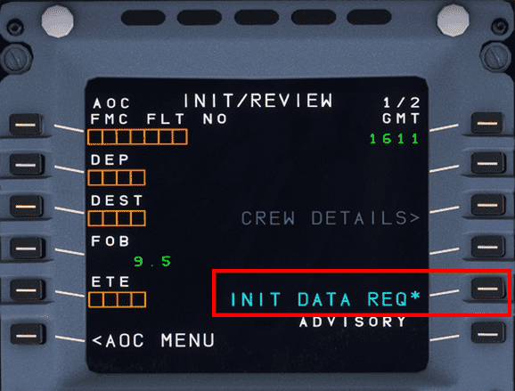
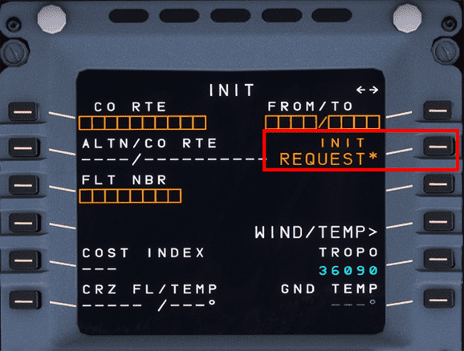

# SimBrief Integration

## Flight Planning

Flying IFR (Instrument Flight Rules) even in a simulation like Microsoft Flight Simulator always requires some level of flight planning.

In addition to the obvious route planning there are several other aspects which are critical to any good flight plan:

- Route Planning
    - Origin and Destination
    - Runways, SID and STAR
    - Compliance with ATC Requirements
    - Routing and Constraints
- Fuel Calculation
- Weather Forecast
- Cost and Time Optimization

See [Flight Planning](https://en.wikipedia.org/wiki/Flight_planning){target=new} on Wikipedia for more information.

Microsoft Flight Simulator tries to offer a simple way to do route planning (World Map before starting a flight) however this falls short, especially for users wanting a more realistic experience for airliner flying.

In real life airlines and pilots use dedicated software alongside various sources and services for creating their flight plans.

In the world of flight simulation simBrief does all that for the users based on real word databases and sources. SimBrief provides on average ~40.000 flight plans to users each day and is the most commonly used tool for flight planning for non-professional flight simulation.

It is absolutely possible to use the simBrief OFP (Operational Flight Plan) to configure and program the aircraft based on it without any special integration into the flight sim software or aircraft.

But as in real world aircraft it is common in flight simulation aircraft to integrate these systems directly with the aircraft's flight management system to be able to import all the relevant planning data. This includes the route, altitudes, constraints, fuel, payload (passengers, cargo), and other data points.

This is why FlyByWire has implemented our simBrief integration and will continue to improve this experience even further in the future.

### Flight Planning with SimBrief

This is best explained by simBrief itself - [simBrief User Guide](https://www.simbrief.com/system/guide.php){target=new}

---

## Using the flyPad simBrief Integration

### Setup A32NX simBrief Integration

The simbrief username needs to configured in the flyPad EFB. See [Setup simBrief Integration](flypados3/settings.md#simbrief-integration)

### Importing the simBrief OFP to the flyPad

See [flyPad Guide - Load from simBrief](flypados3/dashboard.md#load-from-simbrief)

See [flyPad Guide - OFP](flypados3/dispatch.md#ofp-page) on how to view the simBrief Operational Flight Plan.

See [Fuel and Weight](loading-fuel-weight.md) on how to load fuel and payload.

---

## Using the FMS (MCDU) and simBrief Integration

### Importing the simBrief OFP to the FMS (MCDU)

We've included a quick method to have your simBrief OFP automatically loaded into the MCDU. Please do not select an arrival airport on the MSFS world menu otherwise the integration will not work.

This portion of the guide assumes that you understand how to generate a simBrief OFP.

!!! warning "Please Enable Detailed Navlog simBrief Setting"
    {loading=lazy align=left} 

    It is important when generating your simBrief OFP to ensure that the Detailed Navlog setting is enabled. 

    This setting is available when generating a new dispatch. Additionally, we recommend that you save any of your preferred settings here including Detailed Navlog as the 
    default by clicking on `Save Default`. This ensures that this setting is never disabled when generating a new OFP.

    If setting is not enabled the import function may only populate the departure and arrival airports into the flight page on the MCDU.

#### Request Data from simBrief

* Return to `MCDU MENU`
* Click on `ATSU`
* Click on `AOC MENU`
* Click on `INIT/PRESS`
* Click on `INIT DATA REQ`

{loading=lazy}

This will prepare the MCDU to input the flight plan.

#### Initialize Flight Plan

!!! warning "IMPORTANT"
    Do not select an arrival airport on the MSFS world menu or flight planner. Doing this "initializes" the `FROM/TO` field when loading into your flight removing the INIT REQ. option from the `INIT A` page.

Head over to the `INIT A` page.

* Select `INIT REQUEST` by pressing LSK2R

This will load your flight plan from simBrief directly into the MCDU

{loading=lazy}

To learn how to set up the MCDU you can read the [**^^F^^**LIGHT PLAN](../../pilots-corner/beginner-guide/preparing-mcdu.md#flight-plan) section in our beginner's guide.

### Fuel and Weight

See [Fuel and Weight](loading-fuel-weight.md)
