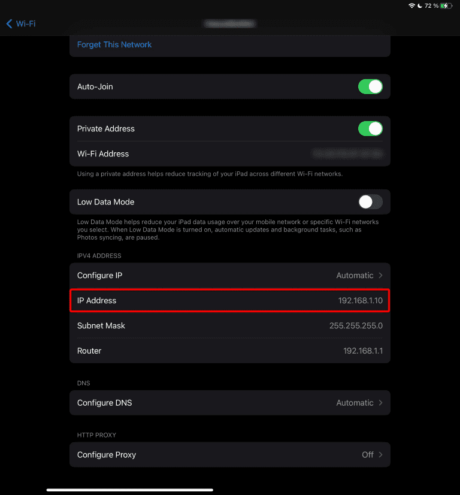
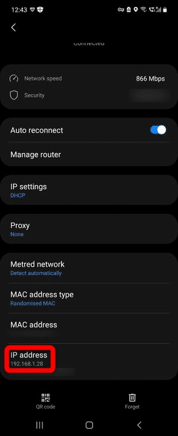
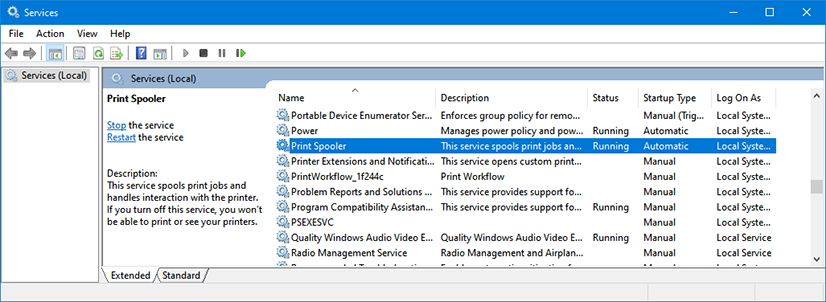

# MCDU Web Interface

## Overview

The MCDU Web Interface allows you to display and control the MCDU on a browser including browsers on mobile devices like phones or tablets.

See list of compatible and tested browsers: [Compatible Browsers](#compatible-browsers)

!!! note "MCDU Web Interface on iPad"
    {loading=lazy}

It also allows to use your real printer on to be used as a cockpit printer for the MCDU.

## Starting the MCDU Web Interface

### Start the MCDU Web Interface Server

To be able to use the MCDU Web Interface you need to start the web server which will provide the application to your browser.

To do this locate the `flybywire-aircraft-a320-neo` folder in your MSFS Community folder. Within this folder you will find a folder called `MCDU SERVER`. Open this folder.

{loading=lazy}

{loading=lazy}

Double click on the `server.exe` file to start the MCDU Server.

!!! tip "You can also you as a command line prompt to start the server."
    See advanced startup options below: [Advanced Start Options](#advanced-start-options)

Once started the MCDU Server application will ask if you want to use your real printer instead of the virtual printer in the cockpit.

If you choose to use your real printer then press ++y++, after which you need to select which printer you want to use. The MCDU Server will list all printers available in your Windows.

If you do not want to use your printer select ++n++.

After this the MCDU Server will start and will provide you with links for your local browser to access the MCDU Web Interface.

**You will need to keep this window open and the MCDU Server running to use the MCDU Web Interface**.

{loading=lazy}

### Browser on Local PC

If you want to use a browser on the same machine on which you are running the Microsoft Flight Simulator and the MCDU Server it is very easy to connect to the MCDU Web Interface.

Just use ++ctrl+left-button++ on the `localhost` link in the command window and it should open the MCDU Web Interface in your default browser.

[http://localhost:8125](http://localhost:8125){target=new}

If you want to start with only the MCDU display and not the whole MCDU panel then add "/fullscreen" to the url.

[http://localhost:8125/fullscreen](http://localhost:8125/fullscreen){target=new}

### Browser on Remote Device

If you want to use the MCDU Web Interface from a remote device (e.g. tablet, phone, 2nd PC, etc.) you need to first make sure you can access the MCDU Web Interface on your PC by allowing incoming network connections to the server through your Windows Firewall. See how to do this here: [Windows Firewall](#windows-firewall)

The MCDU Server command window tries to detect your IP address. Use the `http://xxx.xxx.xxx.xxx:8125` address and enter it into your browser on the remote device.

??? note "Unknown IP Address (click to expand)"
    Sometimes the MCDU Server is not able to detect your IP address.
    To find your correct IP address follow this guide: [How to Find Your IP Address on Windows 11](https://www.howtogeek.com/744082/how-to-find-your-ip-address-on-windows-11/){target=new}

    The port is set to 8125 per default and can be changed be command line options (see [Advanced Start Options](#advanced-start-options)) .

    Enter the correct IP address and port into the remote device's browser address line and hit enter.

    Example: http://192.168.16.1:8125

If you want to start with only the MCDU display without the MCDU panel then add "/fullscreen" to the url.

## How to Use the MCDU Web Interface

The MCDU Web Interface can then be used by mouse or touch on touch enabled devices.

It is also possible to click on the MCDU screen items themselves to actually click the corresponding LSK (Line Select Key).

Changes done in the MCDU Web Interface will be reflected immediately in the cockpit and vice versa. Any change in the cockpit will be immediately shown in the MCDU Web Interface.

If you want only the MCDU display to be shown then tap on the top-most part of the MCDU display. To return to the full MCDU view tap anywhere on the display.

If you want to start with only the MCDU display visible then add "/fullscreen" to the url.

## Using Your Local Printer

If you chose a local printer when starting the MCDU Server, every print you will make from the MCDU to the cockpit printer will instead be printed using your previously selected printer.

The printers available are those known to the PC where you run Microsoft Flight Simulator and the MCDU Server is on. It is not relevant if your remote device where you use the MCDU Web Interface actually knows this printer.


## Advanced Start Options

The MCDU Server application has several additional command line options to control the startup configuration.

```
> server.exe -h

Usage:
server [options]

Options:
--debug              enables debug mode
-h, --help           print command line options
--http-port=...      sets port for http server (default: 8125)
--no-printer         skips prompt to select printer
--printer=...        enables printing to the specified printer
--websocket-port=... sets port for websocket server (default: 8080)
```

- http-port:
    - This is the port you need to add to your URL in the browser to access the MCDU Web Interface.
    - E.g. 8125 for this URL: http://localhost:**==8125==**
- no-printer:
    - To skip the prompt asking to choose a printer and not have a local printer configured. This option is required if you want to start the server without any manual interaction (e.g. starting it with the sim).
- printer:
    - To skip the prompt asking to choose a printer and have a specific local printer configured. This option is required if you want to start the server without any manual interaction (e.g. starting it with the sim).
- websocket-port:
    - The port where the MCDU Web Interface will communicate with the MCDU itself.
    - ~~This is not the port you need to access the MCDU Web Interface with your browser~~.
    - ~~We recommend to **only** change this if absolutely required (e.g. port is already occupied). See [Websocket Port](#websocket-port) for details.~~

### Websocket Port

The websocket port is the port where the MCDU Web Interface will communicate with the actual MCDU. It sends and receives data through this connection.

This will allow to have different UI implementations or even hardware MCDUs in the future. We plan to eventually also create a separate documentation for using this websocket connection directly.

!!! warning "We recommend to **not** change the default port for the websocket. If you have to change this port because it is already occupied on your machine you need to change it as well in the EFB Sim Options Settings page."

## Compatible Browsers

With hundreds of different browsers available today it is not possible to test and support all browsers and their different versions.

In general we expect this feature to work with the common standard browsers on Windows, iOS, Android.

However there will be browsers where this will not work. In this case we recommend to use a standard browser.

We have tested these browsers during the development and these should therefore work ok:

- Windows: Edge, Firefox, Chrome
- iOS: Safari, Firefox, Edge, Chrome, duckduckgo, Brave, Bing
- Android: Chrome, Edge
- Mac OS: Safari, Firefox, Edge, Chrome
- Samsung phone: Chrome, Firefox, duckduckgo
- Linux: Firefox

Always the latest versions of the operating system and the browser.

We have not tested older operating systems or browsers and can't support them. The might or might not work.

Known unsupported operating systems or browsers:

- Samsung Internet Browser
- iOS 9.x, iOS 10.x
- Very old browsers not supporting Web Sockets. See [Can I use Web Sockets](https://caniuse.com/?search=web%20sockets){target=new}

## Troubleshooting and Advanced Configuration

### Network Configuration

To access the MCDU Server from a remote device you need to make sure that this device is on the same network as the PC running the MCDU Server.

This is typically the case if both, the PC and the device use the same Internet router and the same WiFi.i

To check this you can look at the IP address the MCDU server has listed in its command window.

{loading=lazy}

In the example above the IP address is `192.168.1.19`.

Your device should typically also have an IP address starting with `192.168.1.x` in this case.

You can check this in the device's network configuration.

??? tip "Examples for Device Network Information"
    **iPad:**

    {loading=lazy}

    **Samsung Android:**

    {loading=lazy}

If you still can't connect to the MCDU server your firewall might block the traffic. See next chapter.

### Firewall Configuration

!!! danger "Disclaimer"
    Changing Windows settings, especially security settings like the firewall comes with certain risks. Please do not change these settings if you are not comfortable doing so. FlyByWire Simulations cannot take any responsibility for any issues caused by your changes to Windows or security settings.

If you can't reach your MCDU server from your browser on your device or on your local PC then it is very likely that your PC firewall is blocking this network traffic.

To test and confirm this turn off your firewall and try again to reach your MCDU via your browser. If you now can access your MCDU from your browser you have confirmed that it is indeed the firewall that blocks this access.

 **Turn the firewall back on again.**<br/>
 *(never run a PC without a firewall)*

We now know we need to open the ports we want to use. The default ports are **TCP 8125** and **TCP 8080** and these must be allowed to pass the firewall.

There are several ways to open ports on your PC firewall.

For the Windows Firewall you can follow this guide here: [Opening a Port on Windows Firewall Instructions](https://www.howtogeek.com/394735/how-do-i-open-a-port-on-windows-firewall/){target=new  .md-button }

Alternatively you can open a Command Line prompt as Administrator and use these commands:

```
netsh advfirewall firewall add rule name="MCDU Web Server" dir=in action=allow protocol=TCP localport=8125

netsh advfirewall firewall add rule name="MCDU WebSocket Server" dir=in action=allow protocol=TCP localport=8080
```

For an advanced guide of this command see the Microsoft documentation:<br/>[netsh advfirewall firewall](https://docs.microsoft.com/en-US/troubleshoot/windows-server/networking/netsh-advfirewall-firewall-control-firewall-behavior){target=new}

This should now allow access from your browser to the MCDU.

### Occupied Port

Sometimes the default ports 8080 or 8125 are already used by other services on your PC.

In this case you should get error messages similar to this:

```
Error: listen EADDRINUSE: address already in use :::8125
```
or
```
Error: listen EACCES: permission denied 0.0.0.0:8080
```

You can see if a port is occupied by making sure the MCDU Server is off and then running this command:

Windows Command Line:
```
netstat -ano | find "8080"
```
or
Windows Powershell:
```
netstat -aon | findstr 8080
```

If the corresponding port is already in use the output should be similar to this:
```
  TCP    0.0.0.0:8080           0.0.0.0:0              LISTENING       4
  TCP    [::]:8080              [::]:0                 LISTENING       4
  ...
```

#### Webserver Port is Occupied

If the port for the webserver 8125 is already in use you can simply start the MCDU server with a different web server port with this option:

```
server.exe --http-port=8126
```

Of course now the firewall might need to be opened for this new port.

#### MCDU Websocket Server Port is Occupied

If the port for the MCDU Websocket Server is occupied you need to first change this port in the [flyPad EFB Sim options page](/fbw-a32nx/feature-guides/flyPad/settings/#sim-options).

You can then start the MCDU server using the new websocket port with this option:

```
server.exe --websocket-port=8081
```

Of course now the firewall might need to be opened for this new port.

### MCDU Server Architecture

{loading=lazy}

### Printer Issues

If you you start the server and get a similar error messages as this:

```
(node:77404) UnhandledPromiseRejectionWarning: Error: Command failed:
 Powershell.exe -Command Get-CimInstance Win32_Printer -Property DeviceID,Name
...
```

Make sure the "Printer Spooler" Windows service is turned on:

{loading=lazy}
