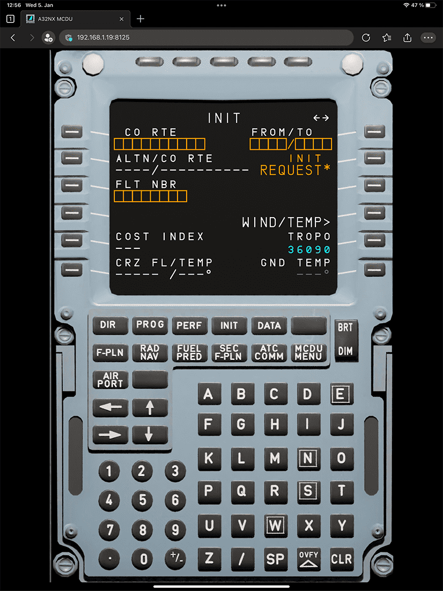
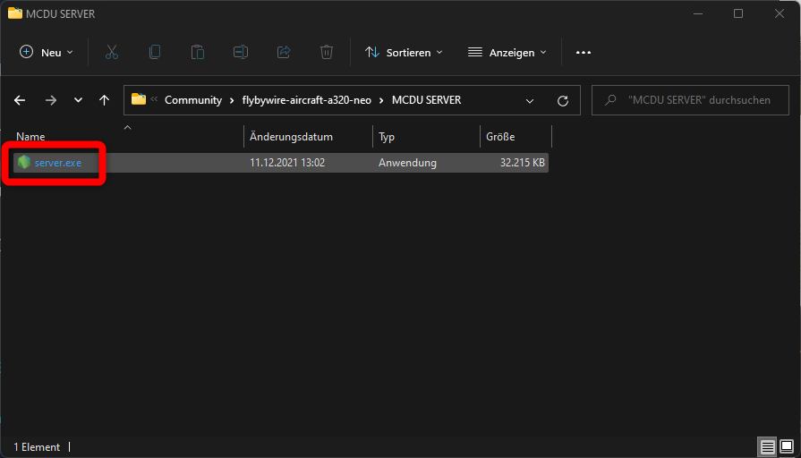
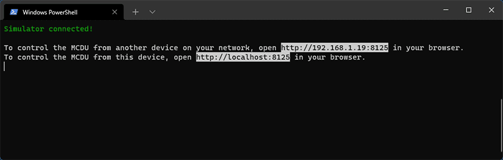

# MCDU Web Interface

## Overview

The MCDU Web Interface allows you to display and control the MCDU on any browser including mobile devices like phones or tablets.

!!! note "MCDU Web Interface on iPad"
    {loading=lazy}

It also allows to use your real printer to be used as a cockpit printer for the MCDU.

## Starting the MCDU Web Interface

### Start the MCDU Web Interface Server

To be able to use the MCDU Web Interface you need to start the web server which will provide the application to your browser.

To do this locate the `flybywire-aircraft-a320-neo` folder in your MSFS Community folder. Within this folder you will find a folder called `MCDU SERVER`. Open this folder.

{loading=lazy}

{loading=lazy}

Double click on the `server.exe` file to start the MCDU Server.

!!! tip "You can also you as a command line prompt to start the server."

Once started the MCDU Server application will ask if you want to use your real printer instead of the virtual printer in the cockpit.

If you choose to use your real printer the press ++y++ after which you need to select which printer you want to use. The MCDU Server will list all printers available in your Windows.

If you do not want to use your printer select ++n++.

After this the MCDU Server will start and will provide you with links for your local browser to access the MCDU Web Interface.

**You will need to keep this window open and the MCDU Server running to use the MCDU Web Interface**.

!!! warning "IP Address for Remote Device"
    The IP address shown for the remote device might be incorrect. The tool pics the first local address it finds put there is a chance that you need to use a different ip address to reach your PC.

    Details see in chapter [Browser on Remote Device](#browser-on-remote-device)

### Browser on Local PC

If you want to use a browser on the same machine on which you are running the Microsoft Flight Simulator and the MCDU Server it is very easy to connect to the MCDU Web Interface.

Just use ++ctrl+left-button++ on the `localhost` link in the command window and it should open the MCDU Web Interface in your default browser.

[http://localhost:8125](http://localhost:8125){target=new}

If you want to start with only the MCDU display then add "/fullscreen" to the url.

[http://localhost:8125/fullscreen](http://localhost:8125/fullscreen){target=new}

### Browser on Remote Device

If you want to use the MCDU Web Interface from a remote device (e.g. tablet, phone, 2nd PC, etc.) you need to first make sure you can access the MCDU Web Interface on your PC by allowing incoming network connections to the server through your Windows Firewall. See how to do this here: [Windows Firewall](#windows-firewall)

The MCDU Server command window tries to guess your IP address. Use the `http://xxx.xxx.xxx.xxx:8125` address and enter it into your browser on the remote device.

!!! note "Incorrect IP Address "
    Sometimes a wrong IP address will be shown in the MCDU Server command window and it will not be possible to connect to the MCDU Server from a remote device.

    To find your correct IP address follow this guide: [How to Find Your IP Address on Windows 11](https://www.howtogeek.com/744082/how-to-find-your-ip-address-on-windows-11/){target=new}

    The port is always set to 8125.

    Enter the correct IP address and port into the remote device's browser address line and hit enter.

    Example: http://192.168.16.1:8125

If you want to start with only the MCDU display then add "/fullscreen" to the url.

## How to Use the MCDU Web Interface

The MCDU Web Interface can then be used by mouse (our touch on touch enabled devices).

It is also possible to click on the MCDU screen items themselves to actually click the corresponding LSK (Line Select Key).

Changes done in the MCDU Web Interface will be reflected immediately in the cockpit and vice versa. Any change in the cockpit will be immediately shown in the MCDU Web Interface.

If you want only the MCDU display to be shown then tap on the top-most part of the MCDU display. To return to full MCDU view tap anywhere on the display.

If you want to start with only the MCDU display then add "/fullscreen" to the url.

## Windows Firewall

!!! danger "Disclaimer"
    Changing Windows settings, especially security settings like the firewall comes with certain risks. Please do not change these settings if you are not comfortable doing so. FlyByWire Simulations cannot take any responsibility for any issues caused by your changes to Windows or security settings.

[How Do I Open a Port on Windows Firewall?](https://www.howtogeek.com/394735/how-do-i-open-a-port-on-windows-firewall/){target=new}

