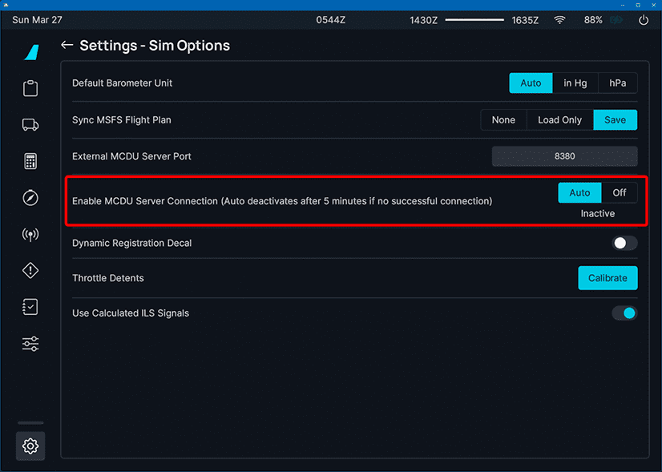
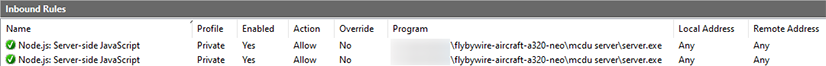
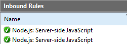
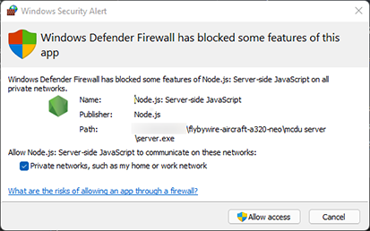
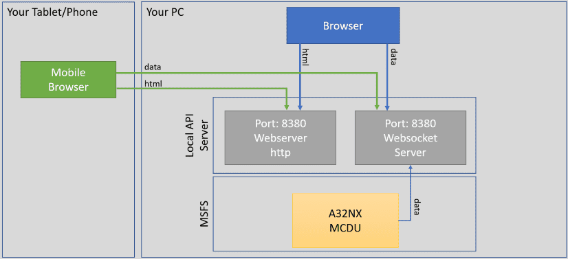

# MCDU Web Interface

!!! bug "TODO rewrite"

<link rel="stylesheet" href="/../../stylesheets/web-mcdu.css">

!!! warning "Not available in the Stable Version"

!!! info "Changes to Previous Version"
    The MCDU Web Interface now uses a web server built into the newly release Local API Server. This Local API Server will host additional local services required for some features of the A32NX.

    In the previous version it was necessary to have a http port (default 8125) and a websocket port (default 8380). The new server only requires one port to be configured. The default port is 8380.

    The URL for the MCDU Web Interface has changed to [http://localhost:8380/interfaces/mcdu](http://localhost:8380/interfaces/mcdu){target=new}

    Configuration is now done via a config file and not with command line arguments any longer. See [Advanced Start Options](#advanced-start-options).

## Overview

The MCDU Web Interface allows you to display and control the MCDU on a browser including browsers on mobile devices like phones or tablets.

See list of compatible and tested browsers: [Compatible Browsers](#compatible-browsers)

!!! note "MCDU Web Interface"
    {loading=lazy}

It also allows to use your real printer on to be used as a cockpit printer for the MCDU.

## Starting the MCDU Web Interface

### Start the MCDU Web Interface Server

To be able to use the MCDU Web Interface you need to start the Local API Server which includes the MCDU Server and which will provide the application to your browser.

To do this locate the `flybywire-aircraft-a320-neo` folder in your MSFS Community folder. Within this folder you will find a an executable file called `local-server.exe`.

{loading=lazy}

Double click on the `local-server.exe` file to start the Local API Server.

!!! tip "You can also use the command prompt to start the server manually"
    See advanced startup options below: [Local API Server Configuration](#local-api-server-configuration)

Once started the MCDU Server application will ask if you want to use your real printer instead of the virtual printer in the cockpit.

If you choose to use your real printer then press ++y++, after which you need to select which printer you want to use. The MCDU Server will list all printers available in your Windows.

If you do not want to use your printer select ++n++.

After this the MCDU Server will start and will provide you with links for your local browser to access the MCDU Web Interface.

**You will need to keep this window open and the Local API Server running to use the MCDU Web Interface**.

!!! info "Local API Server Command Window"
    {loading=lazy}

### MCDU Server Connection Attempts Timeout

Due to issues in the Microsoft Flight Simulator Coherent Engine (Javascript Engine) continuous connection attempts lead to performance problems for some users because of how the engine handles unsuccessful connections. 

Therefore, a timeout mechanism has been built into the MCDU limiting the number of connection attempts the MCDU will execute.

A setting in the fylPad EFB Sim Options page has been introduced to allow users to restart the connection attempts or to turn off the attempts to connect to the MCDU Server completely.



The three settings are:

- Auto On:
    - The MCDU attempts to connect to the MCDU Server for 5min after pressing "Ready to Fly".
    - If this setting is selected the MCDU will try to connect to the MCDU Server for 5min after every start of a new flight.
- Auto Off:
    - After 5min of unsuccessful connection attempts the MCDU will stop any further attempts and this setting will be automatically set.
- Perm Off:
    - The MCDU will not make any attempts to connect to the MCDU Server.

### Browser on Local PC

If you want to use a browser on the same machine on which you are running the Microsoft Flight Simulator and the MCDU Server it is very easy to connect to the MCDU Web Interface.

Just use ++ctrl+"Left Click"++ on the `localhost` link in the command window and it should open the MCDU Web Interface in your default browser.

[http://localhost:8380/interfaces/mcdu](http://localhost:8380/interfaces/mcdu){target=new}

### Browser on Remote Device

If you want to use the MCDU Web Interface from a remote device (e.g. tablet, phone, 2nd PC, etc.) you need to first make sure you can access the MCDU Web Interface on your PC by allowing incoming network connections to the server through your Windows Firewall. See how to do this here: [Windows Firewall](#windows-firewall)

The IP address of the MCDU Web Interface will be displayed during the Local API Server start up.

!!! bug "TODO: image of startup log"

To learn how to find your ip address read this Microsoft article: [Find your IP address in Windows](https://support.microsoft.com/en-au/windows/find-your-ip-address-in-windows-f21a9bbc-c582-55cd-35e0-73431160a1b9)

Enter the correct IP address and port into the remote device's browser address line and hit enter.

Example: http://192.168.16.1:8380/interfaces/mcdu

## How to Use the MCDU Web Interface

The MCDU Web Interface can then be used by mouse or touch depending on your device.

It is also possible to click on the MCDU screen items themselves to actually click the corresponding LSK (Line Select Key).

You can hold the CLR key for >1.5sec to clear all of the scratchpad's content as it is possible in the cockpit itself.

Changes done in the MCDU Web Interface will be reflected immediately in the cockpit and vice versa. Any change in the cockpit will be immediately shown in the MCDU Web Interface.

### Fullscreen Display
If you only want the MCDU display to be shown then tap on the top-most part of the MCDU display. To return to the full MCDU view tap anywhere on the display.

If you want to start with only the MCDU display visible then add `?fullscreen` to the url.

### Sound
You can enable click sounds when pressing buttons on the MCDU by adding `?sound` to the url.

### Day and Night Mode
It is possible to switch between a day and night mode MCDU visualization be clicking/touching the BRT/DIM button in the Web MCDU.

## Using Your Local Printer

If you chose a local printer when starting the MCDU Server, every print you will make from the MCDU to the cockpit printer will also be printed using your previously selected printer.

The printers available are those known to the PC where you run Microsoft Flight Simulator and the MCDU Server is on. It is not relevant if your remote device where you use the MCDU Web Interface actually knows this printer.

Available printers are listed at startup and you need to add the printer you want to use to the configuration as shown here: [Local API Server Configuration](#local-api-server-configuration).

You can also configure font size, margin size and paper size.

## Compatible Browsers

With hundreds of different browsers available today it is not possible to test and support all browsers and their different versions.

In general we expect this feature to work with the common modern standard browsers on Windows, iOS, Android.

However, there will be browsers where this will not work. In this case we recommend to use a standard browser.

We have tested these browsers (current versions) during the development and these should therefore work ok:

- Windows: Edge, Firefox, Chrome
- iOS: Safari, Firefox, Edge, Chrome, duckduckgo, Brave, Bing
- Android: Chrome, Edge
- Mac OS: Safari, Firefox, Edge, Chrome
- Samsung phone: Chrome, Firefox, duckduckgo
- Linux: Firefox
- Amazon Kindle Fire HD 10 : Silk <br/>(App Version 94.2.2.4606.119.10 Android 5.1.1, Fire OS 5.6.9.0)

{==

Always use the latest versions of the operating system and the browser.

We have not tested older operating systems or browsers and can't support them. They might or might not work.

==}

Known unsupported operating systems or browsers:

- Samsung Internet Browser
- iOS 9.x, iOS 10.x
- Very old browsers not supporting Web Sockets. See [Can I use Web Sockets](https://caniuse.com/?search=web%20sockets){target=new}

## Advanced Configuration

### Local API Server Configuration

!!! bug "TODO"

The Local API configuration file can be found here:

!!! note "Local API Server Configuration File"
    

```json title="Local API Server Configuration"
{
	"server": {
		"port": 8380
	},
	"printer": {
		"enabled": false,
		"printerName": null,
		"fontSize": 19,
		"paperSize": "A4",
		"margin": 30
	}
}
```

- port:
    - This is the port you need to add to your URL in the browser to access the MCDU Web Interface
    - E.g. 8380 for this URL: http://localhost:**==8125==**/interfaces/mcdu

- printer
    - enabled:
        - Set it to true if you want to use the printer.
        - Set it to false otherwise.
    - printerName:
        - Put the name of the printer you want to use here.
        - The names of the printers available is displayed during the Local API Server startup.
    - font-size
        - This defines the font size the printer out will use.
        - Default is 19 but for smaller printouts (e.g. thermal printer) a smaller size may be required.
    - margin:
        - This defines the margins for the print out.
    - paper-size:
        - This defines the paper size the printer out uses.
        - See a list of all supported paper sizes below.

??? info "Supported Paper Sizes (click to expand)"
    Based on this list: [PDFKIT Paper Sizes](https://pdfkit.org/docs/paper_sizes.html){target=new}

    - A-series: A0 ... A10
    - B-series: B0 ... B10
    - C-series: C0 ... C10
    - RA-series: RA0 ... RA4
    - SRA-series: SRA0 ... SRA4
    - Common U.S. sizes
        - EXECUTIVE
        - LEGAL
        - LETTER
        - TABLOID
    - Other
        - 4A0
        - 2A0
        - FOLIO

    The exact size can be found here:
    [Overview_of_ISO_paper_sizes](https://en.wikipedia.org/wiki/Paper_size#Overview_of_ISO_paper_sizes){target=new}

### Network Configuration

To access the MCDU Server from a remote device you need to make sure that this device is on the same network as the PC running the MCDU Server.

This is typically the case if both, the PC and the device use the same Internet router and the same WiFi.

To check this you can look at the IP address the MCDU server has listed in its command window.

{loading=lazy}

Or check it as described here: [Find your IP address in Windows](https://support.microsoft.com/en-au/windows/find-your-ip-address-in-windows-f21a9bbc-c582-55cd-35e0-73431160a1b9)

In the example above the IP address is `192.168.1.19`.

Your device should typically also have an IP address starting with `192.168.1.x` in this case.

You can check this in the device's network configuration.

??? tip "Examples for Device Network Information (click to expand)"
    **iPad:**

    {loading=lazy}

    **Samsung Android:**

    {loading=lazy}

If you still can't connect to the MCDU server your firewall might block the traffic. See next chapter.

### Firewall Configuration

!!! danger "Disclaimer"
    Changing Windows settings, especially security settings like the firewall comes with certain risks. Please do not change these settings if you are not comfortable doing so. FlyByWire Simulations cannot take any responsibility for any issues caused by your changes to Windows or security settings.

If you can't reach your MCDU server from your browser on your device or on your local PC then it is very likely that your PC firewall is blocking this network traffic.

To test and confirm this turn off your firewall and try again to reach your MCDU via your browser. If you now can access your MCDU from your browser you have confirmed that it is indeed the firewall that blocks this access.

{==

 **Turn the firewall back on again.**<br/>
 *(never run a PC without a firewall)*

==}

We now know we need to open the port we want to use. The default port is **TCP 8380** and this must be allowed to pass the firewall.

There are several ways to open ports on your PC firewall.

For the Windows Firewall you can follow this guide here:

[Opening a Port on Windows Firewall Instructions](https://www.howtogeek.com/394735/how-do-i-open-a-port-on-windows-firewall/){target=new  .md-button }

Alternatively you can open a Command Line prompt as Administrator and use this command:

``` cmd title="Windows Powershell"
netsh advfirewall firewall add rule name="Local API Server" dir=in action=allow protocol=TCP localport=8380
```

For an advanced guide of this command see the Microsoft documentation:<br/>
[netsh advfirewall firewall](https://docs.microsoft.com/en-US/troubleshoot/windows-server/networking/netsh-advfirewall-firewall-control-firewall-behavior){target=new}

??? warning "Remove Autogenerated Rules (click to expand)"
    Sometimes Windows has already automatically generated some rules after showing you a firewall dialog when starting the MCDU Server.

    If you still can't connect to the MCDU Server these rules might be the cause. After adding your own rule as described above you don't need these anymore and they can be deleted.

    They usually look like this:

    

    

    Windows Dialog creating these automatic rules looks likes like this:
    

This should now allow access from your browser to the MCDU.

### Occupied Port

Sometimes the default ports 8380 is already used by other services on your PC.

In this case you should get error messages similar to this:

``` cmd title="Windows Command Line"
Error: listen EADDRINUSE: address already in use :::8380
```

??? tip "How To Check If a Port is Already In Use? (click to expand)"
    You can see if a port is occupied by making sure the MCDU Server is off and then running this command:

    Windows Command Line:
    ``` cmd title="Windows Command Line"
    netstat -ano | find "8380"
    ```
    or
    Windows Powershell:
    ``` cmd title="Windows Powershell"
    netstat -aon | findstr 8380
    ```

    If the corresponding port is already in use the output should be similar to this:
    ``` cmd title="Output"
      TCP    0.0.0.0:8380       0.0.0.0:0              LISTENING       4
      TCP    [::]:8380          [::]:0                 LISTENING       4
      ...
    ```

#### Port is Occupied

If the port is indeed already occupied then you need to change the default port in the configuration file [Local API Server Configuration](#local-api-server-configuration)

You also need to change the port in the [flyPad EFB Sim options page](/fbw-a32nx/feature-guides/flyPad/settings/#sim-options).

Of course now the firewall might need to be opened for this new port.

## Starting the MCDU Server with Microsoft Flight Simulator

Microsoft Flight Simulator has the possibility to automatically start external applications during its own startup.

We can use this feature to also automatically start the MCDU Server.

!!! warning "Be aware that this feature has some drawbacks and we do not offer support for this MSFS feature"

For this configuration we need to edit a file called `exe.xml` in the MSFS configuration folder.

You can find this folder here:

``` title="Sim from MS Store"
%localAppData%\Packages\Microsoft.FlightSimulator_8wekyb3d8bbwe\LocalCache
```

``` title="Sim from Steam"
%appData%\Microsoft Flight Simulator
```

This file should similar to this although it already might have entries not shown in this example:

``` xml title="exe.xml"
<?xml version="1.0" encoding="Windows-1252"?>
<SimBase.Document Type="SimConnect" version="1,0">
	<Descr>SimConnect</Descr>
	<Filename>SimConnect.xml</Filename>
	<Disabled>False</Disabled>
	
	<!-- NEW APPLICATIONS TO START HERE -->
	
</SimBase.Document>
```

Add the following section before the `</SimBase.Document>` tag and change the `YOUR_COMMUNITY_FOLDER` placeholder with the path to your Community folder.

``` xml title="exe.xml (partial)"
	<Launch.Addon>
		<Name>FlyByWire Local API Server</Name>
		<Disabled>False</Disabled>
		<Path>YOUR_COMMUNITY_FOLDER\flybywire-aircraft-a320-neo\local-server.exe</Path>
	</Launch.Addon>
```
Now every time Microsoft Flight Simulator starts it will also start the MCDU Server.

!!! warning ""
    Unfortunately MSFS does not stop the automatically stated applications after shutting down and you need to close the MCDU Server window manually.

    If you do not do this there will be an error message the next time you start MSFS or the MCDU Server as it is already running.

## MCDU Server Architecture

{loading=lazy}

The MCDU Server uses a web application running in the browser to send and receive data via the Web Socket protocol from the MCDU.

To open the web application the browser will connect to the Local API Server's webserver via http protocol (default port 8030) and download and run the MCDU Web Interface application (HTML/CSS/JavaScript).

The MCDU Web Interface application will open a data connection to the MCDU via Web Socket protocol (default port 8380) and receive data (screen content) and send data (user input like button pushes) from and to the MCDU.

For this to work the browser must be able to reach the MCDU Server via the two TCP port 8380 (this default can be changed) which means users might need to reconfigure their network and firewall settings accordingly (see documentation above).

## Troubleshooting

??? warning "No MCDU SERVER Folder"
    The MCDU Server is only available in the Development Version.

??? warning "MCDU Server Error: Port 8380 is already in use"
    The web socket port 8380 is already in use.

    Solution: [Port is Occupied](#port-is-occupied)

??? warning "MCDU Server not connecting to simulator although flight is Started"
    The MCDU Server does not connect to the flight simulator although the flight is started and aircraft is loaded.

    The port 8380 is already in use.

    Solution: [Port is Occupied](#port-is-occupied)

??? warning "MCDU Server Error: Failed to load printers"

    If you you start the server and get this error messages:

    ``` cmd title="Windows Command Line"
    Error: Failed to load printers.
    Make sure the "Print Spooler" Windows service is running.
    ```
    Solution: Make sure the "Printer Spooler" Windows service is turned on:

    {loading=lazy}

    You can find the Services Manager by pressing ++windows+r++ and then type `services.msc`.

??? warning "MCDU Server Error: `...Encoding not recognized...`"

    When you start the server and and it crashes immediately with an error message mentioning `...Encoding not recognized...` you Windows most likely uses a rare UTF-8 based encoding.

    Solution:

    - Open Windows Control Panel -> Region.
    - Go to the Administrative tab and click Change system locale
    - Make sure the check mark next to Beta: Use UTF-8 for worldwide language support is selected.
    - Click OK and restart your computer.

??? warning "Browser Can't Connect to MCDU Web Interface"
    You browser can't connect to the MCDU Web Interface and times out eventually.

    Cause: This is most likely a network or firewall issue.

    Solutions:

    - [Network Configuration](#network-configuration)
    - [Firewall Configuration](#firewall-configuration)

??? warning "Browser Shows MCDU Web Interface but Display Remains Black"
    You browser can't connect to the MCDU Web Socket port.

    Cause: This is most likely a network or firewall issue.

    Solutions:

    - [Network Configuration](#network-configuration)
    - [Firewall Configuration](#firewall-configuration)

    Cause: Aircraft has no Power / MCDU is still off.

    Solution: Power up the aircraft.

??? warning "Browser Shows MCDU Web Interface only partly or garbled"
    Your browser can connect to the server but does not show the MCDU Web Interface correctly or not at all.

    Cause: This is most likely an incompatible browser.

    Solutions:

    - Use a different browser.
    - See tested browsers: [Compatible Browsers](#compatible-browsers)

??? warning "Printout format incorrect / receipt printer"
    The default format the printer uses is paper size A4 and font size 19.

    For some printer especially receipt printer a different paper size and font size must be used to make the output look good.

    We recommend to experiment with this a bit to find good values for your printer. In our tests we found paper size C8 and font size 10 a good starting point.
