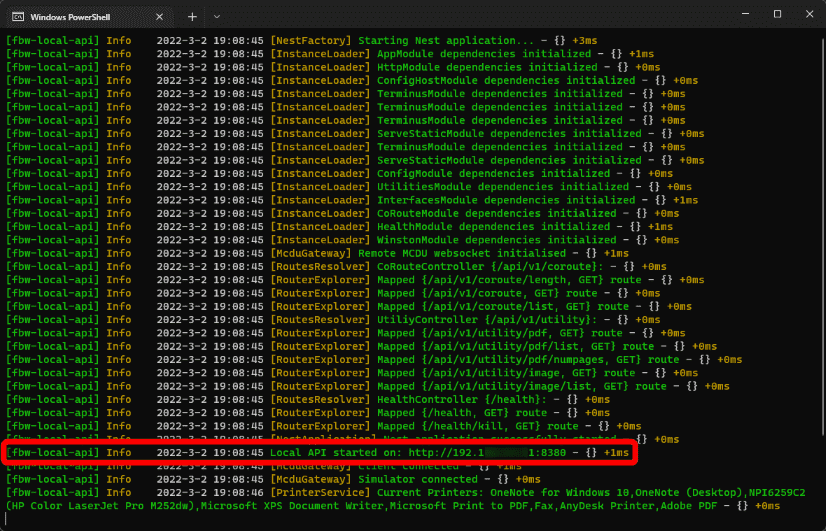
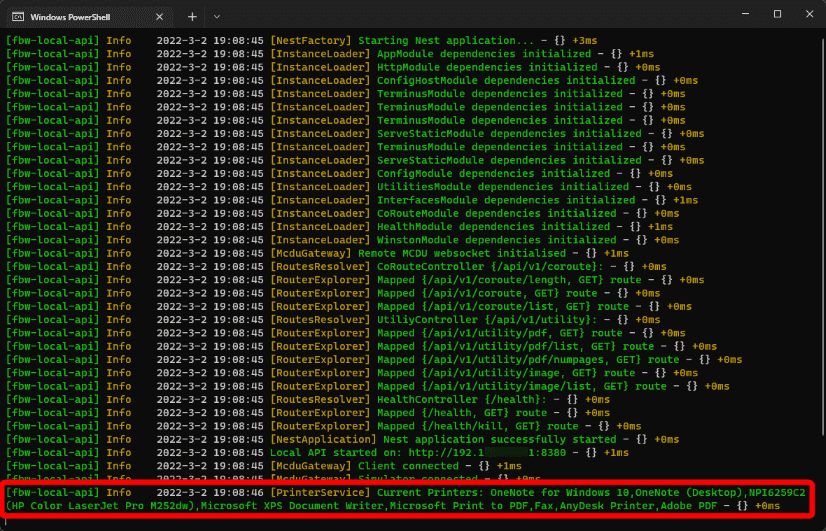

# MCDU Web Interface

<link rel="stylesheet" href="/../../stylesheets/web-mcdu.css">

!!! warning "Not available in the Stable Version"

!!! info "Changes to Previous Version"
    - The MCDU Web Interface now uses a web server built into the newly releases [**Local API Server**](local-api-server.md). This Local API Server will host additional local services required for some features of the A32NX.

    - In the previous version it was necessary to have two ports - a http port (default 8125) and a websocket port (default 8380). The new server only requires one single port to be configured. The default port is 8380.

    - The URL for the MCDU Web Interface has changed to [http://localhost:8380/interfaces/mcdu](http://localhost:8380/interfaces/mcdu){target=new}

    - Configuration is now done via a config file and not with command line arguments any longer. See [Advanced Start Options](#advanced-start-options).

## Overview

The MCDU Web Interface allows you to display and control the MCDU on a browser including browsers on mobile devices like phones or tablets.

See list of compatible and tested browsers: [Compatible Browsers](#compatible-browsers)

!!! note "MCDU Web Interface"
    {loading=lazy}

It also allows to use your real printer on to be used as a cockpit printer for the MCDU.

## Starting the MCDU Web Interface

### Start the MCDU Web Interface Server

The MCDU Web Interface now uses a server built into the newly releases [**Local API Server**](local-api-server.md). The Local API Server will host additional local services required for some features of the A32NX.

See [Start the Local API Server](local-api-server.md#start-the-local-api-server)

### MCDU Server Connection Attempts Timeout

Due to issues in the Microsoft Flight Simulator Coherent Engine (Javascript Engine) continuous connection attempts lead to performance problems for some users because of how the engine handles unsuccessful connections. 

Therefore, a timeout mechanism has been built into the MCDU limiting the number of connection attempts the MCDU will execute.

A setting in the fylPad EFB Sim Options page has been introduced to allow users to restart the connection attempts or to turn off the attempts to connect to the MCDU Server completely.


The three settings are:

- Auto On:
    - The MCDU attempts to connect to the MCDU Server for 5min after pressing "Ready to Fly".
    - If this setting is selected the MCDU will try to connect to the MCDU Server for 5min after every start of a new flight.
- Auto Off:
    - After 5min of unsuccessful connection attempts the MCDU will stop any further attempts and this setting will be automatically set.
- Perm Off:
    - The MCDU will not make any attempts to connect to the MCDU Server.

### Browser on Local PC

If you want to use a browser on the same machine on which you are running the Microsoft Flight Simulator and the MCDU Server just open a browser on this default URL:

[http://localhost:8380/interfaces/mcdu](http://localhost:8380/interfaces/mcdu){target=new}

### Browser on Remote Device

If you want to use the MCDU Web Interface from a remote device (e.g. tablet, phone, 2nd PC, etc.) you need to first make sure you can access the MCDU Web Interface on your PC by allowing incoming network connections to the server through your Windows Firewall. See how to do this here: [Windows Firewall](#windows-firewall)

The IP address of the MCDU Web Interface will be displayed during the Local API Server start up.

{loading=lazy}

To learn how to find your ip address read this Microsoft article: [Find your IP address in Windows](https://support.microsoft.com/en-au/windows/find-your-ip-address-in-windows-f21a9bbc-c582-55cd-35e0-73431160a1b9)

Enter the correct IP address and port into the remote device's browser address line and hit enter.

Example: http://192.168.16.1:8380/interfaces/mcdu

## How to Use the MCDU Web Interface

The MCDU Web Interface can then be used by mouse or touch depending on your device.

It is also possible to click on the MCDU screen items themselves to actually click the corresponding LSK (Line Select Key).

You can hold the CLR key for >1.5sec to clear all of the scratchpad's content as it is possible in the cockpit itself.

Changes done in the MCDU Web Interface will be reflected immediately in the cockpit and vice versa. Any change in the cockpit will be immediately shown in the MCDU Web Interface.

### Fullscreen Display
If you only want the MCDU display to be shown then tap on the top-most part of the MCDU display. To return to the full MCDU view tap anywhere on the display.

If you want to start with only the MCDU display visible then add `?fullscreen` to the url.

### Sound
You can enable click sounds when pressing buttons on the MCDU by adding `?sound` to the url.

### Day and Night Mode
It is possible to switch between a day and night mode MCDU visualization be clicking/touching the BRT/DIM button in the Web MCDU.

!!! note "Day and Night Mode"
    

## Using Your Local Printer

If you configured a local printer, every print you will make from the MCDU to the cockpit printer will also be printed using your local printer.

The printers available are those known to the PC where you run Microsoft Flight Simulator and the MCDU Server is on. It is not relevant if your remote device where you use the MCDU Web Interface actually knows this printer.

Available printers are listed at startup and you need to add the printer you want to use to the configuration as shown here: [Local API Server Configuration](local-api-server.md#local-api-server-configuration).



You can also configure font size, margin size and paper size.

## Compatible Browsers

With hundreds of different browsers available today it is not possible to test and support all browsers and their different versions.

In general we expect this feature to work with the common modern standard browsers on Windows, iOS, Android.

However, there will be browsers where this will not work. In this case we recommend to use a standard browser.

We have tested these browsers (current versions) during the development and these should therefore work ok:

- Windows: Edge, Firefox, Chrome
- iOS: Safari, Firefox, Edge, Chrome, duckduckgo, Brave, Bing
- Android: Chrome, Edge
- Mac OS: Safari, Firefox, Edge, Chrome
- Samsung phone: Chrome, Firefox, duckduckgo
- Linux: Firefox
- Amazon Kindle Fire HD 10 : Silk <br/>(App Version 94.2.2.4606.119.10 Android 5.1.1, Fire OS 5.6.9.0)

{==

Always use the latest versions of the operating system and the browser.

We have not tested older operating systems or browsers and can't support them. They might or might not work.

==}

Known unsupported operating systems or browsers:

- Samsung Internet Browser
- iOS 9.x, iOS 10.x
- Very old browsers not supporting Web Sockets. See [Can I use Web Sockets](https://caniuse.com/?search=web%20sockets){target=new}

## MCDU Server Architecture

{loading=lazy}

The MCDU Server uses a web application running in the browser to send and receive data via the Web Socket protocol from the MCDU.

To open the web application the browser will connect to the Local API Server's webserver via http protocol (default port 8030) and download and run the MCDU Web Interface application (HTML/CSS/JavaScript).

The MCDU Web Interface application will open a data connection to the MCDU via Web Socket protocol (default port 8380) and receive data (screen content) and send data (user input like button pushes) from and to the MCDU.

For this to work the browser must be able to reach the MCDU Server via the two TCP port 8380 (this default can be changed) which means users might need to reconfigure their network and firewall settings accordingly (see documentation above).

## Troubleshooting

??? warning "MCDU Server not connecting to simulator although flight is Started"
    The MCDU Server does not connect to the flight simulator although the flight is started and aircraft is loaded.

    The port 8380 is already in use.

    Solution: [Port is Occupied](local-api-server.md#port-is-occupied)

??? warning "MCDU Server Error: Failed to load printers"

    If you you start the server and get this error messages:

    ``` cmd title="Windows Command Line"
    Error: Failed to load printers.
    Make sure the "Print Spooler" Windows service is running.
    ```
    Solution: Make sure the "Printer Spooler" Windows service is turned on:

    {loading=lazy}

    You can find the Services Manager by pressing ++windows+r++ and then type `services.msc`.

??? warning "Browser Can't Connect to MCDU Web Interface"
    You browser can't connect to the MCDU Web Interface and times out eventually.

    Cause: This is most likely a network or firewall issue.

    Solutions:

    - [Network Configuration](local-api-server.md#network-configuration)
    - [Firewall Configuration](local-api-server.md#firewall-configuration)

??? warning "Browser Shows MCDU Web Interface but Display Remains Black"
    You browser can't connect to the Local API Server port.

    Cause: This is most likely a network or firewall issue.

    Solutions:

    - [Network Configuration](local-api-server.md#network-configuration)
    - [Firewall Configuration](local-api-server.md#firewall-configuration)

    Cause: Aircraft has no Power / MCDU is still off.

    Solution: Power up the aircraft.

??? warning "Browser Shows MCDU Web Interface only partly or garbled"
    Your browser can connect to the server but does not show the MCDU Web Interface correctly or not at all.

    Cause: This is most likely an incompatible browser.

    Solutions:

    - Use a different browser.
    - See tested browsers: [Compatible Browsers](#compatible-browsers)

??? warning "Printout format incorrect / receipt printer"
    The default format the printer uses is paper size A4 and font size 19.

    For some printer especially receipt printer a different paper size and font size must be used to make the output look good.

    We recommend to experiment with this a bit to find good values for your printer. In our tests we found paper size C8 and font size 10 a good starting point.
