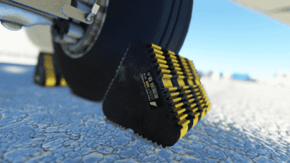
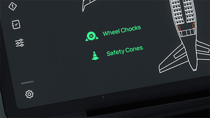

# Wheel Chocks and GSE Safety Cones

## Overview

!!! warning "Not available in the Stable Version."

This page details the safety equipment available when parked with the A32NX. Other than just looking gorgeous the wheel chocks even apply some braking force to hold the aircraft in place.

The flight crew activates the Wheel Chocks and Safety Cones through the 
[flyPad EFB Sim Option Settings](flypados3/settings.md#sim-options).
This simulates the ground crew automatically placing or removing the chocks or cones. The ground crew will determine 
if chocks and cones should be placed or removed based on specific criteria, which are described in the 
[next section](#usage).

!!! block ""
    {loading=lazy align=left width=45%}
    {loading=lazy align=left width=45%}
      
    {loading=lazy align=left width=45%}
    {loading=lazy align=left width=45%}

## Usage

The Wheel Chocks and Safety Cones appear when the following conditions are given:

- Chocks and/or Safety Cones are enabled in the [flyPad EFB Sim Options Settings Page](flypados3/settings.md#sim-options)
- Engines are off (`ENG1+2 N1` < 3.5%)
- Beacon lights are off
- Airplane is on ground
- Airplane is not moving / rolling
- Pushback is disconnected

The flyPad Ground page will show `Wheel Chocks` and/or `Safety Cones` in 

- green if this ground equipment is enabled and visible.
- gray if this ground equipment is enabled but not visible due to the above criteria not 
  being 
  met. 

If chocks are in place there will be brake force applied to the aircraft so it should not move even when the parking brake is disengaged.

If any of the above conditions is not given the chocks and cones will disappear (ground crew will virtually have them removed).
