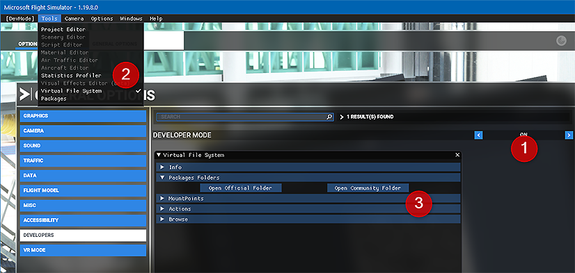

# Installation Guide

Please follow the information on this page to install the FlyByWire Simulations A32NX addon for Microsoft Flight Simulator 2020

*Last Update: {{git_revision_date_localized}}*

!!! warning "Important Notice"

    All FlyByWire Simulations A32NX versions are now independent from the default A320neo.

    We’d like to remind all users of the following two **important changes**:

    The folder in the Community directory is now:

      - `flybywire-aircraft-a320-neo`

    The airplane in the simulator is now titled:

      - `FlyByWire Simulations - A320neo (LEAP)`

!!! danger "MSFS Marketplace Version Discontinued"
    Please uninstall any marketplace version.

    You can reference [this issue](support/reported-issues.md#installation-version-conflicts) in our reported issues page for more details.

---

## Downloads

### FlyByWire Installer

Download the new FlyByWire installer where you can select either the Stable, Development, or Experimental build. Our installer downloads and installs the add-on directly into your community folder.

The following commands can be used:

++ctrl+f5++ - Refreshes Installer

++ctrl+f12++ - Opens the debug tool

#### Installer Debug Logs

You can send us logs to our [Discord](https://discord.gg/flybywire){target=new} for support if you encounter issues with the installer. Please follow the steps below:

  * Open the debug tool ++ctrl+f12++.

  * Find and select ++"Console"++ in the top menu.

  * ++"Right Click"++ anywhere in the log displayed.

  * Click ++"Save as"++ and send the log to us.

[Download Installer](https://api.flybywiresim.com/installer){ .md-button target=new}

### Manual Installation

!!! info "Download"

    === "Latest Stable Version"

        **Current Stable Version - ** 

          Stable is our variant that has the least bugs and best performance. This version will not always be up to date but we gurantee its compatibility with each major patch from MSFS. 

          [Download Stable](https://api.flybywiresim.com/api/v1/download?url=https://flybywiresim-packages.b-cdn.net/stable/A32NX-stable.zip){ .md-button target=new}

          You can see the changelog on the releases page: [View Here](https://github.com/flybywiresim/a32nx/releases){target=new}

    === "Development Version"

        Development will have the latest features that will end up in the next stable. Bugs are to be expected. 

        It updates whenever something is added to the 'master' branch on GitHub. 

         [Download Development](https://api.flybywiresim.com/api/v1/download?url=https://flybywiresim-packages.b-cdn.net/vmaster/A32NX-master.zip){ .md-button target=new}
         
         [**IMPORTANT:** View information on Autopilot / Fly-By-Wire here](feature-guides/autopilot-fbw.md)

    === "Experimental Version"

        This version is similar to the development version, but contains custom systems early in the development phase - expect issues.

        <!-- Currently the new FlyByWire Custom Flight Management System (cFMS) is available in the Experimental version.-->

        ~~Currently the Experimental version is on hold until we start testing new major features. We will then update this page.~~
    
        Please read [Experimental Version Support Page](support/exp.md) before using this version.
    
        It will be updated with the latest changes to the development version every week or so while new major features are tested (not guaranteed).

        [Download Experimental](https://api.flybywiresim.com/api/v1/download?url=https://flybywiresim-packages.b-cdn.net/experimental/A32NX-experimental.zip){ .md-button target=new}

        !!! danger "No Support for Experimental - use at own risk"
            Please do not seek support for the Experimental Version on Discord and only report issues if you have read this page and the reported and known issues.

---

**Please follow ALL steps in this section if you encounter any issues with installation before seeking support.**

Open the zip that you downloaded from one of the links above, and drag the `flybywire-aircraft-a320-neo` folder inside the zip into your Community folder.

See below for the location of your Community folder.

## Community Folder

### Microsoft Store and/or Game Pass Edition

- Copy the `flybywire-aircraft-a320-neo` folder into your community package folder.

It is located in:

* `C:\Users\[YOURUSERNAME]\AppData\Local\Packages\Microsoft.FlightSimulator_<RANDOMLETTERS>\LocalCache\Packages\Community`.

---

### Steam Edition

- Copy the `flybywire-aircraft-a320-neo` folder into your community package folder.

It is located in:

* `C:\Users\[YOUR USERNAME]\AppData\Roaming\Microsoft Flight Simulator\Packages\Community`.

---

### Boxed Edition

- Copy the `flybywire-aircraft-a320-neo` folder into your community package folder.

It is located in:

* `C:\Users\[YOUR USERNAME]\AppData\Local\MSFSPackages\Community`.

---

### Troubleshooting

If the above methods do not work:

To find the Community folder that MSFS is using please follow these steps:

1. Go to your General Settings in MSFS and activate Developer Mode.
2. Go to the menu and select 'Virtual File System'.
3. Click on 'Packages Folders' and select 'Open Community Folder'.

This opens the Community folder in a Windows Explorer. Please ensure that your addons are installed in the folder that is opened.

---

If your issue is not related to installation visit - [**Reported Issues**](support/reported-issues.md)

---

## Clean Install Steps

To perform a clean install you simply have to delete the `flybywire-aircraft-a320-neo` folder from your community folder.

We do however store additional information related to the aircraft in a separate directory. Delete the contents of this folder but not the folder itself.

These locations can be found below.

{ width=70% }

!!! info "Work Folder"
    The locations below contain a "work" folder. We store two important things here that you may not want to delete:

    - Your EFB throttle configuration.
    - Our flight data recorder (for debugging purposes which we may ask you to provide).

    **It is up to you to keep this folder or not.**

To access the folders below:

- Press start.
- Type in run into the start menu and press ++enter++
- Type into the box either `%localappdata%` or `%appdata%` depending on your game version below.
- Press ++"OK"++

If the folders are hidden to you follow the directions on [Microsoft's support site](https://support.microsoft.com/en-us/windows/view-hidden-files-and-folders-in-windows-10-97fbc472-c603-9d90-91d0-1166d1d9f4b5).

### Microsoft Store Version

The folder can be found here:

`%LOCALAPPDATA%\Packages\Microsoft.FlightSimulator_8wekyb3d8bbwe\LocalState\packages\flybywire-aircraft-a320-neo\`

!!! warning ""
    This is not your community directory

### Steam Version

The folder can be found here:

`%APPDATA%\Microsoft Flight Simulator\Packages\flybywire-aircraft-a320-neo\`

!!! warning ""
    This is not your community directory

***

## Contributing

[:fontawesome-brands-github:{: .github } **GitHub Contributing.md**](https://github.com/flybywiresim/a32nx/blob/master/.github/Contributing.md){ .md-button target=new }

More info [A32NX Development Overview](../dev-corner/dev-guide/index.md)

***

## SimBrief Airframe

The FlyByWire Simulations simBrief airframe with correct weights is available below. Please select and update your airframe according to the version you are flying.

!!! info ""
    The airframe below will always be **kept up-to-date** thanks to Navigraph's new sharable airframe feature.

    Please stay tuned to our social media for updates.

- **Stable Version**: ✈ [SimBrief Airframe Link](https://www.simbrief.com/system/dispatch.php?sharefleet=eyJ0cyI6IjE2MzU1MjIxNTI2NzUiLCJiYXNldHlwZSI6IkEyME4iLCJjb21tZW50cyI6IkZMWUJZV0lSRSBBMzJOWCBTVEFCTEUiLCJpY2FvIjoiQTIwTiIsIm5hbWUiOiJGQlcgQTMyTlgiLCJlbmdpbmVzIjoiTEVBUC0xQTI2IiwicmVnIjoiRC1BRkJXIiwiZmluIjoiIiwic2VsY2FsIjoiQUdMUiIsImhleGNvZGUiOiIiLCJjYXQiOiJNIiwicGVyIjoiQyIsImVxdWlwIjoiU0RFMkUzRkdISUoxUldYWSIsInRyYW5zcG9uZGVyIjoiTEIxIiwicGJuIjoiQTFCMUMxRDFPMVMyIiwiZXh0cmFybWsiOiJGTFlCWVdJUkUgQTMyTlgiLCJtYXhwYXgiOiIxNzQiLCJ3Z3R1bml0cyI6IktHUyIsIm9ldyI6IjQ2MjYyIiwibXpmdyI6IjY0MzAwIiwibXRvdyI6Ijc5MDAwIiwibWx3IjoiNjc0MDAiLCJtYXhmdWVsIjoiMTkwNDUiLCJwYXh3Z3QiOiIxMDQiLCJkZWZhdWx0Y2kiOiIxNSIsImZ1ZWxmYWN0b3IiOiJQMTAiLCJjZWlsaW5nIjoiMzk4MDAiLCJjcnVpc2VvZmZzZXQiOiJQMDAwMCJ9){target=new}
- **Development and Experimental Versions**: ✈ [SimBrief Airframe Link](https://www.simbrief.com/system/dispatch.php?sharefleet=337364_1631550522735){target=new} - Credits: [@sidnov](https://github.com/sidnov){target=new}

Pilot ID can be found in the Optional Entries section of the Dispatch Options page.

To learn how to use the various features related to our simBrief integration see the page below.

[SimBrief Integration Guide](feature-guides/simbrief.md){.md-button}

