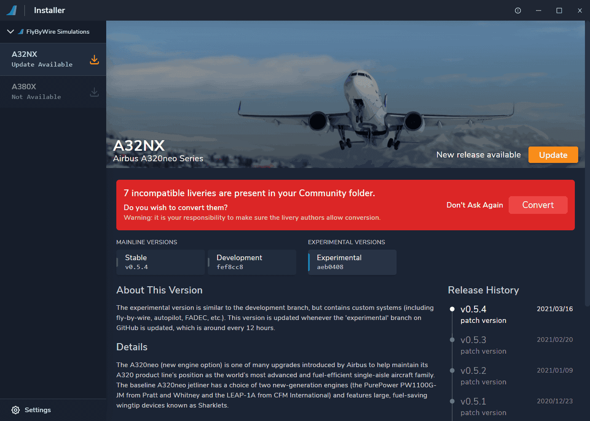
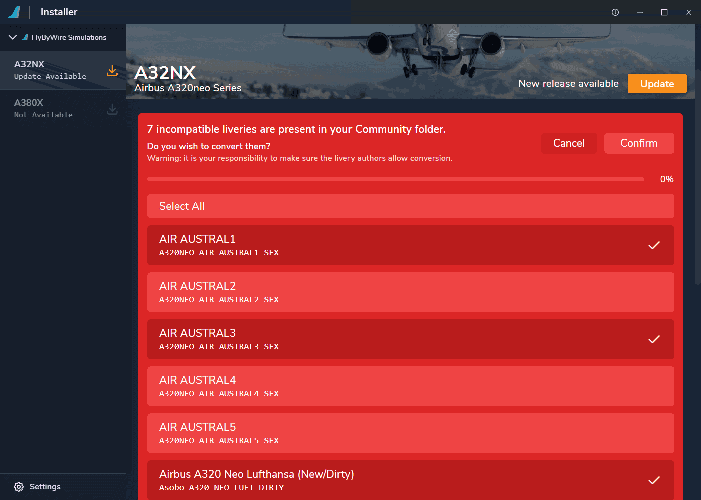
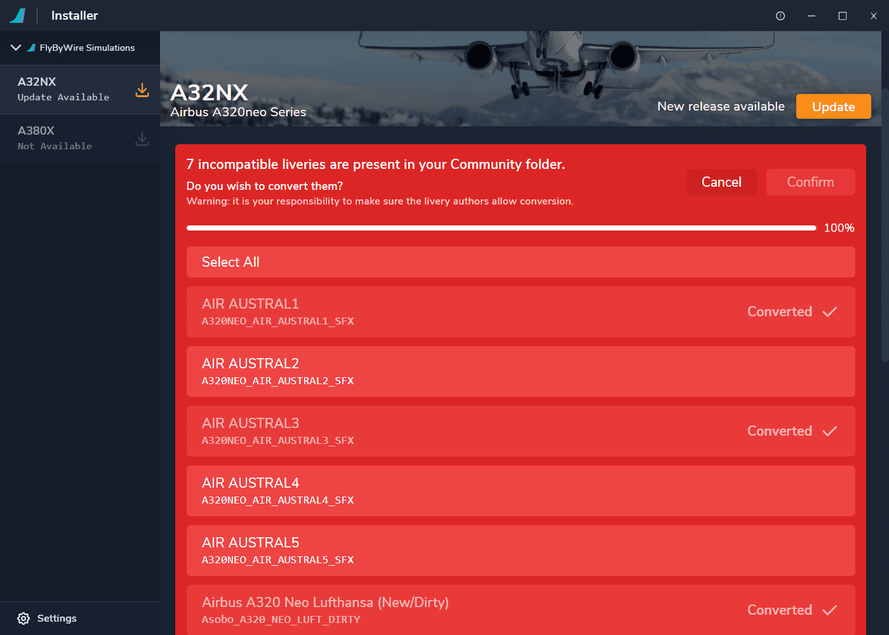
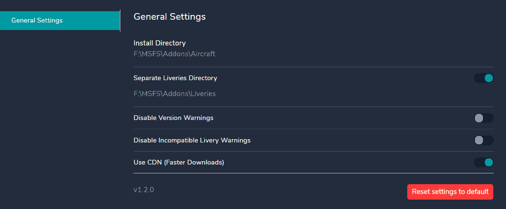

# Liveries Guide

---

## Getting Liveries

Best source for liveries for FlyByWire A32NX is [FBW A32NX @ flightsim.to](https://flightsim.to/c/liveries/flybywire-a32nx/){target=new}.

!!! warning "Always keep liveries up to date"

These liveries are especially made for the FlyByWire add-on. The default A320neo liveries do not work with the FlyByWire add-on any longer. See below how our Installer can help you convert default A320neo liveries.

Our recommendation is to download the dedicated FlyByWire liveries and also to keep the liveries up to date by regularly updating them. This is important as liveries are one of the main cause for issues and CTD (crash to desktop).

## Converting Liveries

### Automatic Conversion

FlyByWire Installer v2.0.0 now handles livery conversions automatically for you. This method is supported by FlyByWire Simulations.

To start please ensure your installer is updated to version 1.2.0 or above. Make sure that all liveries you wish to convert for the A32NX are inside your community directory.

If you are using a separate directory for addons see [Optional Steps](#optional-steps).

### ^^Step 1^^

If your community directory has incompatible liveries you will be greeted by the following prompt when launching our installer:

### ^^Step 2^^

Click `Convert` and the prompt will expand offering you the choice to select specific liveries or `Select All`. The image shows the difference between a non-selected and selected livery.

### ^^Step 3^^

Select all liveries or as many as you'd like and press `Confirm`. Your liveries will now be converted. The progress bar will display 100% when all selected liveries have been successfully converted.

You can confirm conversion by checking your community directory and checking that the new folder name is `livery_folder_name_a32nx`. You can now safely remove the older folders if you wish.

### ^^Optional Steps^^

If you are using an application to host your liveries in a separate directory you can visit the `Settings` at the bottom left of the installer.

Select the toggle for `Separate Liveries Directory` to select a path.

***

### Manual Conversion

!!! warning "Disclaimer"

    This guide is provided with no guarantee of compatibility and meant for the conversion of liveries for personal use.

    **No support will be provided**

To manually convert a livery made for the default A320neo to work with the new FBW A32NX, you have to edit three files in that livery's folder.

!!! info "Step One"

    Open the aircraft.cfg in `..\SimObjects\AirPlanes\NAME_OF_THE_LIVERY\`

    The following lines should look like this:

        base_container = "..\FlyByWire_A320_NEO"
        ui_type = "A320neo (LEAP)"
        ui_manufacturer = "FlyByWire Simulations"

!!! info "Step Two"

    Open the texture.cfg in `..\SimObjects\AirPlanes\NAME_OF_THE_LIVERY\TEXTURE.XXX`

    There's a fallback which points to the Asobo A320. It should now look like this:

        fallback.X=..\..\FlyByWire_A320_NEO\TEXTURE

    (X = the number of the fallback)

!!! info "Step Three"

    Open the model.cfg in `..\SimObjects\AirPlanes\NAME_OF_THE_LIVERY\MODEL.XXX`

    The two model lines should look like this:

        exterior=../../FlyByWire_A320_NEO/model/A320_NEO.xml
        interior=../../FlyByWire_A320_NEO/model/A320_NEO_INTERIOR.xml

Ready to go! Launch the sim and see if it worked.
