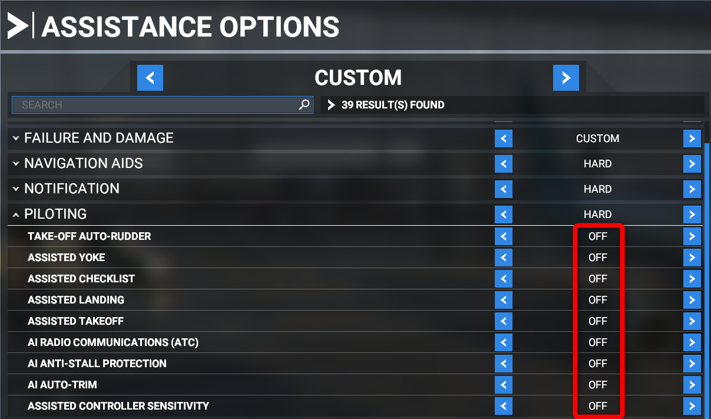
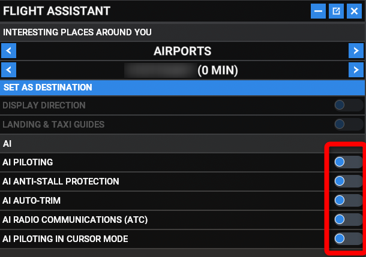
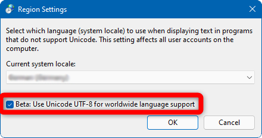

# Recommended Settings

This page aims to list a few recommended settings for the Microsoft Flight Simulator before and while using the FlyByWire A32NX.

## Microsoft Flight Simulator Settings

### Use DX11

Use of DX11 is recommended for best performance due to an issue with some glass cockpit technologies in the DX12 version of the simulator. This is not an FBW issue and we cannot address it for now - please keep in mind DX12 is officially a "beta feature" and thus should not be used unless you know what you are doing.

### Lens Correction Setting

Turn off the Lens Correction setting in the Graphics settings page.

If you do not deactivate it it will be harder to click and move switches, knobs and buttons in the cockpit.

### Deactivate MSFS Assistance Features

Please turn off all MSFS Assistance and AI functions while using the A32NX
To ensure optimal compatibility and best functionality of the A32NX features we recommend to turn all MSFS Assistance and AI features off as they interfere with the A32NX custom features!

!!! block ""
    {valign=top width=48% loading=lazy}
    {valign=top width=48% loading=lazy}

### Controllers

#### Sidestick / Joystick

We **highly recommend** using a sensitivity setting of `-30%` to better simulate the increased force you need to **push or pull** the real sidestick in the aircraft. Please see the screenshot below for an example:

For roll (left or right) use what you think is best for you. The above mentioned -30% is a good starting point.

#### Rudder/Tiller

For the rudder, which by default also controls the nosewheel in MSFS, we recommend a little bit of sensitivity although linear should also work fine.

If you have an extra axis you can use (e.g. twisting joystick while rudder is on pedals) you can separate the nosewheel steering via tiller from the rudder inputs.

Also see [Nosewheel Tiller Separation](feature-guides/nw-tiller.md)

## Important A32NX Settings

### Intallation With Installer

Always use the FlyByWire Installer to install and update the A32NX add-on.

See our [Installation Guide](installation.md).

### Throttle

Our Custom Autopilot implementation requires that the throttle is calibrated to be able to correctly recognize the detents the A320 autoflight system relies on.

See [Throttle Calibration Guide](feature-guides/flypad/throttle-calibration.md)

## Windows Settings

### UTF8 Support

Some users experience problems with various system in the A32NX. These are caused by an issue within MSFS which requires to use the UTF8 REgion setting in Windows.

- Open Windows Control Panel -> Region.
- Go to the Administrative tab and click Change system locale
- Make sure the check mark next to Beta: Use UTF-8 for worldwide language support is selected.
- Click OK and ~~restart your computer~~~.

### Performance Settings

See [Performance Tips](support/performance-tips.md)
