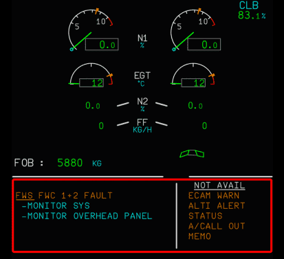
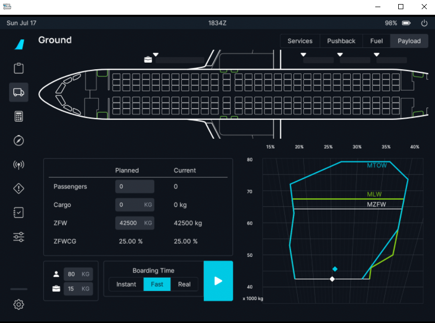

# Experimental Version

The Experimental version is a test version to find problems, issues and to improve functionality based on your feedback. It is **not** meant to be used for **daily use or serious flights with** an Online ATC service.

{--

Currently experimental is geared toward testing the initial version of VNAV with additional features added at the development team's discretion - [see below](#implemented-features-for-testing). Please use the appropriate discord thread to report any issues - [How to Report Issues](#how-to-report-issues).

--}

!!! danger "Do not expect support for the experimental version - use at own risk!"
    Please ensure that you have at least read this page and the known issues before reporting issues in the appropriate threads on our Discord server.

    We ask that you understand that we may not offer support for any experimental issues due to the nature of this version. We will happily answer questions time permitting.

## Implemented Features for Testing

### RMP Navigation Tuning

We are testing the ability for the radio management panel to tune navigational aids. See technical details in the respective [GitHub Pull Request #7241](https://github.
com/flybywiresim/a32nx/pull/7241){target=new}.

### Fine Tuning Engine Parameters

We are further turning our engine primary parameters in regards to EGT and fuel flow in a two part implementation. See technical details in the respective 
[GitHub Pull Request #7542](https://github.com/flybywiresim/a32nx/pull/7542){target=new}.

### Flight Warning System (FWS)

We are testing the new FWS (Flight Warning System) which replaces the previous provisional system. 
See technical details in the respective 
[GitHub Pull Request #4872](https://github.com/flybywiresim/a32nx/pull/4872){target=new}.

{loading=lazy width=50%}

Summary:

This PR is the first step on the way to our new flight warning system, written nearly entirely in Rust and using an 
accurate simulation of the underlying data acquisition and warning logic. The new system is made up of two 
simulated Flight Warning Computers replacing some foundational logic pieces that were previously written in 
Javascript. The vast majority of warnings on the EWD still have exactly the same conditions as previously and have 
not been touched, but will be eventually moved over to the new flight warning computers one by one.

The new Flight Warning Computers are also hooked into the electrical and failure system, so the alerts that are now 
powered by the FWS truly won't work when both FWCs are unpowered or have failed.

### SimBridge

The following are features in testing that require the use of SimBridge:

- [Terrain Display](#terrain-display) - **Now Available on the Development Version**
- Remote MCDU (Web MCDU) - **Now Available on the Development Version**
    - [Setup and Configuration Guide](../../simbridge/remote-displays/configuration.md)
    - [Usage Guide](../../simbridge/remote-displays/remote-mcdu.md)
- [Company Routes](#company-routes) - **Now Available on the Development Version**

!!! tip "SimBridge Information"
    - Learn about SimBridge and further status of various features please - [Read Here](../../simbridge/index.md).
    - [SimBridge setup and configuration guide](../../simbridge/configuration.md).

#### Terrain Display

**Available on the Development Version.**

!!! tip "Configuration"
    [Terrain Usage Guide](../../simbridge/terrain.md){.md-button}

This feature will connect to our external database via SimBridge to accurately display terrain information on the navigation display. We've followed the peaks-mode implementation of honeywell and do not have map-data above 83° north or below 84° south. 

You can read more about the "PEAKS DISPLAY" in this technical guide from Honeywell - [Read Here](https://skybrary.aero/sites/default/files/bookshelf/3364.pdf){target=new}

!!! warning "Reporting Bugs / Strange Behaviors"
    When reporting a bug or strange behavior that we need the GPS position or at least a reference to an airport/VOR/NDB with a distance and direction. 

    This will help us iron out the feature and identify issues faster. For more information on where to report please see [How to Report Issues](#how-to-report-issues) below.

    Expect performance loss as we continue to optimise.

#### Company Routes

This feature allows you to save routes you regularly fly to your PC in the simBrief XML Datafiles format for repeated use.

**Available on the Development Version.**

!!! tip "Configuration and Usage"
    [Company Routes Guide](../../simbridge/coroute.md){.md-button}

### Pause at Top of Descent (TOD)

- New setting in located in the EFB under Realism - Pause at TOD (configurable by distance between 0-50 nm before TOD)
- When enabled, flight will pause at the specified distance before TOD
- If the TOD point shifts before your present position, or AP mode reverts in CRZ, this will pause the simulation.

### Vertical Guidance

- Speed and altitude predictions in the flight plan page, including magenta or amber asterisks.
- Reworked fuel burn and time predictions in the flight plan page (no flight plan B page).
- Pseudowaypoints in the flight plan (SPD/LIM, T/C, T/D, S/C, S/D, DECEL).
- Display of pseudowaypoints on the ND (T/C, T/D, predicted speed changes, etc.)
- Partial implementation of step climbs/descent.
- Linear deviation indication during the descent.
- Following of speed and altitude constraints in the climb phase (credits to tracernz).
- Partial implementation of descent guidance.
- Ability to enter winds for climb, cruise, and descent.

#### Vertical Guidance Planned Implementations

These features are not yet available but will be implemented at a later time.

- Time constraints, RTA
- Flight plan B
- Constant Mach segments
- Vertical guidance for RNAV approaches

### flyPadOS Version 3 (EFB)

- Updated weight and balance features:
    - Dynamic weight information
    - Customizable/interactive passenger and cargo loading
    

For features that are already available in the Development Version - see our guide for usage and known issues.

[flyPadOS 3](../feature-guides/flypados3/index.md){.md-button}

---

## Released Into Development Version

Features in testing that have been released into Development but not Stable will be listed here. This list will be pruned with every Stable release.

- Electronic Flight Control System (EFCS)
- Hydraulic Gear System - [Guide Here](../feature-guides/custom-hydraulics.md)

---

## Known Issues

### EFCS

!!! info ""
    We are keeping these known issues here until dedicated EFCS information is available.

- Improve direct and alternate law: Direct law is not scaled down based on Flaps/Slats configuration, thus can be very sensitive at high speeds, Alternate law still uses TAS for 
the C* law, this is incorrect and will result in issues if no ADR is available.
- V_stall warn AoAs need to be tuned, currently they are just the same as alpha_prot.
- In some situations, AP might not be available in alternate law even though it should be. This is due to how the AP commands are currently executed, which requires the normal 
  laws to be active (IRL this is different). Will take some time to fix this, not planned currently.
- The electrical bus connections are not quite correct yet, the ELAC/SEC 2s have rather complex logic for power supply switching, which is not done yet.

### Pause at TOD Issues

- Since the feature is linked to vertical guidance, having an inaccurate T/D or missing T/D may not pause the simulation.

!!! warning "Sim Limitations"
    Note that while aircraft simulation is suspended (i.e. fuel consumption, airspeed, altitude, physics), environmental simulation will continue (Notably Live Weather, Live Traffic/AI Traffic). Consequences of this include that TCAS TA/RAs will still be issued and if there is a significant change in the weather over time (say a few hours), your vertical descent profile and performance figures may no longer be accurate, which means that the actual T/D point may now have shifted from the originally calculated value.

    The timestamp issued in the pause pop-up shows your real local system's time (localized to your locale) to help mitigate against this problem.

    This is considered a sim limitation as the pause event we utilize does not affect the MSFS world environment. Along this line of thinking, we speculate that without historical live weather and traffic, it would not possible to inject or restore the state that the world was in when the pause was initiated (the time slider in the weather toolbar only affects lighting and will still reflect live wind and weather data).

    Flying using a weather preset and without AI/live traffic avoids this limitation entirely, but would also be a compromise in other ways.

### Vertical Guidance Issues

- There has been a large number of reports indicating that the T/D was placed too late. This will be investigated this further, but we ask you to please check your arrival routing for any odd path drawings. These are not unusual for the speed predictions of VNAV do not affect the LNAV path computations yet, which causes certain turns to be drawn at a larger radius than what will actually be flown. Consequently, VNAV will calculate a profile with more track mileage than what is realistically available and place the T/D too late.
- There is a problem with manually inserted constraints right now, where they are ignored or treated wrongly. Be aware of this and, if possible, advise if you have added any constraints manually when reporting an issue with the profile calculation. This is crucial in helping us identify and reproduce your issue.
- LNAV does not use VNAV speed predictions yet. This means that an approach path will not be forecasted properly. Furthermore, the T/D (Top of Descent) could be misplaced, since the system expects more track miles.
- The descent guidance does not use the speed margins properly yet. The aircraft does not speed up to catch a profile below it.
- The linear deviation indication (green "yoyo") on the PFD might jump around during the descent. This effect is particularly noticeable when new waypoints are sequenced.
- Layout inaccuracies in the MCDU, mostly on the PERF page.
- Predicted speed changes in the descent might seem to show up erratically. The same for the level off arrow while in descent mode.
- Fuel predictions in the MCDU are not very accurate.
- Descent guidance is sensitive to QNH changes. This is partially due to an inaccuracy in MSFS' atmospheric model.
- Winds are not yet taken into account for all phases of flight.

## How to Report Issues

<!--
!!! warning
    We are not taking issue reports at this time.
-->

!!! warning
    Please read the above Known Issues list and also use the search of Discord to see if your issue has already been reported.

    At this time please only report issues via our Discord channel threads:

[//]: # (    [cFMS LNAV+VNAV Issue Reports [NO SUPPORT]]&#40;https://discord.com/channels/738864299392630914/926586416820011098&#41;{target=new .md-button})

    [flyPadOS3 Experimental - Issue Reports [NO SUPPORT]](https://discord.com/channels/738864299392630914/926586416820011098){target=new .md-button}

    [General Experimental Issue Reports [NO SUPPORT]](https://discord.
    com/channels/738864299392630914/965072479796215888){target=new .md-button}

    {--

    Support or immediate solutions for your issues is **not guranteed**. We will collect all issues to fix and improve features in testing continuously.

    --}

**Do not open any issues on GitHub for the Experimental Version!**

### Download and Install

See [Installation Guide](../installation.md#downloads).