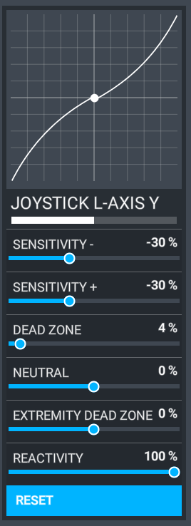

# Experimental Version

The Experimental version is a test version to find problems and issues and to improve functionality based on your feedback. It is not meant to be used for daily use or when you try to do a serious flight on an Online ATC service.

We are currently testing updates to our custom FMS LNAV, and other additional improvements -- see below for a full list.

!!! danger "No Support for Experimental - use at own risk"
    Please do not seek support for the Experimental Version on Discord and only report issues if you have read this page and the reported and known issues.

## New Features to be Tested

- Support for more legs types:
    - **New** - HA, HF, HM legs are now implemented
    - CA (partially), CF, CI (partially), CR, DF, HX (partially), IF
        - see [List of Leg Types ](../../pilots-corner/advanced-guides/flight-planning/leg-types.md)
- Better turn prediction algorithm with support for overfly, course capture, path capture, direct turn, reverse turn, reversions and more
- Support for marking waypoints as overfly in the F-PLN page
- Realistic ND rendering based on IRL hardware and software architecture
- Fixes for performance issues over long flights
- Initial implementation of the Traffic Alert and Collision Avoidance System (TCAS)

### Autopilot and Fly-by-wire

We have made some improvements to the AP and FBW. We **highly recommend** using a sensitivity setting of `-30%` to better simulate the increased force you need to push or pull the real sidestick in the aircraft. Please see the screenshot below for an example:

## Known Issues

- Stringing issues from the flight plan manager might still occur - will be fixed by the upcoming flight plan manager rewrite
- Some path captures (sharp angle turn into a leg) might be off / intercept at the wrong position - will **not** affect guidance
- Course capture turns (course to altitude, INTCPT) and CX legs do not adapt to achieved turn radius
- Some turns might revert / de-revert right before they become active in case of speed changes
- Turn reversion heuristics are not tuned perfectly yet
- VM legs sometimes have the wrong course
- AF, CD, VI, VR, FA, FM, FC, FD, PI legs are not supported
    - see [List of Leg Types ](../../pilots-corner/advanced-guides/flight-planning/leg-types.md)

### TCAS

!!! tip "Now Available in the Development Version"

Please see our [TCAS Page](../../pilots-corner/advanced-guides/flight-guidance/tcas.md) for more details.

## How to Report Issues

!!! warning
    Please read the above Known Issues list and also use the search of  Discord to see if your issue has already been reported.

At this time please only report issues via our Discord channel thread:

 [Experimental - Issue Reports [NO SUPPORT]](https://discord.com/channels/738864299392630914/926586416820011098/926592547059531866){target=new .md-button}

Do not expect support or immediate solutions for your issues. We will collect all issues and fix and improve continuously.

**Do not open any issues on Github for the Experimental Version!**

### Download and Install

See [Installation Guide](../installation.md#downloads).
