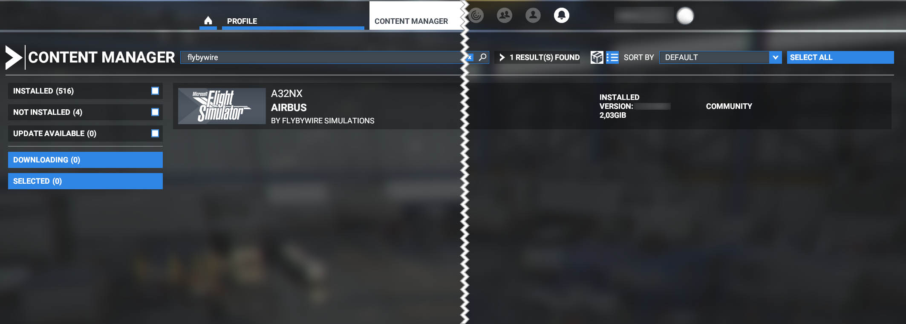
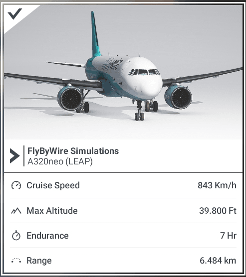

# Reported Known Issues

<link rel="stylesheet" href="/../../stylesheets/reported-issues.css">

!!! error  "STOP - Read this First"

    Please try and remove all other mods/liveries from the community folder and test our add-on again. This will help rule out conflicts.

    *Most reported issues are caused by conflicts with other mods and liveries. If this does not resolve your issue please continue below.*

    **Throttle Calibration is Required** - [Guide Here](../feature-guides/flyPad/throttle-calibration.md)

    ---

     

    FBW Installer - [Download Here](https://api.flybywiresim.com/installer){target=new} / *Sim Version: 1.21.13.0*

!!! warning "Read our Support Guide"

    1. [Learn how to fly an A32NX](index.md#1-learn-how-to-fly-the-a32nx)
    2. [Troubleshoot](index.md#2-how-to-troubleshoot)
    3. [Research Known Issues](index.md#3-research-known-issues)
    4. [Report Issue on Discord](index.md#4-report-issue-on-discord)
    5. [Report Issue on the A32NX Github](index.md#5-report-issue-on-the-a32nx-github)
    6. [Collecting Support Information](index.md#collecting-support-information)

    ---

    Due to the complex nature of our custom autopilot, please visit the dedicated ^^Custom Autopilot / Fly-By-Wire^^ page for more information:

    - [**Main Page**](../feature-guides/autopilot-fbw.md)
    - [**Typical Issues + Solutions**](../feature-guides/autopilot-fbw.md#typical-issues-and-how-to-solve-them)
    - [**Known Issues**](../feature-guides/autopilot-fbw.md#known-issues)

    ---

    Please visit the ^^Dedicated Custom Flight Management System^^ page for more information:

    - [**Features + Issues**](../feature-guides/cFMS.md)
    - [**Special Notes**](../feature-guides/cFMS.md#special-notes)

    ---

    Do this before reporting bugs.

<!--!!! danger "No Support for Experimental - use at own risk"

    Refer to this page for [Known Issues in the Experimental Version](exp.md#known-issues).-->

---

## Known A32NX Issues

*Last Update: {{git_revision_date_localized}}*

<!--
TEMPLATE

??? issue "Issue Headline"

!!! tip ""
    *Affected versions: Stable, Development*

^^Description^^
^^Root Cause^^
^^Possible Solution or Workaround^^
^^Additional Information^^

-->

??? failure "Invisible Aircraft"
    ### Invisible Aircraft

    !!! tip ""
        *Affected versions: Stable, Development*

    ^^Description and Symptoms^^

    If you have the following issues you are **most likely on an outdated stable** or you have an **installation conflict**:

    - White EFB screen
    - PFD is missing bank angle protection indicators
    - `NOT IN DATABASE` MCDU error
    - External lights are not working
    - Invisible Aircraft

    ^^Root Cause^^

    Double install of the add-on and conflict with very old, unsupported versions.

    ^^Possible Solution or Workaround^^

    Go to your content manager and filter for "flybywire" as you see on the following image.

    {loading=lazy}

    If you see old versions (e.g. v0.6.1) or if you have multiple installations of the A32NX please uninstall them in the Content Manager and restart the sim. Reinstall development version from our [installer](https://api.flybywiresim.com/installer){target=new}.

    ^^Additional Information^^

    Information on how to install with the FlyByWire Installer can be found here: [Installation Guide](../installation.md).

??? failure "Bad Performance after Sim Update 7 and Using DX12"
    ### Poor Performance After Sim Update 7 and Using DX12

    !!! tip ""
        *Affected versions: Stable, Development, Experimental*

    ^^Description^^

    Using DX12 introduced in Sim Update 7 seems to not work well with our aircraft.

    ^^Root Cause^^

    Investigation ongoing.

    ^^Possible Solution or Workaround^^

    Use of DX11 is recommended for best performance due to an issue with some
    glass cockpit technologies in the DX12 version of the simulator. This is
    not an FBW issue and we cannot address it for now - please keep in mind
    DX12 is officially a "beta feature" and thus should not be used unless
    you know what you are doing.

??? failure "Mouse Lock Caused by EFB Input Field"
    ### Mouse Lock Caused by EFB Input Field

    !!! tip ""
        *Affected versions: Stable, Development*

    ^^Description^^

    In certain situations, if you have selected an input field on the EFB and changed your view away from the EFB, you may no longer have use of your mouse cursor.

    ^^Root Cause^^

    Under Investigation.

    ^^Possible Solution or Workaround^^

    Please follow the steps below to bypass this issue:

    1. Open your browser (i.e. Chrome / Firefox)
    - In the URL field type in - `localhost:19999`
    - Click on any link
    - Go to the `Console Tab` shown in the browser. (**Note:** This is not the devtools of your browser. The page you are on already has a console tab at the top.)
    - At the bottom type in - `Coherent.call('UNFOCUS_INPUT_FIELD')`
    - Press ++enter++

??? failure "MSFS Freezes after **Ready To Fly**"
    ### MSFS Freezes after **Ready To Fly**

    !!! tip ""
        *Affected versions: Stable, Development*

    ^^Description^^

    If your username on your windows machine (not Xbox gamertag) contains any unicode characters it may cause MSFS to freeze after selecting `Ready to Fly`.

    Sample characters (not all inclusive): **ë** or **õ**

    ^^Root Cause^^

    Unicode Characters in Windows Username.

    Under Investigation.

    ^^Possible Solution or Workaround^^

    Change your windows username and remove any unicode characters present. [Guide Here](https://www.windowscentral.com/how-change-account-name-windows-10-sign-screen){target=new}

    ^^Additional Information^^
    Also see [Unwanted behavior - UTF8](#unwanted-behavior---utf8)

??? failure "Nose Wheel Steering Locked (NW STRG DISC)"
    ### Nose Wheel Steering Locked (NW STRG DISC)

    !!! tip ""
        *Affected versions: Stable, Development*

    ^^Description^^

    Nose wheel steering not working and ECAM might show NW STRG DISC.

    ^^Root Cause^^

    Toolbar Pushback Addon

    ^^Possible Solution or Workaround^^
    - Remove the addon from your community folder or wait for developer to update.
    - Use our EFB which has built in pushback controls or another addon.

??? failure "Unable to Taxi / Aircraft Does Not Move"
    ### Unable to Taxi / Aircraft Does Not Move

    !!! tip ""
        *Affected versions: Stable, Development*

    ^^Description^^

    Nose wheel steering not working and ECAM might show NW STRG DISC.

    ^^Root Cause^^

    Toolbar Pushback Addon

    ^^Possible Solution or Workaround^^
    - Remove the addon from your community folder or wait for developer to update.
    - Use our EFB which has built in pushback controls or another addon.

??? failure "Autopilot, FADEC, Electrical Systems not Working as Intended (UTF8 Issue)"
    ### Autopilot, FADEC, Electrical Systems not Working as Intended (UTF8 Issue)

    !!! tip ""
        *Affected versions: Stable, Development*

    ^^Description^^

    Affects our custom autopilot, FADEC, and electrical system.

    In rare cases the above mentioned systems may not start or behave erratically. This is in part due to `UTF-8` language support beta not enabled on your machine.

    ^^Root Cause^^

    Currently under investigation.

    ^^Possible Solution or Workaround^^

    1. - Open Windows Control Panel -> Region.
         - Go to the Administrative tab and click ++"Change system locale"++
         - Make sure the check mark next to `Beta: Use UTF-8 for worldwide language support` is selected.
         - Click ++"OK"++ and restart your computer.
    2. - Ensure `simconnect.cfg` does not appear in your Documents folder on your computer.

??? failure "Black Screens / Unable to Start"
    ### Black Screens / Unable to Start

    !!! tip ""
        *Affected versions: Stable, Development*

    ^^Description^^

    Black displays, Electrical systems not starting, etc.

    ^^Root Cause^^

    - Conflict with another mod/livery or incorrect installation of the A32NX add-on

    ^^Possible Solution or Workaround^^

    - Remove everything from the Community folder (everything!)
    - Do a [Clean Install](../installation.md#clean-install-steps)
    - Use our [Installer](https://api.flybywiresim.com/installer){target=new} to reinstall the A32NX add-on

    Also see [Autopilot, FADEC, Electrical Systems not Working as Intended](#autopilot-fadec-electrical-systems-not-working-as-intended).

---

??? warning "WX Radar Does Not Update"
    ### WX Radar Does Not Update

    !!! tip ""
        *Affected versions: Stable, Development*

    ^^Description^^

    Sim Update 7 broke the weather radar update on the ND in our aircraft.

    ^^Root Cause^^

    Sim Update 7 change - cause unknown. We are investigating.

    ^^Possible Solution or Workaround^^

    No fix or workaround available at this time.

    Turning the WX off and on or TERR ON ND on and off seems to update the WX on the ND.

??? warning "Ailerons Not Working When Using the Keyboard"
    ### Ailerons Not Working When Using the Keyboard

    !!! tip ""
        *Affected versions: Stable*

        **Note:** This is reported on our [Autopilot / Fly-By-Wire Page](../feature-guides/autopilot-fbw.md) and duplicated here for visibility.

    ^^Description^^

    The aircraft's ailerons can't be controlled with keyboard or button inputs. Therefore the aircraft can't be rolled for left or right turns.

    ^^Root Cause^^

    There is currently an issue with the associated events. We highly recommend using a controller with an axis assigned to use the plane.

    ^^Possible Solution or Workaround^^

    - Use the latest Development version where we have introduced a workaround for this issue. ( [#6222](https://github.com/flybywiresim/a32nx/pull/6222) )

??? warning "Fuel Consumption Too High / Fuel Prediction Too low"
    ### Fuel Consumption

    !!! tip ""
        *Affected versions: Stable, Development*

    ^^Description^^

    Fuel consumption may be higher than estimated in the MCDU (Fuel Pred, F-PLN).

    ^^Root Cause^^

    *A fix is in the works.*

    ^^Possible Solution or Workaround^^

    Take more fuel especially for longer flights.

    ^^Additional Information^^

    We are working on more realistic simulation of various involved systems, e.g. engines. The fuel estimations and consumptions will be inaccurate until we have completed these systems.

??? warning "Autopilot: Unwanted Disconnection"

    ### Autopilot Disconnection While Interacting with the EFB

    !!! tip ""
        *Affected versions: Stable, Development*

    ^^Description^^

    When using the EFB Descent TOD calculator, MSFS control assignments on your keyboard may still be accepted. Therefore, when using the numpad for input into EFB, you may inadvertently be applying flight control events.

    ^^Root Cause^^

    We have identified that the Descent TOD page still accepts outside events.

    *Currently under investigation.*

    ^^Possible Solution or Workaround^^

    1. Unbind any flight control assignments for your numpad or number keys on the keybaord through the MSFS settings.
    - Slightly moving the axis of the rudder and/or sidestick (or pressing 5 on the numpad) after entering data into the EFB. This will center the rudder or alierons to prevent a consistent deflection of flight surfaces.

    ### Autopilot Disconnection Due to Excessive Speed Decay

    !!! tip ""
        *Affected versions: Stable, Development*

    ^^Description^^

    Excessive speed decay during level off from open descent can lead to unwanted autothrust disconnection or even alpha floor in certain high drag/low speed situations.

    ^^Root Cause^^

    Currently under investigation.

    ^^Possible Solution or Workaround^^

    N/A

??? warning "ADIRS not Aligned When not Starting at Gate."
    ### ADIRS not Aligned When not Starting at Gate.

    !!! tip ""
        *Affected versions: Development*

    ^^Description^^

    ADIRS may not be aligned when spawning anywhere except cold & dark at a gate (*intermittent issue*)

    ^^Root Cause^^

    Initialization timing issue of MSFS.

    ^^Possible Solution or Workaround^^

    Workaround: Restart the flight

??? warning "Outer Tank Fuel Transfer"
    ### Outer Tank Fuel Transfer

    !!! tip ""
        *Affected versions: Stable, Development*

    ^^Description^^

    Sometimes the sim will "*miss*" the trigger point being reached for outer tank fuel transfer to initialize.
    This may happen if the sim is "busy" when working with something else OR initial FOB at the start of flight is below the trigger point.

    ^^Root Cause^^

    Intermittent Issue / Under Investigation

    ^^Possible Solution or Workaround^^
    Add enough fuel to get past the trigger point of 239 gallons before departing.

??? warning "EFB Issues in External View"
    ### EFB Issues in External View

    !!! tip ""
       *Affected versions: Stable, Development*

    ^^Description^^

    Can't interact with EFB when popped-out (++ralt+"Left Click"++) and switching to the external camera.

    ^^Root Cause^^
    Under Investigation

    ^^Possible Solution or Workaround^^

    Make sure to click on the actual EFB screen (not the popped out window) before switching to external camera.

??? warning "Controls Freeze up While Looking Around"
    ### Controls Freeze up While Looking Around

    !!! tip ""
        *Affected versions: Stable, Development*

    ^^Description^^

    Using freelook with right mouse button may cause controls to freeze.

    ^^Root Cause^^

    MSFS blocks all other inputs when using freelook with mouse button pressed.

    ^^Possible Solution or Workaround^^

    Try setting `TOGGLE COCKPIT FREELOOK` to your mouse ++middle-button++

    ^^Additional Information^^

    Reference: [MSFS Forum Post](https://forums.flightsimulator.com/t/freelook-with-mouse-causes-controls-to-freeze-after-su5/426349/15){target=new}

??? warning "TCA Throttle Autobrake Disengages While Looking Around"
    ### TCA Throttle Autobrake Disengages While Looking Around

    !!! tip ""
        *Affected versions: Stable, Development*

    ^^Description^^

    MSFS blocks all other inputs when using freelook with mouse button pressed. The TCA knob for Autobrake setting will be lost if this block lasts longer than 1.5sec.

    ^^Root Cause^^

    See the root cause here: [Controls Freeze up While Looking Around](#controls-freeze-up-while-looking-around)

    ^^Possible Solution or Workaround^^

    Do not look around the cockpit for >1.5sec

??? warning "Cockpit Decals Flicker"
    ### Cockpit Decals Flicker

    !!! tip ""
       *Affected versions: Stable, Development*

    ^^Description^^

    Cockpit Decals Flicker in Cockpit view.

    ^^Possible Solution or Workaround^^

    Solution: Update to the latest Stable or Development version.

??? warning "Strobe Light Function Reversed"
    ### Strobe Light Function Reversed

    !!! tip ""
        *Affected versions: Stable, Development*

    ^^Description^^

    When strobe lights are set to `OFF` but the lights are on when starting on the runway.

    ^^Root Cause^^

    Under investigation

    ^^Possible Solution or Workaround^^

    Start cold and dark at the gate.

??? warning "Can't Start Engines When Using TCA Throttle"
    ### Can't Start Engines When Using TCA Throttle

    !!! tip ""
        *Affected versions: Stable, Development*

    ^^Description^^

    Can't start engines with engine switches of  Thrustmaster TCA Throttle Quadrant.

    ^^Root Cause^^

    Wrong default mapping in MSFS.

    ^^Possible Solution or Workaround^^

    - Open the controls menu
    - REMOVE:
        - “Toggle Engine 2 Fuel Valve” - Set to Joystick Button 4
        - “Toggle Engine 1 Fuel Valve” - Set to Joystick Button 3
    - KEEP or SET:
        - “Set Engine 2 Fuel Valve” - Set to Joystick Button 4
        - “Set Engine 1 Fuel Valve” - Set to Joystick Button 3
        

    ^^Additional Information^^

    Also see our [Throttle Calibration Guide](../feature-guides/flyPad/throttle-calibration.md)

??? warning "Liveries Converted from the Default Asobo A320 Cause Issues"
    ### Liveries Converted from the Default Asobo A320 Cause Issues

    ^^Description^^

    Old liveries or liveries intended for the default Asobo A320 cause issues like artifacts, systems not working, CTDs, etc.

    ^^Root Cause^^

    Old liveries or converted Asobo A320 liveries are often not compatible with the latest sim versions or the FlyByWire A32NX.

    !!! warning ""
        Also do not convert liveries from the default Asobo A320 any more. Although out Installer still provides this option we do not recommend this any more as these liveries often cause issues.

    ^^Possible Solution or Workaround^^

    Use current liveries intended for the FlyByWire A32NX from flightsim.to.

    See [Liveries Guide](../liveries.md)

    ^^Additional Information^^

---

??? tip "++ctrl+'E'++ -  Engine Start Unsupported"
    ### ++ctrl+'E'++ -  Engine Start Unsupported

    !!! tip ""
        *Affected versions: Stable, Development*

    ^^Description^^

    The auto start shortcut via ++ctrl+'E'++ will not work.

    Currently you need at least the APU Avail and APU Bleeds to be switched on, as well as the fuel pumps to be on for a normal engine start. (Crossbleed starts will be implemented at a later time).

    ^^Root Cause^^

    Our custom systems and realistic simulation of onboard systems requires the proper engine start procedure for the A320neo.

    ^^Possible Solution or Workaround^^

    We highly suggest learning how to start the engines manually by reading our beginner guide. [Beginner Guide - Engine Start Section](../../pilots-corner/beginner-guide/engine-start-taxi.md#engine-start).

??? tip "Cockpit Interaction System"
    ### Cockpit Interaction System

    !!! tip ""
        *Affected versions: Stable, Development*

    ^^Description^^

    Switches, knobs and dials can't be used with simple mouse clicks as before.

    Controls appear highlighted in color (mostly blue) when the mouse hohvers over them.

    ^^Root Cause^^

    Asobo

    ^^Possible Solution or Workaround^^

    We recommend the legacy (previous) method of the Cockpit Interaction System:

    - Go to Menu
    - General Options
    - Accessibility
    - Find the `Cockpit Interaction System` setting
    - Change to `legacy`

    ^^Additional Information^^

    Using **New** Cockpit Interaction System

    - Highlight a control (like a knob).
    - Hold ++"Left Click"++ to lock to that control. Now your mouse will not affect any other controls or other mouse bindings.
    - Move the mouse left to turn the knob left, move it right to turn the knob right (with the ++"Left Click"++ held down)
    - You can also use the scroll wheel while holding ++"Left Click"++ down to turn the knob left or right.
    - To push a control / knob in, lock to the control using ++"Left Click"++ and then ++"Right Click"++.
    - To pull a control / knob out, hold ++"Left Click"++ and then click your scroll wheel ++"Middle Mouse"++.
        - Note: If you already use the ++"Middle Mouse"++ button to activate freelook this may not work. Check your keybinds so this feature does not conflict.

    !!! tip ""
        This list is based on our testing and feedback. For more information see the [MSFS Release Notes](https://forums.flightsimulator.com/t/microsoft-flight-simulator-available-today-on-xbox-series-x-s-and-xbox-game-pass/425795) - Cockpit Interactions.

    Direct your support questions and feedback of this feature to Asobo.

??? tip "No EFB (flyPad) in Cockpit"
    ### No EFB (flyPad) in Cockpit

    !!! tip ""
        *Affected versions: Stable, Development*

    ^^Description^^

    No EFB (fylPad) visible in cockpit.

    ^^Root Cause^^

    Default Asobo A320 aircraft selected isntead of the FlyByWire A32NX.

    ^^Possible Solution or Workaround^^

    Select the **^^FlyByWire Simulations A320neo (LEAP)^^** in the aircraft selector instead of the Asobo one.

    {width=50% align=left loading=lazy}

---

## Common MSFS Issues impacting all Aircraft

??? failure "CTD (Crash to Desktop)"
    ### CTD (Crash to Desktop)

    !!! tip ""
        *Affected versions: Stable, Development*

    ^^Description^^

    With the current state of the sim it is basically impossible to analyze CTDs let alone fix them as MSFS does not provide any tools or logs for analyzing CTDs.

    If we can reliably reproduce a CTD in our aircraft we will try to fix it or at least work around it. But most CTDs are very unpredictable and can be caused by many things:

    - Add-ons and mods
        - Liveries (flightsim.to just removed 1000s of them because of that)
        - Airports
        - Basically any add-on and mod that may be outdated or have conflicting files
    - MSFS itself (e.g. Rolling Cache is often a cause)
    - Hardware (GFX Card and Driver, Overclocking, etc.)
    - Controllers and Drivers

    Unfortunately just using the sim's API functions might trigger a CTD, so the trigger could be the aircraft but the root cause would be the sim.

    If you can reproduce it reliably please share this information with us on Discord or our GitHub so we can try to also reproduce it. This would be the first step to fix anything.

    ^^Root Cause^^

    Various possible reasons - impossible to determine at the moment.

    ^^Possible Solution or Workaround^^

    There also is currently no known guaranteed solution, however users have found success with by trying the following:

    1. [Perform a clean install](../installation.md#clean-install-steps)
    2. Try without anything else installed in community.
    3. Try without FSUIPC OR update FSUIPC.
    4. Try downloading the bat file that is pinned in the #support channel on our [Discord](https://discord.gg/flybywire). Run it to clean up any FBW background files.
    5. Run without live weather and/or live traffic.
    6. Delete your rolling cache in the sim and create a new one.
    7. Delete any manual cache in the sim and create new ones.
    8. Run the game as Administrator.
    9. Visit and read the [MSFS Known Issues Page](https://flightsimulator.zendesk.com/hc/en-us/articles/360016027399-KNOWN-ISSUES-Last-update-July-28-2021-) OR [MSFS Troubleshooting & Support](https://flightsimulator.zendesk.com/hc/en-us/sections/360004475200-Troubleshooting-Support-Windows-10-PC)

    ^^Additional Information^^

    Please also search in the MSFS Discord and Forum for CTD causes and solutions.

    [MSFS ZenDesk Safe-Mode-FAQ](https://flightsimulator.zendesk.com/hc/en-us/articles/4405893759378-PC-versions-Safe-Mode-FAQ){target=new}

    [MSFS ZenDesk CTDs-issues-Basic-Troubleshooting](https://flightsimulator.zendesk.com/hc/en-us/articles/4406280399250-All-versions-Crashing-CTDs-issues-Basic-Troubleshooting){target=new}

    [MSFS ZenDesk CTDs-issues-Advanced-Troubleshooting](https://flightsimulator.zendesk.com/hc/en-us/articles/4406280653202-All-versions-Crashing-CTDs-issues-Advanced-Troubleshooting){target=new}

    [MSFS Forum ctd-analysis-by-community](https://forums.flightsimulator.com/t/kadw-andrews-ctd-analysis-by-community-contributions/465405){target=new}

    !!! info "Peripherals"
        This is an important snippet from MSFS known issues.

        If you are getting CTDs, it could be one of your peripherals disconnecting sometime during the flight, which then causes the sim to CTD.

        It could be anything from a usb drive to a controller. Please try to minimise how many peripherals you have connected.

??? failure "CTD When Pressing **FLY** on World Menu"
    ### CTD when pressing **FLY** on world menu

    !!! tip ""
        *Affected versions: Stable, Development*

    See [CTD (Crash to Desktop)](#ctd-crash-to-desktop)

    ^^Possible Solution or Workaround^^

     Check your content manager for missing packages

??? failure "Aircraft Invisible"
    ### Aircraft invisible

    !!! tip ""
        *Affected versions: Stable, Development*

    ^^Description^^

    Aircraft invisible after starting flight.

    See [Invisible Aircraft](#invisible-aircraft) for A32NX specific issue.

    ^^Root Cause^^

    - Missing MSFS packages
    - Livery/Mod Conflict

    ^^Possible Solution or Workaround^^

    Check your content manager for missing packages

    ^^Additional Information^^

??? warning "Difficulty Accurately Clicking Controls"
    ### Difficulty Accurately Clicking Controls

    !!! tip ""
        *Affected versions: Stable, Development*

    ^^Description^^

    Click spots for different controls in the virtual cockpit may seem "misaligned" or generally difficult to accurate select.

    ^^Root Cause^^

    Sim Update 7 Issues

    ^^Possible Solution or Workaround^^

    Turn off *Lens Correction* in the MSFS graphics settings.

    

??? warning "Flight Planning and Autoflight Issues"
    ### Flight Planning and Autoflight Issues

    !!! tip ""
        *Affected versions: Stable*

    ^^Description^^

    There are certain bugs with the default FMS - the FlyByWire team is working on a custom FMS which will fix and address all these bugs and adds much better lateral navigation.

    1. Autopilot tries to go Direct to RWY when activating approach.
    - Autopilot tries to return to a previous waypoint when activating approach.
    - Selecting a STAR and arrival runway in the MCDU while in flight will result in the issues above.

    ^^Root Cause^^

    Asobo default Flight Planning System causes this.

    ^^Possible Solution or Workaround^^

    - Use DIRECT to head to the correct waypoint on your F-PLN or use selected heading. This should allow you to continue with your selected STAR for arrival.
    - You can also try switching to selected heading BEFORE selecting your STAR and arrival runway to prevent unwanted flight plan redirection.
        - Ensure your next waypoint is correct on the ND before returning to managed HDG/NAV mode on the FCU.
    - If you can, always enter your expected approach in the MCDU before departing. If this doesn't need to be changed, this will skip the turnaround bug on approach. This issue and others like it will be resolved in cFMS.

    ^^Additional Information^^

    The Asobo default flight planning system will be completely replaced by the upcoming FlyByWire Custom Flight Management System.

??? warning "Navigation Data Issues"
    ### Navigation Data Issues

    !!! tip ""
        *Affected versions: Stable, Development*

    ^^Description^^

    Missing navigation data:
    - Waypoints, VOR, NDB, etc.
    - SIDs, STAR, APPR
    - Airports

    ^^Root Cause^^

    MSFS' Navigation Data issue - missing data or corrupt data.

    ^^Possible Solution or Workaround^^

    If you use Navigraph:

    - Install/uninstall Navigraph data with the Navigraph Navdata Center application.
    - __Do not__ delete `navigraph-navdata` from the community packages directory, as this will leave default navdata disabled.

    If not using Navigraph:

    - MSFS navigation data is not complete and some issues are to be expected especially when using 3rd party planning tools like SimBrief.
    - No workaround available but often the issue can be ignored and still have a successful flight.

    ^^Additional Information^^

    You can test these issue by using the MSFS World Map. If the required nav data (waypoint, SID, STAR, APPR, RwY, Airport, etc.) is missing in the World Map as well, then it is a general nav data issue and not an issue with the aircraft.

??? warning "NOT IN DATABASE When Loading Flight Plan"
    ### NOT IN DATABASE When Loading Flight Plan

    See [Navigation Data Issues](#navigation-data-issues)

??? warning "Rudder Keybindings Not Working"
    ### Rudder Keybindings Not Working

    !!! tip ""
        *Affected versions: Stable, Development*

    ^^Description^^

    Rudder control with keyboard not possible.

    ^^Root Cause^^

    Wrong key bindings.

    ^^Possible Solution or Workaround^^

    You have to set your keybinding to rudder axis right and left

??? warning "Altitude Issues"
    ### Altitude Issues

    !!! tip ""
        *Affected versions: Stable, Development*

    ^^Description^^

    The effects of non-standard day pressure and temperature on altitude in MSFS were inaccurate during *Sim Update 5*.

    This is reported to be fixed by Asobo in current patch - **World Update 6**.

    ^^Root Cause^^

    MSFS issue.

    ^^Possible Solution or Workaround^^

    Climb or descend a couple hundred feet at a time until the in game ATC stops requesting you to climb or descend.

    ^^Additional Information^^

    VATSIM

    VATSIM controllers may also see you at a different altitude when you are below the transition altitude. We recommend including a note on your flight plan that you are using MSFS. VATSIM software is being modified to remedy this.

??? warning "MSFS Live Weather"
    ### MSFS Live Weather

    !!! tip ""
        *Affected versions: Stable, Development*

    ^^Description^^

    If the live weather feature is experiencing issues you may experience the following:

    - Degraded aircraft performance.
    - Airspeed and climb rate issues.

    You will typically see higher or excessive fuel flow alongside exceedingly high SAT, which leads to high TAT and ISA deviation.

    !!! info ""
        ISA deviation is the difference between SAT and the ISA temperature for that altitude and is indicated by the value next to ISA in the ECAM.

    ^^Root Cause^^

    MSFS Issue

    ^^Possible Solution or Workaround^^

    Use a static weather preset for your flight.

---

??? warning "Incompatibilities"
    ### Incompatibilities

    !!! tip ""
        *Affected versions: Stable, Development*

    - ASOBO *Aviator/Beta Club* A320 liveries are incompatible with the A32NX add-on
    - Wipers don't function correctly with converted FSX Liveries

---

??? info "Fixed Issues"
    ## Fixed Issues

    !!! tip ""
        Unless stated otherwise, all fixed issues are first released on our development version.

    - Printing METAR causes CTD

    - Not Able to Create or Load Flight Plan after sim update 7 (fixed in all versions)

    - AP not Following the Flight Plan (Deadzones Issue) - Fixed with custom autopilot.

    - Wing Dips on Landing

    - Upper ECAM Displays Wrong THR Levers Position / N1 Rating

    - Using the *"Pounds (lbs)"* on the EFB. *[Fixed PR #5344](https://github.com/flybywiresim/a32nx/pull/5344){target=new}*
        - Closed Issues: [#5316](https://github.com/flybywiresim/a32nx/issues/5316), [#5321](https://github.com/flybywiresim/a32nx/issues/5321)

    - Installer v1.2.0 issues resolved in v2.0.0.

    - Selected Heading may not work after using DIR feature or inputting a STAR. *[Fixed PR #5593](https://github.com/flybywiresim/a32nx/pull/5593)*
        - Closed Issue: [#5479](https://github.com/flybywiresim/a32nx/issues/5479)

    * ND Terrain does not appear. *[Fixed #5470](https://github.com/flybywiresim/a32nx/pull/5470)*

    * Turning off right PFD also disables left one. *Fixed*

    * Vertical speed indicator not working. *[Fixed PR #5398](https://github.com/flybywiresim/a32nx/pull/5398)*

    * In development/experimental versions, the engine startup sound is bugged due to a fuel flow issue. This will be fixed when engine startup procedures will be implemented. *(fixed)*

    * Due to changes in the way flap lift is modelled, the plane may bounce when transitioning between certain flaps settings (flaps 1 to flaps 2 and flaps 3 to flaps FULL). *(fixed)*
        - The stable version is less affected than the development version.

    * Installer v1.1.1 potential issues: *(fixed)*
        - Getting default version or black screens after using installer on v1.1.0
            - Workaround: Delete the `flybywire-aircraft-a320-neo folder`, then install it again.
        - Installer not showing your existing installation:
            - This is due to the new modular system which requires a new full installation.
            - Workaround: Install the add-on again via the installer.

    * VOR/ADF indicators not showing on the ND *(fixed)*

    * Unable to climb / flaps 1 issue *(fixed)*

    * EFB not clickable *(fixed in development version)*

    * V/S mode stuck at 1500 fpm or inoperable *(fixed)*

    * ILS not showing on approach / does not auto populate in RADNAV *(fixed)*
        - Workarounds (may apply to 3rd party sceneries):
            - Manually input your ILS frequency into RADNAV. Type in the frequency found on your chart and press the key next to LS/Freq. Sample: 111.30

    * Left PFD lagging / freezing *(fixed)*
        - The team is aware of the issue and is working hard to resolve it, potential fixes are being tested

    * PFD artificial horizon freezes *(fixed)*
        - Workaround:
            - Turn off PFD, wait >10 seconds and turn PFD back on.

---

## Legend

!!! failure "Breaking Issue"
!!! warning "Non Breaking Issue / Inconvenience"
!!! tip "Config Issue / Usage Issue"

