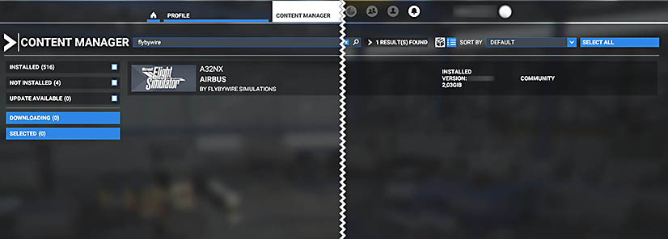

# Reported Known Issues

<link rel="stylesheet" href="/stylesheets/toc-tables.css">
!!! danger  "STOP - Read this First"

    Please try removing all other mods/liveries from the community folder and test our add-on again. This will help rule out conflicts.

    *Most reported issues are caused by conflicts with other mods and liveries. If this does not resolve your issue, please continue below.*

    **Throttle Calibration is Required** - [Guide Here](../feature-guides/flypados3/throttle-calibration.md)

    ---

     

    FBW Installer - [Download Here](https://api.flybywiresim.com/installer){target=new} / *Latest Sim Version: 1.37.19.0*

!!! warning "Read our Support Guides"

    1. [Learn how to fly an A32NX](index.md#1-learn-how-to-fly-the-a32nx)
    2. [Troubleshoot](index.md#2-how-to-troubleshoot)
    3. [Research Known Issues](index.md#3-research-known-issues)
    4. [Report Issue on Discord](index.md#4-report-issue-on-discord)
    5. [Report Issue on the FBW Aircraft GitHub](index.md#5-report-issue-on-the-a32nx-github)
    6. [Collecting Support Information](index.md#collecting-support-information)

    === "Custom Autopilot"

        Due to the complex nature of our custom autopilot, please visit the dedicated ^^Custom Autopilot / Fly-By-Wire^^ page for more information:
    
        - [**Main Page**](../feature-guides/autopilot-fbw.md)
        - [**Typical Issues + Solutions**](../feature-guides/autopilot-fbw.md#typical-issues-and-how-to-solve-them)
        - [**Known Issues**](../feature-guides/autopilot-fbw.md#known-issues)

    === "Custom FMS"

        Please visit the ^^Dedicated Custom Flight Management System^^ page for more information on our latest implementation:
    
        - [**Features + Issues**](../feature-guides/cFMS.md)
        - [**Special Notes**](../feature-guides/cFMS.md#special-notes)
        - [**Known Issues**](../feature-guides/cFMS.md#known-issues)

    === "SimBridge"

        If you're having issues with ^^SimBridge^^, please follow our dedicated guide for it:
        
        - [**SimBridge Troubleshooting Guide**](../../simbridge/troubleshooting.md)

    ---

    Do this before reporting bugs.

---

<!--

TEMPLATE

??? issue "Issue Headline"

!!! tip ""
    *Affected versions: Stable, Development*

^^Description^^
^^Root Cause^^
^^Possible Solution or Workaround^^
^^Additional Information^^

-->

##  Quick Links

- [Commonly Reported Issues](#commonly-reported-issues)
    
- [Solutions to Commonly Reported Issues](#solutions-to-commonly-reported-issues)

- [FBW Installer Issues](#fbw-installer-issues)

- [Incompatible and Problematic Add-ons/Mods](#incompatible-and-problematic-add-onsmods)

## Use the Browser's Search Function

On Desktop, press ++ctrl+'F'++ to search for an issue within the current page.

## Legend

!!! bug "Breaking Issue / Bug"
!!! warning "Non-Breaking Issue / Inconvenience"
!!! tip "Config Issue / Usage Issue"

## Commonly Reported Issues
The following list of issues are commonly reported on our Discord support channel. Please check these before reporting any other issue on Discord. 

*Last Update: {{git_revision_date_localized}}*

??? bug "Invisible Aircraft"
    ### Invisible Aircraft

    !!! tip ""
        *Affected versions: Stable, Development*

    ^^Description^^

    The aircraft can be selected but is invisible in the Hangar and after starting the flight. 

    ^^Possible Solution or Workaround^^
    
    See [Remove Old Marketplace Installation](#remove-old-marketplace-installation)

??? bug "Infinite Loading Times"
    ### Infinite Loading Times

    !!! tip ""
        *Affected versions: Stable, Development*

    ^^Description^^

    While loading into a flight, the loading never stops and the flight never starts. 

    ^^Possible Solution or Workaround^^
    
    Try these solutions:

    - Wait at least 20 - 30 min, as loading after an aircraft update can take a very long time because the sim compiles the so-called wasm files 
    - [Remove Old Marketplace Installation](#remove-old-marketplace-installation)
    - [Clean Install](#clean-install)
    - [Use the Latest Version of MS Flight Simulator](#use-the-latest-version-of-ms-flight-simulator)
    - [Enable Windows UTF-8 Support](#enable-windows-utf8-support)
    - [Test With Only the A32NX Add-on in Community](#test-with-only-the-a32nx-add-on-in-community)

??? bug "Broken Systems, Black Screens, Broken Cockpit Layout"
    ### Broken Systems, Black Screens, Broken Cockpit Layout

    !!! tip ""
        *Affected versions: Stable, Development*

    ^^Description^^

    After loading into a flight, some systems like electricity are broken, the cockpit displays are black, the cockpit layout is broken.

    ^^Possible Solution or Workaround^^
    
    Try these solutions:

    - [Test With Only the A32NX Add-on in Community](#test-with-only-the-a32nx-add-on-in-community)
    - [Clean Install](#clean-install)
    - [Remove Old Marketplace Installation](#remove-old-marketplace-installation)
    - [Enable Windows UTF-8 Support](#enable-windows-utf8-support)
    - [Use the Latest Version of MS Flight Simulator](#use-the-latest-version-of-ms-flight-simulator)

??? bug "Outdated Systems And Missing Features, Although Current Version Installed"
    ### Outdated Systems And Missing Features, Although Current Version Installed

    !!! tip ""
        *Affected versions: Stable, Development*

    ^^Description^^

    The flyPad EFB or other systems are outdated and missing features compared to what is documented. 

    ^^Possible Solution or Workaround^^
    
    Try these solutions:

    - [Make Sure You Have the Latest Version of the A32NX Add-on](#make-sure-you-have-the-latest-version-of-the-a32nx-add-on)
    - [Test With Only the A32NX Add-on in Community](#test-with-only-the-a32nx-add-on-in-community)
    - [Clean Install](#clean-install)

??? bug "Cockpit Lights and Display Are Erratically On"
    ### Cockpit Lights and Display Are Erratically On

    !!! tip ""
        *Affected versions: Stable, Development*

    ^^Description^^

    After loading into a flight, the cockpit lights and displays are partly on and partly off.

    ^^Possible Solution or Workaround^^
    
    Try these solutions:

    - [Test With Only the A32NX Add-on in Community](#test-with-only-the-a32nx-add-on-in-community)
    - [Clean Install](#clean-install)
    - [Remove Old Marketplace Installation](#remove-old-marketplace-installation)
    - [Enable Windows UTF-8 Support](#enable-windows-utf8-support)
    - [Use the Latest Version of MS Flight Simulator](#use-the-latest-version-of-ms-flight-simulator)

??? bug "Performance Issues / FPS Issues"
    ### Performance Issues / FPS Issues

    !!! tip ""
        *Affected versions: Stable, Development*

    ^^Description^^

    Experiencing low FPS or stuttering while using the A32NX.

    Sim performance is a very complex topic, and it is usually  very specific to a user's hardware and configuration. 
    There are often no general solutions to these issues and users need to configure their system in a way it can handle complex custom aircraft like the A32NX.  

    Be aware that the A32NX is not a finished product, and many systems are not yet optimized for performance. We will continue to improve this during the ongoing development of the A32NX. 

    The Stable and Development versions of the A32NX are working well for most of our users. If you encounter problems, you might need to tune your system to handle the complexity of the A32NX (see solutions below).

    ^^Possible Solution or Workaround^^

    - [Do Not Use DX12](#do-not-use-dx12)
    - [Toolbar Pushback Add-on Issues](#toolbar-pushback-add-on-issues)
    - [Your Controls Performance Issues](#your-controls-performance-issues)
    - [Test With Only the A32NX Add-on in Community](#test-with-only-the-a32nx-add-on-in-community)
    - Make sure MSFS is configured for optimal performance 
        - See this article: [Graphic Settings in MSFS](https://forums.flightsimulator.com/t/how-to-graphics-settings-and-performance-guide-su5-complete-retest-8-2-2021/132407)
        - Tip: better to be GPU bound than CPU bound

??? bug "Unable to Move or Taxi"
    ### Unable to Move or Taxi

    !!! tip ""
        *Affected versions: Stable, Development*

    ^^Description^^

    The aircraft is unable to move or taxi. The ECAM is showing a "NW STRG DISC" warning. 
    This is caused by an invisible tug which is still connected to the aircraft.
    This is an MSFS issue as the visual representation of the tug and the connection to the aircraft can get out of 
    sync.

    If you are using rudders/pedals like the Thrustmaster T.Flight Rudder Pedals, make sure they are correctly set up and calibrated. Otherwise the toe brakes may be impeding taxiing.

    ^^Possible Solutions or Workarounds^^

    - [Disconnect the Tug](#disconnect-the-tug)
    - [Toolbar Pushback Add-on Issues](#toolbar-pushback-add-on-issues)
    - [Rudder/Pedal Settings](#rudder-or-toe-brake-operation-issues)

??? bug "Unexpected Engines Shut Down"
    ### Unexpected Engines Shut Down

    !!! tip ""
        *Affected versions: Stable, Development*

    ^^Description^^

    The aircraft is unexpectedly shutting down the engines. This is usually caused by either a conflicting controller mapping triggering the engine shutdown, e.g., when using the keyboard or controller when retracting the gear or flaps.

    Another common cause is users forgetting to fuel the aircraft. 

    - Remove the conflicting mapping (e.g. "Auto Start Engine" or similar)
    - Follow the correct fueling procedure for the A32NX: 
      [Fuel and Weight](../feature-guides/loading-fuel-weight.md#loading-fuel-and-weight)

??? bug "Crash To Desktop (CTD)"
    ### Crash To Desktop (CTD)

    !!! tip ""
        *Affected versions: Stable, Development*

    ^^Description^^

    With the current state of the sim, it is basically impossible to analyze CTDs, let alone fix them, as MSFS does not provide any tools or logs for analyzing CTDs.

    If we can reliably reproduce a CTD in our aircraft, we will try to fix it or at least work around it. But most CTDs are very unpredictable and can be caused by many things:

    - Add-ons and mods
        - Liveries (flightsim.to just removed 1000s of them because of that)
        - Airports
        - Basically any add-on and mod that may be outdated or have conflicting files
    - MSFS itself (e.g., Rolling Cache is often a cause)
    - Hardware (GFX Card and Driver, Overclocking, etc.)
    - Controllers and Drivers
    - Any third-party application that connects to MSFS

    Unfortunately, just using the sim's API functions might trigger a CTD, so the trigger could be the aircraft, but the root cause would be the sim.

    If you can reproduce it reliably, please share this information with us on Discord or our GitHub, so we can try to reproduce it as well. This would be the first step to fixing anything.

    ^^Possible Solution or Workaround^^

    There currently is no known guaranteed solution for all cases; However, users have found success with by trying the following:

    1. Remove everything from the Community folder - **really everything**! [Test With Only the A32NX Add-on in 
    Community](#test-with-only-the-a32nx-add-on-in-community)
    1. [Enable Windows UTF-8 Support](#enable-windows-utf-8-support)
    1. Perform a [Clean Install](../installation.md#clean-install-steps)
    1. Stop any third-party application which connect to MSFS 
       FSUIPC, YourControls, Fs2Crew, GSX, SPAD.next, ...
    1. Run without live weather and/or live traffic.
    1. Check your content manager for missing packages
    1. Delete your rolling cache in the sim and create a new one.
    1. Delete any manual cache in the sim and create new ones.
    1. Run the game as Administrator.
    1. Visit and read the [MSFS Known Issues Page](https://flightsimulator.zendesk. com/hc/en-us/articles/360016027399-KNOWN-ISSUES-Last-update-July-28-2021-) OR [MSFS Troubleshooting & Support](https://flightsimulator.zendesk.com/hc/en-us/sections/360004475200-Troubleshooting-Support-Windows-10-PC)

    ^^Additional Information^^

    Please also search in the MSFS Discord and Forum for CTD causes and solutions.

    [MSFS Zendesk Safe-Mode-FAQ](https://flightsimulator.zendesk.com/hc/en-us/articles/4405893759378-PC-versions-Safe-Mode-FAQ){target=new}

    [MSFS Zendesk CTDs-issues-Basic-Troubleshooting](https://flightsimulator.zendesk.com/hc/en-us/articles/4406280399250-All-versions-Crashing-CTDs-issues-Basic-Troubleshooting){target=new}

    [MSFS Zendesk CTDs-issues-Advanced-Troubleshooting](https://flightsimulator.zendesk.com/hc/en-us/articles/4406280653202-All-versions-Crashing-CTDs-issues-Advanced-Troubleshooting){target=new}

    [MSFS Forum ctd-analysis-by-community](https://forums.flightsimulator.com/t/kadw-andrews-ctd-analysis-by-community-contributions/465405){target=new}

    !!! info "Peripherals"
        This is an important snippet from MSFS known issues.

        If you are getting CTDs, it could be one of your peripherals disconnecting sometime during the flight, which then causes the sim to CTD.

        It could be anything from a USB drive to a controller. Please try to minimize how many peripherals you have connected.

??? bug "Lost Use of Mouse After Typing in a flyPad Input Field"
    ### Lost Use of Mouse After Typing in a flyPad Input Field

    !!! tip ""
        *Affected versions: Stable, Development*

    ^^Description^^

    In certain situations, if you have selected an input field on the EFB and changed your view away from the EFB, you may no longer have use of your mouse cursor.

    ^^Root Cause^^

    Under Investigation.

    ^^Possible Solution or Workaround^^

    Try pressing ++ctrl+z++.

    If this didn't help, please follow the steps below to bypass this issue:

    1. Open your browser (i.e., Chrome / Firefox)
    - In the URL field, type - `localhost:19999`
    - Click on any link
    - Go to the `Console Tab` shown in the browser. (**Note:** This is not the DevTools of your browser. The page you are on already has a console tab at the top.)
    - At the bottom type in - `Coherent.call('UNFOCUS_INPUT_FIELD')`
    - Press ++enter++

??? bug "MSFS Freezes After 'Ready To Fly'"
    ### MSFS Freezes After 'Ready To Fly'

    !!! tip ""
        *Affected versions: Stable, Development*

    ^^Description^^

    If your username on your Windows machine (not Xbox gamertag) contains any Unicode characters, it may cause MSFS to freeze after selecting `Ready to Fly`.

    Sample characters (not all-inclusive): **ë** or **õ**

    ^^Root Cause^^

    Unicode Characters in Windows Username.

    Under Investigation.

    ^^Possible Solution or Workaround^^

    Change your windows username and remove any Unicode characters present. [Guide Here](https://www.windowscentral.com/how-change-account-name-windows-10-sign-screen){target=new}

    ^^Additional Information^^

    Also see [UTF-8 Support](../settings.md#utf-8-support) 

??? bug "MSFS Performance Degradation In-Flight"
    ### MSFS Performance Degradation In-Flight

    !!! tip ""
        *Affected versions: Stable, Development*

    ^^Description^^

    Reports in the MSFS forums detail issues impacting FPS performance in the sim. Notably, this occurs during flights that are longer than 2 hours but is not contained to this metric. You may see your normal FPS drop to < 10 FPS as a result of this issue.

    ^^Additional Information^^

    Follow the MSFS Forums Discussion - [here](https://forums.flightsimulator.com/t/after-playing-a-few-hours-fps-drops-from-40-to-5fps/389603/941).

??? warning "Nav Data Issues"
    ### Nav Data Issues

    !!! tip ""
        *Affected versions: Stable, Development*

    ^^Description^^

    The A32NX uses the sim's nav data. So, any nav data issues will usually also be present in other default aircraft and the World Map.

    You can test these issues by using the MSFS World Map. If the required nav data (waypoint, SID, STAR, APPR, Rwy, Airport, etc.) is missing in the World Map as well, then it is a general nav data issue and not an issue with 
    the aircraft. 

    Most common nav data issues come from flight planning tools (e.g., SimBrief, etc.) which use outdated nav data versions (so called AIRAC). These often cost free tools are limited to generating routes using obsolete AIRAC cycles, while MSFS regularly updates to the latest AIRAC available. This can lead to route incompatibilities and various error messages when you import or enter the flight plan to the MCDU, including "NOT ALLOWED", "NOT IN DATABASE", and "AWY/WPT MISMATCH".

    Any of these errors during route import could mean that your route is no longer valid in the current cycle, and 
    cannot be properly used as a valid flight plan in the sim. 

    ^^Possible Solution or Workaround^^

    To avoid this, we recommend a Navigraph subscription, which will make sure SimBrief and the sim have identical nav data. Also, you would have the matching Navigraph charts at your disposal.

    If you have a Navigraph subscription but still have issues with the nav data, try a re-installation of the navigation data by removing and installing the data with the Navigraph Data Center tool.

??? warning "CPDLC with Hoppie on IVAO"
    ### CPDLC with Hoppie on IVAO   

    !!! tip ""
        *Affected versions: Development*

    ^^Description^^

    The answer-transmission of ATC instructions cannot be sent and the DCDU shows "SYSTEM BUSY" or does not send the message. It is not possible to send answers, close or delete ATC instructions.

    ^^Root Cause^^

    The IVAO ATC software Aurora sends wrong message IDs in instructions. In the message handling of the A32NX, this causes the wrong interpretation and association of messages.

    ^^Possible Solution or Workaround^^

    Do not use CPDLC on IVAO.

    ^^Additional Information^^

    We are working with IVAO on a bugfix.

??? warning "No Weather Radar"
    ### No Weather Radar

    !!! tip ""
        *Affected versions: Stable, Development*

    ^^Description^^

    The A32NX currently does not have an operating weather radar. This is due to performance issues related to the default 
    Asobo WX systems and implementing a custom ND in our aircraft.

    The team is currently waiting on a weather API to be implemented to make a radar that is as realistic as possible. You can read the MSFS forum here.

    [MSFS Feature Request for Weather API](https://forums.flightsimulator.com/t/implement-weather-and-terrain-api-s-for-aircraft-developers-to-implement-accurate-radar-predictive-windshear-egpws-and-metar-wind-uplink/442016)
    
??? warning "Fuel Prediction Too Low"
    ### Fuel Prediction Too Low

    !!! tip ""
        *Affected versions: Development*

    ^^Description^^

    Fuel prediction on the MCDU may not calculate enough fuel for the duration of your flight.

    ^^Root Cause^^

    We are working on more realistic simulation of various involved systems, e.g., engines. The fuel predication will be inaccurate until we have updated the fuel planning feature on the MCDU. *Under Investigation*

    ^^Possible Solution or Workaround^^

    When using the MCDU fuel planning feature, take more fuel than what is calculated for you - especially for longer flights.

??? warning "Autopilot: Unwanted Disconnection"
    ### Autopilot: Unwanted Disconnection

    !!! tip ""
        *Affected versions: Stable, Development

    ^^Description^^

    There are several common reasons for an autopilot disconnection, most of them are typically caused by user/pilot error.

    One common cause is input from controllers. Make sure your controllers are working correctly and do not send unwanted input. Use the MSFS deadzone controller settings to prevent unwanted input.

    Another common cause is the A320 protections for High Speed, High Angle of Attack incl. Alpha Floor. 
    See our dedicated documentation for the A320 protections:
    [A320 Protection Documentation](../../pilots-corner/advanced-guides/protections/overview.md)

??? warning "ADIRS Not Aligned When Starting at Runway or in the Air"
    ### ADIRS Not Aligned When Starting at Runway or in the Air

    !!! tip ""
        *Affected versions: Development*

    ^^Description^^

    ADIRS may not be aligned when spawning anywhere except cold & dark at a gate (*intermittent issue*)

    ^^Root Cause^^

    Initialization timing issue of MSFS.

    ^^Possible Solution or Workaround^^

    Workaround: Restart the flight

??? warning "Unexpected Out of Fuel - No Fuel Transfer From Outer Tanks"
    ### Unexpected Out of Fuel - No Fuel Transfer From Outer Tanks

    !!! tip ""
        *Affected versions: Stable, Development*

    ^^Description^^

    Occasionally, the sim will "*miss*" the trigger point being reached for outer tank fuel transfer to initialize.
    This may happen if the sim is "busy" working on something else OR the initial FOB at the start of the flight is below the trigger point.

    ^^Root Cause^^

    Intermittent Issue / Under Investigation

    ^^Possible Solution or Workaround^^
    
    Add enough fuel to get past the trigger point of 239 gallons before departing.

    Use the flyPad fuel page to add fuel to the aircraft: 
    [Fuel Page](../feature-guides/loading-fuel-weight.md#loading-fuel-and-weight)

??? warning "Flypad Can’t Be Used in External View" 
    ### Flypad Can’t Be Used in External View

    !!! tip ""
        *Affected versions: Stable, Development*

    ^^Description^^

    Due to a sim limitation, the flyPad cannot be used in the external view. 

??? warning "Ground Services on the flyPad Are Out of Sync"
    ### Ground Services on the flyPad Are Out of Sync
    
    !!! tip ""
        *Affected versions: Stable, Development*
    
    ^^Description^^
    
    The ground services on the flyPad are out of sync with the ground services on the aircraft/airport.

    As an aircraft in MSFS has no access to the ground service's real state, it is possible that the flyPad is out of sync with the actual state of the ground services. E.g., a door is open, but the corresponding door button is grayed out. 
    
    ^^Possible Solution or Workaround^^
    
    Please do a hard reset on the flyPad by either using the hardware power button or pressing and holding the software button. See [flyPad General Usage](../../fbw-a32nx/feature-guides/flypados3/index.md#general-usage) for more information.

??? warning "Controls Freeze up While Looking Around"
    ### Controls Freeze up While Looking Around

    !!! tip ""
        *Affected versions: Stable, Development*

    ^^Description^^

    Using freelook with the right mouse button may causes controls to freeze.

    ^^Root Cause^^

    MSFS blocks all other inputs when using freelook with the mouse button pressed.

    ^^Possible Solution or Workaround^^

    Try setting `TOGGLE COCKPIT FREELOOK` to your mouse ++middle-button++

    ^^Additional Information^^

    Reference: [MSFS Forum Post](https://forums.flightsimulator.com/t/freelook-with-mouse-causes-controls-to-freeze-after-su5/426349/15){target=new}

??? warning "TCA Throttle Autobrake Disengages While Looking Around"
    ### TCA Throttle Autobrake Disengages While Looking Around

    !!! tip ""
        *Affected versions: Stable, Development*

    ^^Description^^

    MSFS blocks all other inputs when using freelook with the mouse button pressed. The TCA knob for Autobrake setting will be lost if this block lasts longer than 1.5sec.

    ^^Root Cause^^

    See the root cause here: [Controls Freeze up While Looking Around](#controls-freeze-up-while-looking-around)

    ^^Possible Solution or Workaround^^

    Do not look around the cockpit for > 1.5 s

??? warning "Can't Start Engines When Using TCA Throttle"
    ### Can't Start Engines When Using TCA Throttle

    !!! tip ""
        *Affected versions: Stable, Development*

    ^^Description^^

    MSFS default mappings for TCA Throttle are not working. 

    ^^Root Cause^^

    Wrong default mapping in MSFS. 

    ^^Possible Solution or Workaround^^

    1)

    - Open the controls menu
    - REMOVE:
        - “Toggle Engine 2 Fuel Valve” - Set to Joystick Button 4
        - “Toggle Engine 1 Fuel Valve” - Set to Joystick Button 3
    - KEEP or SET:
        - “Set Engine 2 Fuel Valve” - Set to Joystick Button 4
        - “Set Engine 1 Fuel Valve” - Set to Joystick Button 3
        

    2) 

    - Set the value `Joystick Button 8` for both the values shown below.
    - Set the ACTION TYPE for SET ENGINE NORM MODE to `ON RELEASE` shown below.

    {loading=lazy}

    {loading=lazy}

    ^^Additional Information^^

    Also see our [Throttle Calibration Guide](../feature-guides/flypados3/throttle-calibration.md)

??? warning "Liveries Converted from the Default Asobo A320 Cause Issues" 
    ### Liveries Converted from the Default Asobo A320 Cause Issues

    !!! tip ""
        *Affected versions: Stable, Development*

    ^^Description^^

    Old liveries or liveries intended for the default Asobo A320 cause issues like artifacts, systems not working, CTDs, etc.

    ^^Root Cause^^

    Old liveries or converted Asobo A320 liveries are often not compatible with the latest sim versions or the FlyByWire A32NX.

    ^^Possible Solution or Workaround^^

    Use current liveries intended for the FlyByWire A32NX from flightsim.to.

    See [Liveries Guide](../liveries.md)

??? warning "Ice Building Up on Cockpit Windows"
    ### Ice Building Up on Cockpit Windows

    !!! tip ""
        *Affected versions: Stable, Development*

    ^^Description^^

    Icing occurs (windshield, engines, wings) although Anti-Ice is turned on.

    ^^Root Cause^^

    There is actually no anti-ice capability in MSFS, and Asobo currently has no plans to add it in the near future.

    The anti-ice systems therefore work as deice systems (after the fact) rather than anti-ice systems (preventive).

    ^^Possible Solution or Workaround^^

    No workaround, but flights should not be impacted too much by this.

    ^^Additional Information^^

     The consequence of this MSFS behavior is that the auto-probe/windshield heat will not always prevent ice from forming on the windshield or the pitot probe. Although the ice should melt fairly quickly (and no need to switch from auto to on), the windshield can still freeze over, and you can lose airspeed information upon first entering icing conditions if they are severe enough.

    The same goes for wing and engine anti-ice - turning them on before ice actually forms may not prevent ice from forming there, but it should melt fairly quickly.

??? warning "Refueling/Boarding Buttons Missing/Disabled on EFB Fuel/Payload Page"
    ### Refueling/Boarding Buttons Missing/Disabled on the EFB Fuel/Payload Page

    !!! tip ""
        *Affected versions: Stable, Development*

    ^^Description^^

    You may find the 'play' button (that is used to initialise the refueling process) or the 'boarding' button (used to initiate boarding of passengers) is missing or disabled on the 'Fuel' or 'Payload' page of the EFB (flyPad). This occurs when [GSX Synchronization](https://docs.flybywiresim.com/fbw-a32nx/feature-guides/flypados3/settings/#3rd-party-options) is enabled. 

    GSX is a third-party software developed and sold by FSDreamteam, which you can purchase and install to enhance ground operations at airports.

    ^^Possible Solution or Workaround^^
    
    - If you are **not** using GSX, then you will need to disable both options on the [GSX Synchronization](https://docs.flybywiresim.com/fbw-a32nx/feature-guides/flypados3/settings/#3rd-party-options) page on the EFB, under Settings -> 3rd Party Options.
    
    - If you do use GSX, then much of the boarding and refueling process is completed through GSX itself, while also still requiring some interaction with the A32NX EFB. This is explained in detail in our [GSX Integration Guide](https://docs.flybywiresim.com/fbw-a32nx/feature-guides/gsxintegration).

??? warning "Pop-out Feature Not Working"
    ### Pop-out Feature Not Working

    !!! tip ""
        *Affected versions: Stable, Development*

    ^^Description^^

    The MSFS pop-out feature is not working for certain screens in the A32NX flight deck. 

    While this is an MSFS issue, it can cause problems if you regularly enjoy popping out various screens for use with external hardware or another monitor.

    ^^Root Cause^^

    MSFS off-screen pop-out issue when your monitor setup may have changed between Sim Updates. This data is reportedly stored locally and in the cloud.

    ^^Possible Solution or Workaround^^

    !!! tip ""
        Please note that you should first check the following before trying any workarounds.

        - You can see the **magnifying glass** when attempting to pop out the panel. 

    You can try using the MSFS Pop Out Panel Manager application to restore the position if you suspect the pop-out is off-screen. 

    [Download MSFS Pop Out Panel Manager](https://github.com/hawkeye-stan/msfs-popout-panel-manager)

    For more information on how to actually solve the issue, please reference the following GitHub issue for more information:

    [MSFS Popout Workaround / Pop out panel manager issue](https://github.com/hawkeye-stan/msfs-popout-panel-manager/issues/73){target=new .md-button}

??? tip "Hard To Control the Aircraft during Taxi, TakeOff, or Landing"
    ### Hard To Control the Aircraft during Taxi, TakeOff, or Landing

    !!! tip ""
        *Affected versions: Stable, Development*

    ^^Description^^

    The aircraft is hard to control during taxi, takeoff, or landing.

    ^^Possible Solution or Workaround^^

    - [Deactivate MSFS Assistance Features](../../fbw-a32nx/settings.md#deactivate-msfs-assistance-features)

??? tip "Rudder or Toe Brake Operation Issues"
    ### Rudder or Toe Brake Operation Issues

    !!! tip ""
        *Affected versions: Stable, Development*

    ^^Description^^

    Experience problems like brakes getting stuck while taxiing or twitching rudders, or taxiing is erratic. 

    ^^Root Cause^^

    - MSFS Assistance settings (esp. AUTO_RUDDER) are activated. These need to be **deactivated** for the A32NX.
    - Rudder setup is not correct.

    ^^Possible Solution or Workaround^^
    
    - Deactivate [MSFS Assistance Features](../../fbw-a32nx/settings.md#deactivate-msfs-assistance-features)
    - Rudder Settings: See the correct settings for rudder using the T.Flight Rudder Pedals as an example: [T.Flight Rudder Pedals Settings](./detail-pages/rudder.md)

??? tip "++ctrl+'E'++ - Engine Start Unsupported" 
    ### ++ctrl+'E'++ - Engine Start Unsupported

    !!! tip ""
        *Affected versions: Stable, Development*

    ^^Description^^

    The auto-start shortcut via ++ctrl+'E'++ will not work.

    Currently, you need at least the APU Avail and APU Bleeds to be switched on, as well as the fuel pumps to be on for a normal engine start. (Crossbleed starts will be implemented at a later time).

    ^^Root Cause^^

    Our custom systems and realistic simulation of onboard systems requires the proper engine start procedure for the A320neo.

    ^^Possible Solution or Workaround^^

    We highly suggest learning how to start the engines manually by reading our beginner guide. 
    [Beginner Guide - Engine Start Section](../../pilots-corner/beginner-guide/engine-start-taxi.md#engine-start).

??? tip "flyPad EFB Missing in Cockpit"
    ### flyPad EFB Missing in Cockpit

    !!! tip ""
        *Affected versions: Stable, Development*

    ^^Description^^

    No EFB (flyPad) visible in the cockpit.

    ^^Root Cause^^

    Default Asobo A320 aircraft selected instead of the FlyByWire A32NX.

    ^^Possible Solution or Workaround^^

    Select the **^^FlyByWire Simulations A320neo (LEAP)^^** in the aircraft selector instead of the Asobo one.

    {width=50% align=left loading=lazy}

??? tip "Incompatible Keyboard Mapping for Pause Function"
    ### Incompatible Keyboard Mapping for Pause Function

    !!! tip ""
        *Affected versions: Stable, Development*

    ^^Description^^

    If the `Pause` function is mapped to any key other than ++esc++ this other key will trigger `Pause` when typing it into input fields of the EFB or the MCDU when using the keyboard input mode.

    ^^Root Cause^^
    
    This is an MSFS limitation for Coherent driven JavaScript instruments. 

    ^^Possible Solution or Workaround^^

    Make sure that the `Pause` function is only mapped to the ++esc++ key and not to any other keys.

??? tip "Difficulty Accurately Clicking Controls"
    ### Difficulty Accurately Clicking Controls

    !!! tip ""
        *Affected versions: Stable, Development*

    ^^Description^^

    Click spots for different controls in the virtual cockpit may seem "misaligned" or generally difficult to accurately select.

    ^^Root Cause^^

    Sim Update 7 Issues

    ^^Possible Solution or Workaround^^

    Turn off *Lens Correction* in the MSFS graphics settings.

    

??? tip "Aircraft Not Following Flight Plan Route"
    ### Aircraft Not Following Flight Plan Route

    !!! tip ""
        *Affected versions: Stable, Development*

    ^^Description^^
    
    This is typically caused by flying into a discontinuity or an incomplete setup of the aircraft. 

    ^^Read the documentation about Discontinuities^^

    - [Discontinuities](../../pilots-corner/advanced-guides/flight-planning/disco.md)

## Solutions to Commonly Reported Issues 
The following list of solutions solves most reported issues on our Discord support channel. 
Please try these before reporting any other issue on Discord.

??? tip "General Troubleshooting Steps"
    ### General Troubleshooting Steps

    ^^Description^^

    Most issues with the A32NX can be solved by following the below steps.  
    Try these first before you report an issue on Discord or GitHub. 

    ^^Troubleshooting Steps^^
   
    - [Remove Old Marketplace Installation](#remove-old-marketplace-installation)
    - [Test With Only the A32NX Add-on in Community](#test-with-only-the-a32nx-add-on-in-community)
    - [Clean Install](#clean-install)
    - [Enable Windows UTF-8 Support](#enable-windows-utf-8-support)
    - [Make Sure to Use the Latest Version of MS Flight Simulator](#use-the-latest-version-of-ms-flight-simulator)

??? tip "Remove Old Marketplace Installation"
    ### Remove Old Marketplace Installation
    
    !!! tip ""
        *Affected versions: Stable, Development*

    ^^Description and Symptoms^^

    If you have the following issues, you are **most likely on an outdated stable**, or you have an **installation conflict**:

    - Invisible Aircraft
    - Infinite loading times
    - White EFB screen
    - PFD is missing bank angle protection indicators
    - `NOT IN DATABASE` MCDU error
    - External lights are not working

    ^^Root Cause^^

    Double installation of the add-on and conflict with very old, unsupported versions.

    ^^Possible Solution or Workaround^^

    Go to your content manager and filter for "flybywire" as you see in the following image.

    {loading=lazy}

    If you see old versions (e.g., v0.6.1) or if you have multiple installations of the A32NX, please uninstall them in the Content Manager and restart the sim. Reinstall development version from our [installer](https://api.flybywiresim.com/installer){target=new}.

    ^^Additional Information^^

    Information on how to install with the FlyByWire Installer can be found here: [Installation Guide](../installation.md).

??? tip "Use the Latest Version of MS Flight Simulator"
    ### Use the Latest Version of MS Flight Simulator

    The A32NX only works with the latest version of MS Flight Simulator. Please make sure that your simulator is up 
    to date.    

??? tip "Use the Latest Version of the A32NX Add-on"
    ### Use the Latest Version of the A32NX Add-on

    The A32NX is constant being improved and extended. New features, changed features, and bug fixes are constantly being added. Because of this, it is important to make sure that you have the latest version of the A32NX add-on.

    The latest fixes and features are available in the Development version of the add-on.

    Use our Installer to check availability of new updates and keep your installation as current as possible.

??? tip "Clean Install"
    ### Clean Install

    See [Clean Install](../installation.md#clean-install-steps)

??? tip "Enable Windows UTF-8 Support"
    ### Enable Windows UTF-8 Support

    See [UTF8 Support](../../fbw-a32nx/settings.md#utf-8-support)

??? tip "Test With Only the A32NX Add-on in Community"
    ### Test With Only the A32NX Add-on in Community

    !!! danger "**This is the most important troubleshooting step for Microsoft Flight Simulator!!**"

    To make sure the issue you are experiencing is not caused by a conflict with other add-ons or liveries ***remove everything (really everything!) from your [Community Folder](#community-folder-content)** and perform a [clean reinstall](../installation.md#clean-install-steps) of the A32NX with the [FlyByWire Installer](https://api.flybywiresim.com/installer){target=new}.

    An easy way to do this without deleting your add-ons and liveries is to rename the current Community folder to "Community.old" and then create a new Community folder, which then empty. You can the use then FlyByWire Installer to reinstall the A32NX. 

??? tip "Use the Correct Airframe for SimBrief"
    ### Use the Correct Airframe for SimBrief

    See [SimBrief Airframe](../../fbw-a32nx/installation.md#simbrief-airframe)

??? tip "Turn Off All MS Flight Simulator Assistance Features"
    ### Turn Off All MS Flight Simulation Assistance Features

    See [Deactivate MSFS Assistance Features](../../fbw-a32nx/settings.md#deactivate-msfs-assistance-features)

??? tip "Throttle Calibration"
    ### Throttle Calibration

    See our [Throttle Calibration Guide](../feature-guides/flypados3/throttle-calibration.md)

??? tip "Check your MSFS Uses the Correct Community Folder"
    ### Check your MSFS Uses the Correct Community Folder

    See [Community Folder](../../fbw-a32nx/installation.md#community-folder)

??? tip "Setup Your Controller Deadzones"
    ### Setup Your Controller Deadzones

    In certain situations, your hardware maybe causing unwanted inputs when attempting to fly the aircraft. Increasing the deadzone setting for your controller can help prevent these inputs.

    - Go to your settings
    - Controls and select your yoke/joystick/controller.
    - After that, click the sensitivity button on the top left, which should take you to the menu where you can adjust your deadzones.
    
    Start with 20 % deadzone, if the problem persists, keep increasing it. If it's fine with 20 % you can then slowly decrease it too.

    {loading=lazy}

??? tip "Understand Discontinuities"
    ### Understand Discontinuities

    See [Discontinuities Guide](../../pilots-corner/advanced-guides/flight-planning/disco.md)

??? tip "Sync MSFS Flight Plan with the A32NX Flight Plan"
    ### Sync MSFS Flight Plan with the A32NX Flight Plan

    See [Sync to MSFS Flight Plan](../../fbw-a32nx/feature-guides/cFMS.md#sync-mcdu-to-msfs)

??? tip "Cockpit Interaction System"
    ### Cockpit Interaction System

    !!! tip ""
        *Affected versions: Stable, Development*

    ^^Description^^

    Switches, knobs, and dials can't be used with simple mouse clicks as before. (Can't push or pull knobs).

    ^^Root Cause^^

    Asobo

    ^^Possible Solution or Workaround^^

    We recommend the legacy (previous) method of the Cockpit Interaction System:

    - Go to Menu
    - General Options
    - Accessibility
    - Find the `Cockpit Interaction System` setting
    - Change to `legacy`

    ^^Additional Information^^

    Using **New** Cockpit Interaction System

    - Highlight a control (like a knob).
    - Hold ++"Left Click"++ to lock to that control. Now, your mouse will not affect any other controls or other mouse bindings.
    - Move the mouse left to turn the knob left, move it right to turn the knob right (with the ++"Left Click"++ held down)
    - You can also use the scroll wheel while holding ++"Left Click"++ down to turn the knob left or right.
    - To push a control / knob in, lock to the control using ++"Left Click"++ and then ++"Right Click"++.
    - To pull a control / knob out, hold ++"Left Click"++ and then click your scroll wheel ++"Middle Mouse"++.
        - Note: If you already use the ++"Middle Mouse"++ button to activate freelook this may not work. Check your keybinds, so this feature does not conflict.

    !!! tip ""
        This list is based on our testing and feedback. For more information, see the [MSFS Release Notes](https://forums.flightsimulator.com/t/microsoft-flight-simulator-available-today-on-xbox-series-x-s-and-xbox-game-pass/425795) - Cockpit Interactions.

    Direct your support questions and feedback on this feature to Asobo.

??? tip "Do Not Use DX12"
    ### Do Not Use DX12

    Do not use DX12 in your MS Flight Simulator as it causes massive performance issues for many users. 

??? tip "Disconnect the Tug"
    ### Disconnect the Tug

    If you have the "NW STRG DISC" message on the upper ECAM display, but you can't see a tug, please press 
    ++shift+'P'++ on your keyboard to disconnect the invisible pushback tug.
    
    This is an MSFS issue sometimes triggered by pushback tools like Toolbar Pushback Add-on and the flyPad pushback 
    system.   

## FBW Installer Issues

??? bug "Download Issues - FBW Products"
    ### Download Issues - FBW Products
    
    ^^Description^^

    In certain situations, your ISP may block our CDN (Content Distribution Network) served by Cloudflare. Cloudflare allows us to save costs when users download our aircraft from our installer to 
    provide a seamless installation process for a variety of our products.

    Additionally, any disturbance to the stability of your connection may cause any downloads to fail and may need to be retried when you have a more stable connection.

    ^^Common Error Codes^^

    - ECONNRESET
    - ETIMEDOUT
    - ENOTFOUND
    - HTTP 403

    ^^Possible Solution or Workaround^^

    We recommend one of the following actions:

    1. TEMPORARY Solution: Try a VPN - a great free one that's reliable is [ProtonVPN](https://protonvpn.com/).
        - Please do your own due diligence and research when utilizing a VPN, even with our recommended one above.
    2. Download a full build from our website [here]() - Please ensure you follow our [manual installation instructions](../installation.md#manual-installation).
    3. Contact your ISP to check with them if there are any existing issues utilizing Cloudflare on their network.

    ^^Additional Information^^

    Below is a list of countries that are possibly affected by this issue. Please note that it may not be *every* ISP in the country.

    - Brazil
    - China
    - Iberia
    - Portugal
    - Saudi Arabia
    - Spain

??? bug "Installer Permission Problems"
    ### Installer Permission Problems
    
    ^^Description^^

    During installation of a product a "Windows Permission Error" with the error code EPERM shows up and the installation is aborted.

    ^^Root Cause^^
    
    Sometimes the permissions of the community folder are set to not allow the current user to install addons in it.
    This might be set since the installation of MSFS or MSFS might have changed it at some point.
    
    ^^Possible Solution or Workaround^^

    One of the following solutions usually lets the desired addon be installed

    * Check the permissions of the community folder and correct them.
    * Rename the current community folder, create a new one with the same name and move your installed addons into the new community folder.
    * Start the installer with admin permissions.

## Incompatible and Problematic Add-ons/Mods

The following add-ons and mods are known to be incompatible and cause issues with the A32NX. We recommend you uninstall these before starting the sim and flying with the A32NX, especially if you experience issues with the aircraft.

??? bug "Weather Radar Mod"
    ### Weather Radar Mod
    
    !!! tip ""
        *Affected versions: Development*
    
    ^^Description^^
    
    Aircraft systems may no longer function appropriately when the Weather Radar Mod for FBW A320 Neo is installed. 

    ^^Root Cause^^

    This addon overwrites the entire Navigation Display.

    ^^Possible Solution or Workaround^^

    Uninstall the mod.

    ^^Additional Information^^

    The author of this mod specifically states that, if any issues are present with our aircraft, then this mod should be removed when flying.

??? bug "Lights Addons"
    ### Lights Addons

    !!! tip ""
        *Affected versions: Stable, Development*

    ^^Description^^

    If you are experiencing issues with the lights in the cockpit we have found some addons create breaking conflicts with the A32NX.

    You may experience various cockpit lights to not illuminate the cockpit appropriately or refuse to turn on at all.

    **Note: This issue is separate from the UTF8 issues and strictly affects lighting only.**

    We have identified the following addon to be the main offender:

    !!! warning ""
        New Light (enhancement taxi, landing light and other extrior light) | by nicottine

    Please be aware there may be other lights addons that may also cause this issue.

    ^^Root Cause^^

    It isn't currently possible to seamlessly modify lights on planes via mods. Creators would instead have to replace the whole airplane systems definition - which breaks everything when we 
    update it ourselves.

    ^^Possible Solution or Workaround^^

    - Uninstall the mod
    - Use an add-on linker to ensure the mod is only installed when you plan to use it.

??? bug "LVFR A321neo Compatibility Mod"
    ### LVFR A321neo Compatibility Mod

    !!! tip ""
        *Affected versions: Stable, Development*
    
    ^^Description^^

    This Add-on is known to cause severe issues with the A32NX.

    This compatibility mod is available on flightsim.to and may overwrite our systems / EFB, resulting in outdated systems or missing features in our EFB when the mod is installed.

    ^^Possible Solution or Workaround^^

    - Uninstall the mod
    - Use an add-on linker to ensure the mod is only installed when you plan to use it.

??? bug "Co-Pilot Add-ons"
    ### Co-Pilot Add-ons

    !!! tip ""
        *Affected versions: Stable, Development*
    
    ^^Description^^

    The Co-Pilot Add-ons are known to cause severe issues with the A32NX.
    
    ^^Possible Solution or Workaround^^
    
    - Uninstall the add-ons

??? bug "3rd Party Interior Textures - Black Screens"
    ### 3rd Party Interior Textures Black Screens

    !!! tip ""
        *Affected versions: Development*
    
    ^^Description^^

    3rd party interior textures mods are breaking the state of our custom instruments. This is similar to the older 
    `panel.cfg` livery issue that created systems conflicts.

    We have identified the following texture pack to be the main offender:

    !!! warning ""
        Improved Textures Mod - A32NX & A320neo | by FlightFlow

    {--

    Please do not install add-ons that modify files or overwrite files inside the `flybywire-aircraft-a320-neo` folder.

    --}

    ^^Root Cause^^

    Conflict with our own handcrafted textures.

    ^^Possible Solution or Workaround^^

    Remove the offending 3rd party interior texture.

??? bug "Your Controls Performance Issues"
    ### Your Controls Performance Issues

    !!! tip ""
        *Affected versions: Stable, Development*

    ^^Description^^

    If you have this 3rd party add-on installed, but it is not in use for your flight, you may experience degraded performance (FPS) in the simulator.

    ^^Possible Solution or Workaround^^

    - Remove the add-on from your community folder if it will not be in use for your flight.

??? bug "Toolbar Pushback Add-on Issues"
    ### Toolbar Pushback Add-on Issues

    !!! tip ""
        *Affected versions: Stable, Development*

    ^^Description^^

    This 3rd party addon may have the following intermittent issues:

    - Stuck aircraft
    - Unable to taxi
    - Unable to turn nosewheel
    - Performance degradation

    ^^Possible Solution or Workaround^^

    - Remove the add-on from your community folder or wait for developer to update or see next item.
    - Keep the add-on but remove it from the toolbar once you have pushed back
    - Use our EFB which has built in pushback controls or another add-on.

---
