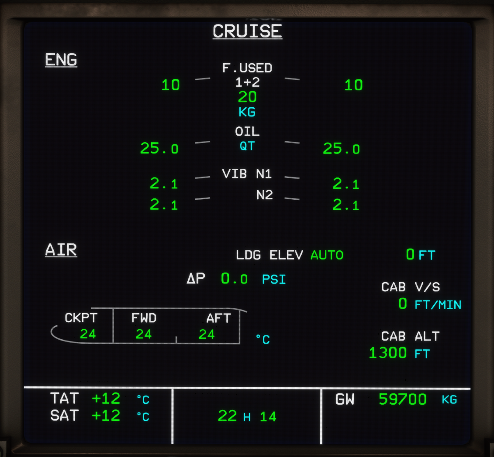

# ECAM CRUISE page

[Back to ECAM System Display Overview](index.md){ .md-button }

| Number | Name                        | Variation       | Meaning                                                                                                                                                        |
|:-------|:----------------------------|:----------------|:---------------------------------------------------------------------------------------------------------------------------------------------------------------|
| 1      | Fuel Used                   | Green           | Fuel used by the engines (multiplies of 10 kg/20 lb).                                                                                                          |
|        |                             | Amber dashed    | Value accuracy is degraded and fuel flow not valid.                                                                                                            |
| 2      | Oil Quantity                | Green           | Oil quantity is normal (0 to 25 QT).                                                                                                                           |
|        |                             | Amber           | Oil quantity below the oil advisory limit (1.35 QT).                                                                                                           |
| 3      | N1, N2 Vibrations           | Green           | Vibration of the LP(HP) rotor is in normal range.                                                                                                              |
|        |                             | Amber           | Level of LP(HP) rotor vibration is excessive.                                                                                                                  |
| 4      | Landing Elevation           | LDG ELEV AUTO   | Appears green when LDG ELEV selector is AUTO.                                                                                                                  |
|        |                             | LDG ELEV MAN    | Appears green when LDG ELEV selector is not in AUTO.                                                                                                           |
|        |                             | Elevation in ft | Landing elevation selected either automatically by the FMGS or manually by the pilot appears in green (but not when the MODE SEL pushbutton switch is in MAN). |
| 5      | Cabin Differential Pressure | Green &#8710;P  | Appears green when normal. Pulses green when &#8710;P >= 1.5 psi before landing.                                                                               |
|        |                             | Amber &#8710;P  | Outside normal range: &#8710;P <= - 0.4 psi or >= 8.5 psi.                                                                                                     |
| 6      | Cabin Vertical Speed        | Green           | Normal range.                                                                                                                                                  |
|        |                             | Pulsing Green   | Pulses when V/S > 1.750 ft/min (resets at 1.650 ft/min).                                                                                                       |
| 7      | Cabin Altitude              | Green           | Normal range.                                                                                                                                                  |
|        |                             | Pulses          | Above 8.800 ft (resets at 8.600 ft).                                                                                                                           |
|        |                             | Red             | Above 9.550 ft.                                                                                                                                                |
| 8      | A/C Zones                   | Green           | Designated zone and corresponding temperature.                                                                                                                 |

