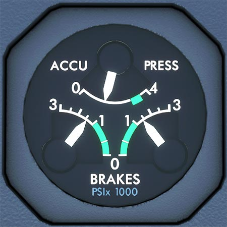

# Accumulator Pressure Indication

---

[Back to Flight Deck](../index.md){ .md-button }

---

## Description

- ACCU PRESS:
    - Pressure in the yellow hydraulic system brake accumulators.
- BRAKES:
    - Yellow hydraulic system pressure delivered to the brakes. Measured upstream of the alternate servo valves.

---

[Back to Flight Deck](../index.md){ .md-button }
