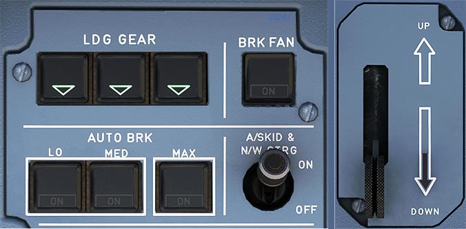

# Autobrake and Gear Indications

---

[Back to Flight Deck](../index.md){ .md-button }

---

## Description

The Airbus A320neo has three landing gears. Two main gears retracting inward and one nose gear retracting forward.

Two Landing Gear Control and Interface Units (LGCIUs) manage the extension and retraction of the gear and the operation of the doors. They also supply information to the ECAM for display, and send signals indicating whether the aircraft is in flight or on the ground to other aircraft systems.

The nose gear is also used for steering on the ground.

The main wheels have carbon multidisc brakes, which can be actuated by either of two independent brake systems.
The normal system uses green hydraulic pressure, whereas the alternate system uses the yellow hydraulic system backed up by the hydraulic accumulator.

An anti-skid and autobrake system is also provided.

## Usage

### Landing Gear Indicator Panel

- UNLK:
    - Illuminate red if the gear is not locked in the selected position.
- Green Triangle:
    - Illuminate green if the gear is locked down.

### L/G LEVER

- UP:
    - Selects landing gear retraction.
    - The brake system brakes the wheels of the main gear.
- DOWN:
    - Selects landing gear extension.
    - The gear cannot be retracted while the aircraft is on the ground.

### RED ARROW

Lights up if the landing gear is not locked down when the aircraft is in the landing configuration, and a red warning appears on ECAM.

!!! attention ""
    Currently not available or INOP in the FBW A32NX for Microsoft Flight Simulator.

### A/SKID & N/W STRG

The anti-skid system is the aircraft's equivalent to modern car's ABS system. It produces maximum braking efficiency by maintaining the wheels just short of an impending skid by releasing brake forces when on the verge of locking. ECAM displays the released brakes in this case.

The anti-skid is deactivated when ground speed is less than 20 knots.

- ON:
    - Available green hydraulic system pressure, then Anti-skid and Nose Wheel Steering is available.
    - Lost green hydraulic pressure:
        - Yellow hydraulic system pressure takes over automatically to supply the brakes:
        - Anti-skid remains available.
        - The triple indicator shows yellow system brake pressure.
- OFF:
    - Yellow hydraulic system supplies brake pressure.
    - Anti-skid is deactivated and pilot must limit brake pressure to avoid locking a wheel with the help of the triple indicator.
    - Nose wheel steering is lost.
    - Differential braking still available through the pedals.
    - The triple indicator shows yellow system brake pressure.

### AUTO/BRK

The A320neo has an autobrake system which activates either in case of an aborted takeoff or after landing and maintains a selected deceleration rate. This improves comfort of passengers and reduces load from the flight crew.

It has 4 settings: OFF, LO, MED and MAX.

MED mode sends progressive pressure to the brakes 2 s after the ground spoilers deploy in order to decelerate the aircraft at 3 m/s² (9.8 ft/s²) LO mode sends progressive pressure to the brakes 2 s after the ground spoilers deploy, in order to decelerate the aircraft at 2 m/s² (6.6 ft/s²).

- MAX (takeoff):
    - If the flight crew aborts the takeoff, maximum pressure goes to the brakes when the ground spoilers are being deployed.
    - Can only be activated for takeoff and not while airborne.
- MED
    - Usually selected for landing on a shorter, wet or contaminated runway.
    - Sends progressive pressure to the brakes 2 seconds after the ground spoilers deploy in order to decelerate the aircraft at 3 meters/second^2^ (9.8 feet/second^2^).
- LO
    - Usually selected for landing on a normal-length, dry and uncontaminated runway.
    - Sends progressive pressure to the brakes 2 seconds after the ground spoilers deploy. Decelerates the aircraft at 2 meters/second^2^ (6.6 feet/second^2^ ).
- Lights
    - Blue ON light indicates positive arming.
    - Green DECEL light indicates deceleration is 80% of the selected rate.
    - Note: DECEL light will not illuminate if the predetermined deceleration is not reached due to antiskid operation on a contaminated (slippery) runway. This does not mean that autobrake is not working.
- Off:
    - Not active.

### BRK FAN

- ON:
    - If the left-hand main landing gear is down and locked the fans run.
- OFF:
    - Brake fans are stopped.
- HOT Lt:
    - When the brakes get too hot, this amber light comes on and ECAM shows a caution.

---

[Back to Flight Deck](../index.md){ .md-button }
