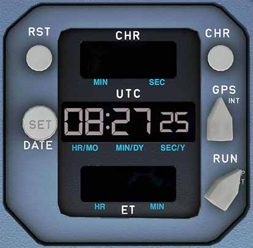

# Clock

---

[Back to Flight Deck](../index.md){ .md-button }

---

## Description

The A320neo has a built-in independent clock which sends time data to several systems. It has redundant electrical supply and is also directly connected to the aircraft's Hot Battery Bus.

Functions :

- "UTC" (GMT) time in hours, minutes, and seconds on the center counter.
- Elapsed time (ET) (from engine startup) in hours and minutes on the lower counter.
- Chronometer (CHR), which measures a time interval (from the pushing of the CHRONO button) in minutes and seconds.
- Date display.

## Usage

### UTC (GMT) counter

24-hour format clock.

### Elapsed Time (ET) counter

Tracks flight time

### Chrono (CHR) counter

Tracks elapsed time. Controlled by the CHR pushbutton.

The first push starts the CHR counter and the second push stops the CHR counter but keeps the display at its last indication.

### Reset (RST)

Resets the chrono counter when the counter is running.

### ET selector

- RUN:
    - ET counter starts
- STP:
    - ET counter stops
- RST:
    - ET counter is blanked. The selector returns to its STP position when the selector is released.

Note: When alternating between "RUN" and "STP" a cumulative elapsed time can be measured.

### DATE/SET button

- First push:
    - Date mode. The UTC time display is replaced by the date (day month year).

- Second push:
    - Time mode. The date display disappears.

Note: In order to select the date mode, the UTC selector must be set on "GPS" or "INT" position.

!!! info ""
    In the FlyByWire A32NX, the Date Set button must be held to show date. It switches back to time when released.

---

[Back to Flight Deck](../index.md){ .md-button }
