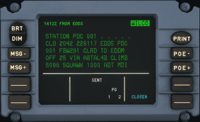

# Datalink Ctl and Display Unit

---

[Back to Flight Deck](../index.md){ .md-button }

---

!!! note "API Documentation: [DCDU Panel API](../../a32nx_api.md#dcdu)"

## Description

The Datalink Ctl and Display Unit (DCDU) is used by the pilots to communicate with Air Traffic Control (ATC) by the means of text messages instead of voice radio.

In addition to the DCDU, the MCDU is used to prepare a request.

See our detailed documentation on [Hoppie ACARS](../../../../fbw-a32nx/feature-guides/hoppie.md)

---

[Back to Flight Deck](../index.md){ .md-button }
