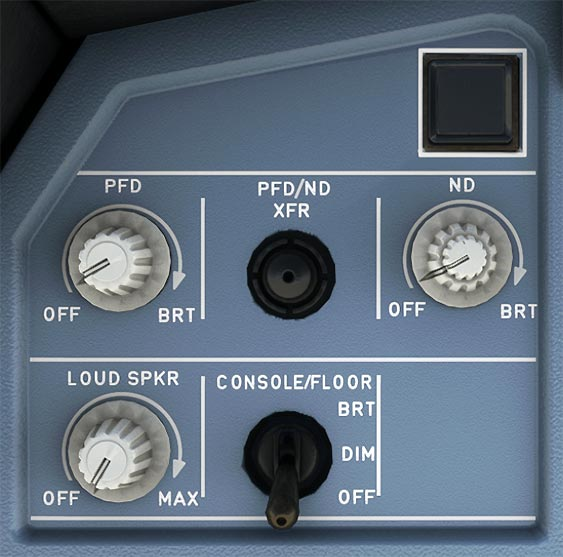

# Instrument Lighting Control Panel

---

[Back to Flight Deck](../index.md){ .md-button }

---

## Description

## Usage

### OFF/BRT knobs

These knobs are used to turn the displays (PFD, ND) on and off, and also adjust their brightness.

- PFD
    - If the PFD is turned off (knob turned all the way counterclockwise) the PFD image is automatically displayed on the NDU, but the pilot may recover the ND by means of the PFD-ND XFR pushbutton.

    !!! note ""
        Currently PFD/ND XFR is not available in the FBW A32NX for Microsoft Flight Simulator.

- ND
    - The outer knob adjusts the brightness of both the weather radar image and the EGPWS terrain display. The inner knob adjusts the  brightness of the ND symbols. The ND is turned off if this knob is turned all the way counterclockwise.

### PFD/ND XFR Pushbutton

Exchanges the PFD and the ND. If the PFDU fails, the PFD automatically transfers to the NDU.

!!! note ""
    Currently not available in the FBW A32NX for Microsoft Flight Simulator.

### Loudspeaker Volume Knob

Adjusts the volume of the loudspeaker for radio communication.

- OFF:
    - Radio signals are not broadcast on loudspeaker.
- Clockwise rotation:
    - Radio signals are broadcast on loudspeaker at the set volume.

Note: Does not control the loudness of aural alert and voice messages.

!!! note ""
    Currently not available in the FBW A32NX for Microsoft Flight Simulator.

### Console/Floor Lt.

Adjusts the lights of the side console and of the briefcase on each side of the cockpit. Also adjusts the lighting of the floor around each flight crew member's seat. The lights can be set to bright, dim, or off.

<!-- TODO: - which one is used for FBW??? -->

<!--
### GPWS – G/S pushbutton

- GPWS: This red light comes on when any mode from 1 to 4, or any TAD or TCF alert is activated. A specific voice alert accompanies it.
- G/S: Comes on amber when Mode 5 is activated. It is accompanied by the aural “GLIDE SLOPE” warning.
- Note:
    - If the flight crew presses this button briefly when a glide slope warning is on, the G/S light goes out and the “GLIDE SLOPE” aural warning (soft or loud) stops.
    - On ground, the GPWS can be tested by pressing this pushbutton. If the pushbutton is pressed briefly, some of the aural warnings sound and pushbutton captions, related to the GPWS, come on. If the pushbutton is pressed continuously, then all the aural warnings sound.

### PULL UP – GPWS pushbutton
- PULL UP: Comes on when the second boundary of mode 1 is penetrated or when the mode 2 is activated. A “PULL UP” or “TERRAIN - TERRAIN PULL UP” voice warning accompanies it.
- GPWS: Comes on in amber when any other mode is activated. It is accompanied by a corresponding aural alert.
- Note:
    - If the flight crew briefly presses this button, when mode 5 alert is heard, the GPWS light goes out and the aural alert stops.
    - The GPWS can be tested by pressing this pushbutton (on ground only).
-->

---

[Back to Flight Deck](../index.md){ .md-button }
