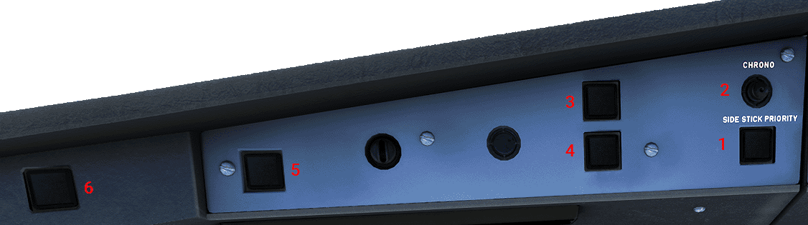

# Warning Panel

---

[Back to Flight Deck](../index.md){ .md-button }

---

!!! note "API Documentation: [Warning Panel](../../a32nx_api.md#warning-panel)"

## Usage

### 1. SIDE STICK PRIORITY

- Red arrow light:
    - Illuminates in front of the pilot who is losing authority.
    - Light extinguishes if the pilot has recovered authority.
        - If the pilot either:
            - Releases his TAKEOVER pb before the priority condition is set
            - Used the TAKEOVER pb to cancel a set priority situation. 
         **Sidestick priority audio**: The audio voice message "PRIORITY LEFT" or "PRIORITY RIGHT" is played each time priority is taken.

- Green CAPT and F/O lights:
    - Both lights will flash if the pilots are attempting to move both sidesticks at the same time and neither pilot takes priority.
    - If a pilot who has taken priority by using the TAKEOVER pb and the other pilot's sidestick is in motion or not neutral, the light of the pilot who has taken priority illuminates. It will extinguish when the opposing sidestick returns to the neutral position.

!!! attention ""
    Currently not available or INOP in the FBW A32NX for Microsoft Flight Simulator.

### 2. CHRONO

- Pushing this button shows the chronometer time on the respective ND.
- Pushing it a second time will freeze the time.
- Pushing it a third time will reset the chronometer, and the displayed value disappears from the ND.

### 3. MASTER WARN

- Illuminates and flashes red for a level 3 warning.
- Provides an audible warning (repetitive chimes, sounds, or a synthetic voice).

### 4. MASTER CAUTION

- Illuminates with a steady amber for a level 2 caution.
- Provides a single audible chime.

These lights go out when:

- Any pilot presses the light (some warnings will not be extinguished such as overspeed or stall).
- The warning/caution event is over.
- Any pilot presses the CLR pb on the ECAM control panel (some warnings will not be extinguished such as overspeed or stall).
- Any pilot presses the EMER CANC pb on the ECAM control panel.

The aural warnings terminate when:

- Any pilot presses the MASTER WARN light (some warnings will not be extinguished such as overspeed or stall).
- The warning event is over.
- Any pilot presses the EMER CANC pb on the ECAM control panel.

### 5.  AUTOLAND WARNING LIGHT

- The events below trigger a flashing AUTOLAND red warning accompanied by a triple click audio warning when the aircraft is below 200ft RA and aircraft is in LAND mode:

    - AP1 and AP2 OFF below 200ft RA.
    - LOC deviation (1/4 dot above 15ft RA) or GLIDE deviation (1 dot above 100ft RA). Both LOC and GLIDE scales will flash on the PFD.
    - LOC signal lost above 15ft or loss of GLIDE signal when above 100ft. The flight director bars flash on the PFD and LAND mode remains engaged.
    - Difference of radio altimeter indications is more than 15ft.

### 6. ATC MSG

- Will flash when an ATC message is received via the CPDLC (Controller-Pilot Data Link Communication), accompanied by an alarm. This notification can be cancelled by pressing the "ATC MSG" pb.

!!! attention ""
    Currently not available or INOP in the FBW A32NX for Microsoft Flight Simulator.

---

[Back to Flight Deck](../index.md){ .md-button }

