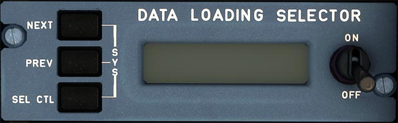

# FMS Load Panel

---

[Back to Flight Deck](../index.md){ .md-button }

---

## Description

This panel helps the aircraft maintenance team to review and update the aircraft's databases.

The A320neo has the following software & databases:

- FMS Software
- NAV Database
- Airline Modifiable Information Database
- Operational Program Configuration (OPC)
- PERF Database
- Magnetic Variation Database (MAG VAR)

!!! info ""
    Currently not available or INOP in the FBW A32NX for Microsoft Flight Simulator.

---

[Back to Flight Deck](../index.md){ .md-button }

