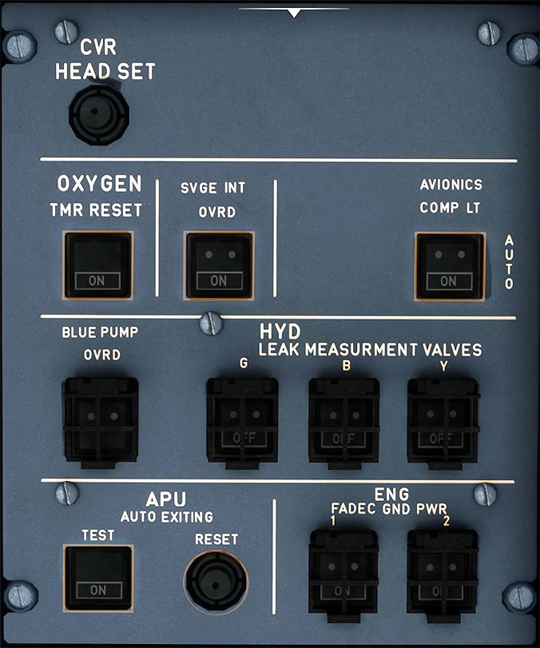

# Maintenance Panel

---

[Back to Flight Deck](../index.md){ .md-button }

---

---
## Usage

### CVR Headset

Headphone output to monitor the Cockpit Voice Recorder for testing.

### OXYGEN TMR RESET

The maintenance crew uses this pushbutton to reset the control circuit, after the system is already in operation.

- ON: The PASSENGER SYS ON light goes off.
- FAULT: when the door latch solenoids are energized for more than 30s, this light comes on in white.

!!! info ""
    Currently not available or INOP in the FBW A32NX for Microsoft Flight Simulator.

### SVCE INT OVRD

- Auto: Ground personnel can communicate with the flight crew through the service interphone jacks 10 s after the aircraft has landed. The landing gear must be compressed.
- ON: Communication is possible when the landing gear is not compressed. The ON light is white.

!!! info ""
    Currently not available or INOP in the FBW A32NX for Microsoft Flight Simulator.

### AVIONICS COMP LT

- AUTO: avionic compartment lighting is automatically controlled by door opening.
- ON: avionic compartment lighting is on.

!!! info ""
    Currently not available or INOP in the FBW A32NX for Microsoft Flight Simulator.

### BLUE PUMP OVRD (guarded)

- ON: The blue electric pump is on if the ELEC PUMP pushbutton switch on the HYD panel is on AUTO.
- OFF: The blue electric pump is controlled by the automatic logic.

### HYD LEAK MEASUREMENT VALVES (guarded)

- OFF: The corresponding electrohydraulic valve closes and shuts off hydraulic supply to the primary flight controls.
- ON: The corresponding electrohydraulic valve opens to go back to normal hydraulic supply.

!!! info ""
    Currently not available or INOP in the FBW A32NX for Microsoft Flight Simulator.

### APU

- TEST PB-SW: When pressed, tests the following APU circuits:
    - Fire warning
    - Auto-extinguishing
    - Shutdown

    During the test sequence, the APU MASTER sw must be ON.
    If all circuits are operating correctly, the OK light comes on.

    Note: If the APU was running, it shuts down.

- RESET PB: When pressed, resets the test circuit.

!!! info ""
    Currently not available or INOP in the FBW A32NX for Microsoft Flight Simulator.

### ENG FADEC GND PWR

- OFF: The electrical network of the aircraft or the FADEC alternator automatically supplies the FADEC.
- ON: On the ground, when pressed, the electrical network of the aircraft supplies the FADEC when:
    - The ENG FIRE pb-sw is not pressed,
    - The FADEC alternator does not supply the FADEC.
---

[Back to Flight Deck](../index.md){ .md-button }
