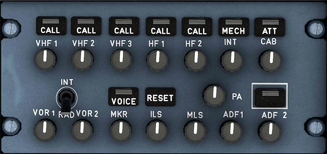
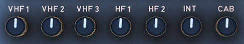

# 3rd Audio Control Panel

---

[Back to Flight Deck](../index.md){ .md-button }

---

## Description

!!! info ""
    Currently not available or INOP in the FBW A32NX for Microsoft Flight Simulator.

## Usage

### Transmission Keys

!!! info ""
    Currently, only the VHF1-3 channels are available in the FBW A32NX for Microsoft Flight Simulator.

- Pressed:
    - Channel selected for transmission.
    - Green lines come on.
    - Deselecting by pressing the pushbutton again, through selecting another channel.
- CALL:
    -  When the SELCAL system detects a call, the legend flashes amber (and buzzer sounds).
- MECH:
    - When called from the nose gear bay, the legend flashes amber (and buzzer sounds). If it is not reset, the MECH light goes off after 60 seconds.
- ATT:
    - When called by a cabin attendant, the legend flashes amber (and buzzer sounds). If it is not reset, the ATT light goes off after 60 seconds.

### Reception Knobs

!!! info ""
    Currently, only the VHF2-3 channels are available for selection in the FBW A32NX for Microsoft Flight Simulator. VHF1 is always selected, although not lit.

These knobs are used to allow the flight crew to activate a channel for reception and to adjust volume.

- Pushing the knob to "knob out" selects the channel for reception. The integral white light comes on. Rotating the knob adjusts the volume.
- Pushing the knob (knob stays in) deselects the channel for reception.

### RESET

Extinguishes CALL, MECH, and ATT lights.

!!! info ""
    Currently not available or INOP in the FBW A32NX for Microsoft Flight Simulator.

### VOICE

Inhibit the audio navigation signals (VOR, ADF) and filters out ident signals and turns on the green ON light.

!!! info ""
    Currently not available or INOP in the FBW A32NX for Microsoft Flight Simulator.

### INT/RAD

Press-to-talk switch for boom mike or oxygen mask mike.

!!! info ""
    Currently not available or INOP in the FBW A32NX for Microsoft Flight Simulator.

### PA (Passenger Address)

Passenger Address is used by the flight personnel to make passenger announcements through loudspeakers in the cabin.

!!! info ""
    Currently not available or INOP in the FBW A32NX for Microsoft Flight Simulator.

#### PA transmission key

Pressed and held: To make an announcement a boom, mask, or hand mike is used.

!!! info ""
    Currently not available or INOP in the FBW A32NX for Microsoft Flight Simulator.

#### PA reception knob

- Pressed and released (knob out):
    - The message goes to the loudspeakers and the integral white light comes on. The flight crew can rotate the knob to adjust the volume.
- Pressed (knob in):
    - The PA system is disconnected. The white light goes out.

!!! info ""
    Currently not available or INOP in the FBW A32NX for Microsoft Flight Simulator.

---

[Back to Flight Deck](../index.md){ .md-button }
