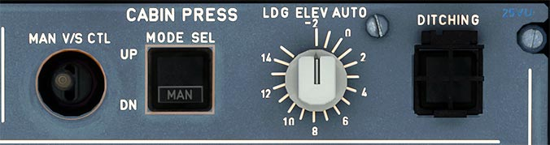

# Cabin Pressurization

---

[Back to Flight Deck](../index.md){ .md-button }

---

## Description

The cabin pressurization system controls the pressurization of the cabin to allow crew and passengers to fly comfortably without the usage of oxygen masks and negative impact of too low pressure at high altitude.

The flight crew can set the system to operate automatically, semi-automatically, or manually.

In normal operation, cabin pressurization is fully automatic.

On Ground (GN), before takeoff, and 55 seconds after landing, the outflow valve fully opens to ensure that there is no residual cabin pressure. At touchdown, any remaining cabin pressure is released at a cabin vertical speed of 500 feet/minute.

At Takeoff (TO) the system avoids a pressure surge at rotation, by pre-pressurization of the aircraft at a rate of 400 feet/minute, until the &#916;P reaches 0.1 psi. At lift-off, the controller initiates the climb phase.

During Climb (CL), the cabin altitude increases according to a fixed pre-programmed method accounting for the aircraft's actual rate of climb.

In Cruise (CR), the system maintains cabin altitude at the level-off value, or at the landing field elevation, whichever is higher.

While in Descent (DE), the systems control the pressure rate of descent, such that cabin pressure equals the landing field pressure, just before landing. The maximum descent rate is 750 feet/minute.

During a take-Off Abort (AB) the system prevents the cabin altitude from climbing. Cabin pressure is set back to the takeoff altitude + 0.1 psi.

## Usage

###  LDG ELEV sel

- AUTO:
    - FMGS data is used to construct an optimized pressure schedule.
- Other positions:
    - Selected pressure is used (from - 2000 to + 14 000 feet) as landing elevation reference.

!!! Note ""
    The LDG ELEV selector scale is only given as an indication; refer to the ECAM information for accurate adjustment.

### MODE SEL

- AUTO:
    - Automatic pressurization control mode is used.
- MAN:
    - Appears in white, and FAULT does not come on. Manual control of pressurization is done using the MAN V/S CTL switch.
- FAULT:
    - Appears in amber and the ECAM caution light comes on when both automatic systems are faulty.

### MAN V/S CTL

This switch controls the outflow valve position, when the MODE SEL pushbutton is in the MAN position.

- UP:
    - The valve moves towards the open position.
- DN:
    - The valve moves towards the closed position.

!!! Note ""
    The outflow valve operates slowly, so the pilot must hold the toggle switch in the UP or DN position until reaching the target VIS.

### DITCHING guarded

- Normal:
    - The system functions normally.
- ON:
    - The system closes all valves to the "outside" (outflow valve, emergency ram air inlet, avionics ventilation inlet and extract valves, and pack flow control valves).

---

[Back to Flight Deck](../index.md){ .md-button }

