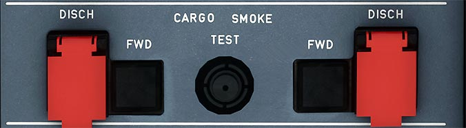

# Cargo Smoke Panel

---

[Back to Flight Deck](../index.md){ .md-button }

---

!!! note "Incorrect Label"
    The right side and button label is incorrect. It should say AFT.

## Usage

### SMOKE light

When the system detects smoke in the compartment, a red light and an ECAM warning come on.

Both channels need to detect smoke, or one channel detects smoke and the SDCU finds that the other channel is faulty.

### DISCH

Ignites the squib to discharge the extinguishing agent in the corresponding compartment (FWD or AFT).

### DISCH light

Amber light comes on, indicating that the agent bottle has fully discharged.

### TEST

To test the system press this button and hold it:

- Tests the smoke detectors
- Turns on the red smoke lights and displays an ECAM warning
- Closes the ventilation system's isolation valves.
- Turns on the amber DISCH lights.

---

[Back to Flight Deck](../index.md){ .md-button }
