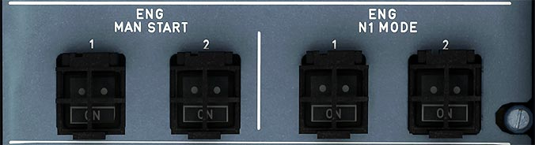

# Engine Manual Start and N1 Mode Panel

---

[Back to Flight Deck](../index.md){ .md-button }

---

## Usage

!!! attention ""
    Currently not available or INOP in the FBW A32NX for Microsoft Flight Simulator.

### ENG MAN START

- ON:
    - The start valve opens if the ENG MODE selector is set to CRANK or IGN/START and N2 <20%. Both pack valves close during the start sequence.

    Note: The start valve closes automatically when N2 ;;:: 50 %. The blue ON light comes on.

- Off:
    - When the ENG MAN START pushbutton switch is set to OFF during a manual engine start, the start valve closes if the MASTER switch is OFF.

!!! note ""
    Currently not available in the FBW A32NX for Microsoft Flight Simulator.

### ENG N1 MODE

If plane is equipped with IAE engines there are two additional guarded N1 MODE indicator switches. N1 mode is used for changing the thrust control between EPR and N1 (abnormal situation).

- N1 RATED MODE:
    - In the N1 rated mode, the FADEC controls engine N1 as a function of thrust lever position, temperature, and altitude while preventing the engine from exceeding operating limits. Thrust is controlled in the same manner as in the normal mode without auto thrust. Place the thrust lever in the TO/GA detent to obtain TO/GA thrust, the MCT detent to obtain MCT thrust, and the CL detent to obtain climb thrust.

- N1 UNRATED MODE:
    - In the N1 unrated mode (N1 DEGRADED mode on ECAM) the FADEC controls engine N1 as a function of thrust lever position only. The thrust lever detents do not provide limit protections; over boost is possible. With one engine in the N1 rated mode, the N1 of the unrated engine should be matched with the N1 of the rated engine (the thrust levers may not be aligned). If both engines degrade to the N1 unrated mode, N1 limit values in the Takeoff Performance, Climb Performance, and Landing Performance chapters must be used.

!!! note ""
    Currently not available in the FBW A32NX for Microsoft Flight Simulator.

---

[Back to Flight Deck](../index.md){ .md-button }
